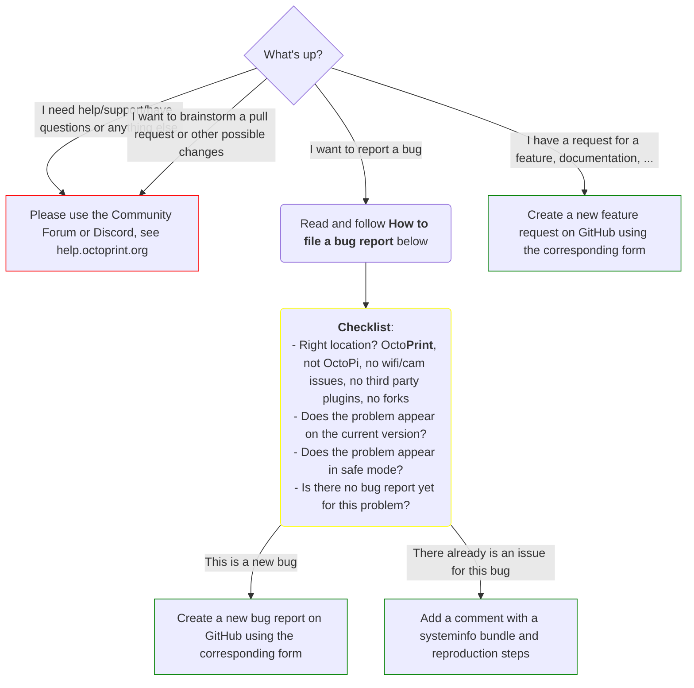

# Contribution Guidelines

This document outlines what you need to know before **[creating tickets](#issues-tickets-however-you-may-call-them)**
or **[creating pull requests](#pull-requests)**.

## Contents

  * [Issues, Tickets, however you may call them](#issues-tickets-however-you-may-call-them)
  * [How to file a bug report](#how-to-file-a-bug-report)
    * [What should I do before submitting a bug report?](#what-should-i-do-before-submitting-a-bug-report)
    * [What should I include in a bug report?](#what-should-i-include-in-a-bug-report)
    * [Where can I find which version and branch I'm on?](#where-can-i-find-which-version-and-branch-im-on)
    * [Where can I find those log files you keep talking about?](#where-can-i-find-those-log-files-you-keep-talking-about)
    * [Where can I find my browser's error console?](#where-can-i-find-my-browsers-error-console)
  * [Setting up a development environment](#setting-up-a-development-environment)
  * [Pull requests](#pull-requests)
  * [What do the branches mean?](#what-do-the-branches-mean)
  * [How OctoPrint is versioned](#how-octoprint-is-versioned)
  * [On AI use when contributing to OctoPrint](#on-ai-use-when-contributing-to-octoprint)
  * [History](#history)
  * [Footnotes](#footnotes)

## Issues, Tickets, however you may call them

Please read the following instructions fully and follow them. You can
help the project tremendously this way: not only do you help the maintainers
to **address problems in a timely manner** but also keep it possible for them
to **fix bugs, add new and improve on existing functionality** instead of doing
nothing but ticket management.



- **[Read the FAQ](https://faq.octoprint.org)**
- If you want to report a **bug**, [read "How to file a bug report" below](#how-to-file-a-bug-report)
  and *[use the provided bug reporting form](#what-should-i-include-in-a-ticket)*.
  You do not need to do anything else with your ticket.
- If you want to post a **feature request** or a **documentation request**, add `[Request]`
  to your issue's title (e.g. `[Request] Awesome new feature`). A question on how to run/change/setup
  something is **not** what qualifies as a request here, use the
  [community forum at community.octoprint.org](https://community.octoprint.org) for
  such support issues.
- If you are a **developer** that wants to brainstorm a pull request or possible
  changes to the plugin system, please get in touch on the
  [community forum at community.octoprint.org](https://community.octoprint.org/c/development).
- If you need **support**, have a **question** or some **other reason** that
  doesn't fit any of the above categories, the issue tracker is not the right place.
  Consult the [community forum at community.octoprint.org](https://community.octoprint.org/c/support) instead.

No matter what kind of ticket you create, never mix two or more "ticket reasons"
into one ticket: One ticket per bug, request, brainstorming thread please.

> [!NOTE]
> A bot is in place that monitors new tickets, automatically
> categorizes them and checks new bug reports for usage of the provided template.
> That bot will only bother you if you open a ticket that appears to be a bug (no
> `[Request]` in the title) without the complete template, and it
> will do that only to ensure that all information needed to solve the issue is
> available for the maintainers to directly start tackling that problem.

## How to file a bug report

> [!IMPORTANT]
> Please also take note of the section ["AI use in Bug Reports and other issues"](#ai-use-in-bug-reports-and-other-issues) below.

If you encounter an issue with OctoPrint, you are welcome to
[submit a bug report](https://github.com/OctoPrint/OctoPrint/issues/new?template=01_bug_report.yml).

Before you do that for the first time though please take a moment to read the
following section *completely* and also follow the instructions in the
"new issue" form. Thank you! :)

### What should I do before submitting a bug report?

1. **Make sure you are at the right location**. This is the bug tracker
   of the official version of OctoPrint, which is the 3D print server and
   corresponding web interface itself.

   **OctoPrint doesn't manage your network connection or your webcam nor
   can it fix your printer not getting detected as a serial interface** -
   if you have any kinds of problems with that, get in touch on the
   [community forum](https://community.octoprint.org).

   **This is not the bug tracker of OctoPi**, which is the preconfigured
   Raspberry Pi image including OctoPrint among other things - that one can be found
   [here](https://github.com/guysoft/OctoPi). If you have any kind of specific
   issue with how the OctoPi system is setup, go there please.

   **This is also not the bug tracker of any OctoPrint Plugins you
   might have installed**. Report any issues with those in their corresponding
   bug tracker (probably linked to from the plugin's homepage).

   Finally, **this is also not the right bug tracker if you are running a
   forked version of OctoPrint**. Seek help for such unofficial versions from
   the people maintaining them instead.

2. Please make sure to **test out the current version** of OctoPrint to see
   whether the problem you are encountering still exists, and **test without
   any third-party plugins enabled** to make sure it's not a misbehaving
   plugin causing the issue at hand. For that please restart OctoPrint in
   **safe mode**, either by selecting "Restart OctoPrint in safe mode" from
   the "System" menu, or by starting OctoPrint from the command line with
   `octoprint serve --safe`. Then try to reproduce your issue. Find out
   more about safe mode in the [docs](https://docs.octoprint.org/en/main/features/safemode.html).

   You might also want to try the current development version of OctoPrint
   (if you aren't already). Refer to the [FAQ](https://faq.octoprint.org)
   for information on how to do this.

3. The problem still exists? Then please **look through the
   [existing tickets](https://github.com/foosel/OctoPrint/issues?state=open)
   (use the [search](https://github.com/foosel/OctoPrint/search?q=&ref=cmdform&type=Issues))**
   to check if there already exists a report of the issue you are encountering.
   Sorting through duplicates of the same issue sometimes causes more work than
   fixing it. Take the time to filter through possible duplicates and be really
   sure that your problem definitely is a new one. Try more than one search query
   (e.g. do not only search for "timelapse" if you happen to run into an issue
   with your webcam, also search for "recording" etc). Do not only read the subject lines
   of tickets that look like they might be related, but also read the ticket itself!

   **Very important:** Please make absolutely sure that if you find a bug that looks like
   it is the same as your's, it actually behaves the same as your's. E.g. if someone gives steps
   to reproduce his bug that looks like your's, reproduce the bug like that if possible,
   and only add a "me too" if you actually can reproduce the same
   issue. Also **provide all information like Systeminfo Bundle, additional logs & versions, different reproduction steps**
   and whatever was additionally requested over the course of the ticket
   even if you "only" add to an existing ticket. The more information available regarding a bug, the higher
   the chances of reproducing and solving it. But "me too" on an actually unrelated ticket
   makes it more difficult due to on top of having to figure out the original problem
   there's now also a [red herring](https://en.wikipedia.org/wiki/Red_herring) interfering - so please be
   very diligent here!

If in doubt about any of the above - get in touch on the [community forums](https://community.octoprint.org)
instead of opening a ticket here. If you are actually running into a bug, we'll figure it out together
there.

### What should I include in a bug report?

First of all make sure your use **a descriptive title**. "It doesn't work"
and similar unspecific complaints are NOT descriptive titles.

**Always use the [bug reporting form](https://github.com/OctoPrint/OctoPrint/issues/new?template=01_bug_report.yml)** for new bug reports.

When adding a "me too" to an existing bug report, *always* include a system info bundle as well, and provide
your reproduction steps.

### Where can I find the System Info Bundle?

Please refer to [this FAQ entry](https://community.octoprint.org/t/what-is-a-systeminfo-bundle-and-how-can-i-obtain-one/29887).

### Where can I find which version and branch I'm on?

Please refer to [this FAQ entry](https://community.octoprint.org/t/how-can-i-find-out-the-version-of-octoprint-or-octopi-i-am-running/204/1).

### Where can I find those log files you keep talking about?

Please refer to [this FAQ entry](https://community.octoprint.org/t/where-can-i-find-octoprints-and-octopis-log-files/299/1).

### Where can I find my browser's error console?

See [How to open the Javascript Console in different browsers](https://webmasters.stackexchange.com/questions/8525/how-to-open-the-javascript-console-in-different-browsers)

## Setting up a development environment

See [the corresponding chapter in the documentation](https://docs.octoprint.org/en/main/development/environment.html).
This also includes information on how to run the test suite and how to build
the documentation, the bundled virtual printer plugin and OctoPrint's versioning
and branching strategy.

## Pull requests

> [!IMPORTANT]
> Please also take note of the section ["AI use for Pull Requests"](#ai-use-for-pull-requests) below.

1. If you want to add a new feature to OctoPrint, **please always first
   consider if it wouldn't be better suited for a plugin.** As a general rule
   of thumb, any feature that is only of interest to a small sub group should
   be moved into a plugin. If the current plugin system doesn't allow you to
   implement your feature as a plugin, please get in touch on the
   [forums](https://community.octoprint.org/c/development) to get
   the discussion going on how best to solve *this* in OctoPrint's plugin
   system - maybe that's the actual PR you have been waiting for to contribute :)
2. If you plan to make **any large or otherwise disruptive changes to the
   code or appearance, please get in touch on the
   [forums](https://community.octoprint.org/c/development)** first so
   that we can determine if it's a good time for your specific pull
   request. It might be that we're currently in the process of making
   heavy changes to the code locations you'd target as well, or your
   approach doesn't fit the general "project vision", and that would
   just cause unnecessary work and frustration for everyone or
   possibly get the PR rejected.
3. Create your pull request **from a custom branch** on your end (e.g.
   `wip/my-new-feature`)[1].
4. Create your pull request **only against the `dev` branch**. In case of big changes,
   [get in touch](https://community.octoprint.org/c/development) first.
5. Create **one pull request per feature/bug fix**.
6. Make sure there are **only relevant changes** included in your PR. No
   changes to unrelated files, no additional files that don't belong (e.g.
   commits of your full virtual environment). Make sure your PR consists
   **ideally of only one commit** (use git's rebase and squash functionality).
7. Make sure you **follow the current coding style**. This means:
     * Spaces for indenting and alignment, indentation width 4.
     * English language (code, variables, comments, ...)
     * Comments where necessary: Tell *why* the code does something like it does
       it, structure your code
     * Following the general architecture
     * If your PR needs to make changes to the Stylesheets, change the
       ``.less`` files from which the CSS is compiled.
     * Make sure you do not add dead code (e.g. commented out left-overs
       from experiments).
8. Ensure your changes **pass the existing unit tests**. PRs that break
   those cannot be accepted. You can run the unit tests locally (after
   [initial development environment setup with "develop" dependencies](https://docs.octoprint.org/en/main/development/environment.html))
   by running

   ```
   pytest
   ```

   in the OctoPrint checkout folder. An [automatic build workflow](https://github.com/OctoPrint/OctoPrint/actions?query=workflow%3ABuild)
   is also setup so that if the tests should fail, your PR will be marked
   accordingly.
9. Run the **pre-commit check suite** against your changes. You can run that (after
   [initial development environment setup with "develop" dependencies](https://docs.octoprint.org/en/main/development/environment.html))
   by running

   ```
   pre-commit run --hook-stage manual --all-files
   ```

   in the OctoPrint checkout folder. If you install the pre-commit hooks via
   `pre-commit install` (which you really should!) this will even be taken care of for you prior to committing.

   An [automatic build workflow](https://github.com/OctoPrint/OctoPrint/actions?query=workflow%3ABuild)
   is in place that will run these checks - if they fail your PR will be marked accordingly.
10. **Test your changes thoroughly**. That also means testing with usage
    scenarios you don't normally use. If you only test with your printer, test with the
    virtual printer and vice versa. State in your pull request how you tested
    your changes. Ideally **add unit tests** - OctoPrint severely lacks in that
    department, but we are trying to change that, so any new code already covered
    with a test suite helps a lot!
11. In your pull request's description, **state what your pull request does**,
    as in, what feature does it implement, what bug does it fix. The more
    thoroughly you explain your intent behind the PR here, the higher the
    chances it will get merged fast. There is a template provided below
    that can help you here.
12. Don't forget to **add yourself to the [AUTHORS](./AUTHORS.md)
    file** :)

Template to use for Pull Request descriptions (should get pre-filled automatically):

```
<!--
Thank you for your interest in contributing to OctoPrint, it's
highly appreciated!

Please make sure you have read the "guidelines for contributing" as
linked just above this form, there's a section on Pull Requests in there
as well which contains important information.

As a summary, please make sure you have ticked all points on this
checklist:
-->

- [ ] You have read through `CONTRIBUTING.md`
- [ ] Your changes are not possible to do through a plugin and relevant
  to a large audience (ideally all users of OctoPrint)
- [ ] If your changes are large or otherwise disruptive: You have
  made sure your changes don't interfere with current development by
  talking it through with the maintainers, e.g. through a
  Brainstorming ticket
- [ ] Your PR targets OctoPrint's `dev` branch
- [ ] Your PR was opened from a custom branch on your repository
  (no PRs from your version of `main`, `bugfix`, `next` or `dev`
  please), e.g. `wip/my_new_feature` or `wip/my_bugfix`
- [ ] Your PR only contains relevant changes: no unrelated files,
  no dead code, ideally only one commit - rebase and squash your PR
  if necessary!
- [ ] If your changes include style sheets: You have modified the
  `.less` source files, not the `.css` files (those are generated
  with `lessc`)
- [ ] You have tested your changes (please state how!) - ideally you
  have added unit tests
- [ ] You have run the existing unit tests against your changes and
  nothing broke (`pytest`)
- [ ] You have run the included `pre-commit` suite against your changes
  and nothing broke (`pre-commit run --all-files`)
- [ ] You have added yourself to the `AUTHORS.md` file :)

<!--
Describe your PR further using the template provided below. The more
details the better!
-->

#### What does this PR do and why is it necessary?

#### How was it tested? How can it be tested by the reviewer?

#### Was any kind of genAI (ChatGPT, Copilot etc) involved in creating this PR?

#### Any background context you want to provide?

#### What are the relevant tickets if any?

#### Screenshots (if appropriate)

#### Further notes

<!--
Be advised that your PR will be checked automatically by CI. Should any of the CI
checks fail, you will be expected to fix them before your PR will be reviewed, so
keep an eye on it!
-->
```

## How is OctoPrint versioned?

See [the corresponding chapter in the documentation](https://docs.octoprint.org/en/main/development/versioning.html).

## What do the branches mean?

See [the corresponding chapter in the documentation](https://docs.octoprint.org/en/main/development/branches.html).

## On AI use when contributing to OctoPrint

What follows here are the guidelines for AI use when contributing to OctoPrint.

When we say "AI use", we mean *all kinds* of Generative AI based chatbots (including GitHub's Copilot!), coding and other such tools.

### AI use in bug reports and other issues

If you use an AI tool to create a bug report or other issue for OctoPrint (even GitHub's Copilot!) you **must** reveal this fact in your report.

If you find a problem, write the issue yourself using the provided issue form. If you struggle with language or phrasing, you can of course use any help with that that you want, but please make sure to write most of it yourself and don't just copy and paste an AI generated issue to the project. Those generated reports typically are too wordy and rarely to the point (in addition to the common fabricated details), and will in all likelihood nevertheless lack the information we actually need to be able to debug and fix your issue.

### AI use for pull requests

When contributing a pull request you always need to make sure that the proposal is good quality and a best effort that follows our guidelines. A basic rule of thumb is that if someone can spot that the contribution was made with the help of AI, you have more work to do.

We can accept code written with the help of AI into the project, but the code must still follow coding standards, be written clearly, be documented, feature test cases and adhere to all the normal requirements we have. You also must understand it yourself and be able to explain it to us - no "vibe coding" please.

Whatever kind of contribution you submit with your PR, be it code, documentation change, workflows, etc: If you prepared it with the help of an AI, you **must** reveal this fact in your PR!

## History

  * 2015-01-23: More guidelines for creating pull requests, support/questions
    redirected to Mailinglist/G+ community
  * 2015-01-27: Added another explicit link to the FAQ
  * 2015-07-07: Added step to add yourself to AUTHORS when creating a PR :)
  * 2015-12-01: Heavily reworked to include examples, better structure and
    all information in one document.
  * 2016-02-10: Added information about branch structure and versioning.
  * 2016-02-16: Added requirement to add information from template to existing
    tickets as well, explained issue with "me too" red herrings.
  * 2016-03-14: Some more requirements for PRs, and a PR template.
  * 2016-06-08: New `prerelease` and `rc` branches explained.
  * 2016-09-09: New `rc/*` branches explained.
  * 2016-09-23: Some more work on "How to file a bug report" based on recent
    experiences
  * 2017-01-25: Fixed a typo
  * 2017-03-09: Allow PRs against `maintenance` branch for bugs in stable.
  * 2017-03-10: Reproduce bugs in safe mode to make sure they are really caused
    by OctoPrint itself and not a misbehaving plugin.
  * 2017-03-27: Added safe mode section to ticket template.
  * 2017-11-22: Added note on how to run the unit tests
  * 2018-03-15: Link to new community forum and some clarifications re bug
    reporting
  * 2018-03-29: "Where to find version numbers" is now located on the FAQ
  * 2018-10-18: Allow PRs against `maintenance` branch for improvements and small
    new features, suggest getting in touch on the forum for larger changes
  * 2020-08-10: Update versioning scheme and PR instructions
  * 2020-09-23: Move branch & versioning into development docs
  * 2020-10-07: Introduce `pre-commit`
  * 2021-02-04: Issue forms! \o/
  * 2021-03-04: Correct issue forms link
  * 2021-04-27: Systeminfo Bundles! \o/
  * 2025-05-21: Guidelines regarding the use of AI
  * 2025-09-03: Changes according to the new branching strategy

## Footnotes
  * [1] - If you are wondering why, the problem is that anything that you add
    to your PR's branch will also become part of your PR, so if you create a
    PR from your version of `dev` chances are high you'll add changes to the
    PR that do not belong to the PR.
