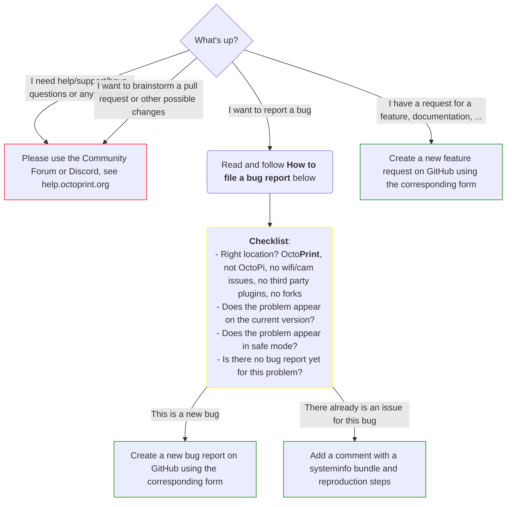

# Contribution Guidelines

This document outlines what you need to know before **[creating tickets](#issues-tickets-however-you-may-call-them)**
or **[creating pull requests](#pull-requests)**.

## Contents

  * [Issues, Tickets, however you may call them](#issues-tickets-however-you-may-call-them)
  * [How to file a bug report](#how-to-file-a-bug-report)
    * [What should I do before submitting a bug report?](#what-should-i-do-before-submitting-a-bug-report)
    * [What should I include in a bug report?](#what-should-i-include-in-a-bug-report)
    * [Where can I find which version and branch I'm on?](#where-can-i-find-which-version-and-branch-im-on)
    * [Where can I find those log files you keep talking about?](#where-can-i-find-those-log-files-you-keep-talking-about)
    * [Where can I find my browser's error console?](#where-can-i-find-my-browsers-error-console)
  * [How to report a vulnerability?](#how-to-report-a-vulnerability)
  * [Setting up a development environment](#setting-up-a-development-environment)
  * [Pull requests](#pull-requests)
  * [How is OctoPrint versioned](#how-is-octoprint-versioned)
  * [What do the branches mean?](#what-do-the-branches-mean)
  * [How should I format my commit messages?](#how-should-i-format-my-commit-messages)
  * [On AI use when contributing to OctoPrint](#on-ai-use-when-contributing-to-octoprint)
  * [History](#history)
  * [Footnotes](#footnotes)

## Issues, Tickets, however you may call them

Please read the following instructions fully and follow them. You can
help the project tremendously this way: not only do you help the maintainers
to **address problems in a timely manner** but also keep it possible for them
to **fix bugs, add new and improve on existing functionality** instead of doing
nothing but ticket management.


```mermaid
flowchart TD
    Choice{What's up?} -->|I need help/support/have questions or anything else| Community["`Please use the Community Forum or Discord, see help.octoprint.org`"]
    Choice -->|I want to report a bug| ReadBug("`Read and follow **How to file a bug report** below`")
    ReadBug --> Checklist("`**Checklist**:
    - Right location? Octo**Print**, not OctoPi, no wifi/cam issues, no third party plugins, no forks
    - Does the problem appear on the current version?
    - Does the problem appear in safe mode?
    - Is there no bug report yet for this problem?
    `")
    Checklist -->|This is a new bug| NewBug[Create a new bug report on GitHub using the corresponding form]
    Checklist -->|There already is an issue for this bug| AddMeToo[Add a comment with a systeminfo bundle and reproduction steps]
    Choice -->|I have a request for a feature, documentation, ...| NewFR[Create a new feature request on GitHub using the corresponding form]
    Choice -->|I want to brainstorm a pull request or other possible changes| Community
    style Community stroke:red
    style NewBug stroke:green
    style AddMeToo stroke:green
    style NewFR stroke:green
    style Checklist stroke:yellow
```

- **[Read the FAQ](https://faq.octoprint.org)**
- If you want to report a **bug**, [read "How to file a bug report" below](#how-to-file-a-bug-report)
  and *[use the provided bug reporting form](#what-should-i-include-in-a-ticket)*.
  You do not need to do anything else with your ticket.
- If you want to post a **feature request** or a **documentation request**, add `[Request]`
  to your issue's title (e.g. `[Request] Awesome new feature`). A question on how to run/change/setup
  something is **not** what qualifies as a request here, use the
  [community forum at community.octoprint.org](https://community.octoprint.org) for
  such support issues.
- If you are a **developer** that wants to brainstorm a pull request or possible
  changes to the plugin system, please get in touch on the
  [community forum at community.octoprint.org](https://community.octoprint.org/c/development).
- If you need **support**, have a **question** or some **other reason** that
  doesn't fit any of the above categories, the issue tracker is not the right place.
  Consult the [community forum at community.octoprint.org](https://community.octoprint.org/c/support) instead.

No matter what kind of ticket you create, never mix two or more "ticket reasons"
into one ticket: One ticket per bug, request, brainstorming thread please.

> [!NOTE]
> A bot is in place that monitors new tickets, automatically
> categorizes them and checks new bug reports for usage of the provided template.
> That bot will only bother you if you open a ticket that appears to be a bug (no
> `[Request]` in the title) without the complete template, and it
> will do that only to ensure that all information needed to solve the issue is
> available for the maintainers to directly start tackling that problem.

## How to file a bug report

> [!IMPORTANT]
> Please also take note of the section ["AI use in Bug Reports and other issues"](#ai-use-in-bug-reports-and-other-issues) below.

If you encounter an issue with OctoPrint, you are welcome to
[submit a bug report](https://github.com/OctoPrint/OctoPrint/issues/new?template=01_bug_report.yml).

Before you do that for the first time though please take a moment to read the
following section *completely* and also follow the instructions in the
"new issue" form. Thank you! :)

### What should I do before submitting a bug report?

1. **Make sure you are at the right location**. This is the bug tracker
   of the official version of OctoPrint, which is the 3D print server and
   corresponding web interface itself.

   **OctoPrint doesn't manage your network connection or your webcam nor
   can it fix your printer not getting detected as a serial interface** -
   if you have any kinds of problems with that, get in touch on the
   [community forum](https://community.octoprint.org).

   **This is not the bug tracker of OctoPi**, which is the preconfigured
   Raspberry Pi image including OctoPrint among other things - that one can be found
   [here](https://github.com/guysoft/OctoPi). If you have any kind of specific
   issue with how the OctoPi system is setup, go there please.

   **This is also not the bug tracker of any OctoPrint Plugins you
   might have installed**. Report any issues with those in their corresponding
   bug tracker (probably linked to from the plugin's homepage).

   Finally, **this is also not the right bug tracker if you are running a
   forked version of OctoPrint**. Seek help for such unofficial versions from
   the people maintaining them instead.

2. Please make sure to **test out the current version** of OctoPrint to see
   whether the problem you are encountering still exists, and **test without
   any third-party plugins enabled** to make sure it's not a misbehaving
   plugin causing the issue at hand. For that please restart OctoPrint in
   **safe mode**, either by selecting "Restart OctoPrint in safe mode" from
   the "System" menu, or by starting OctoPrint from the command line with
   `octoprint serve --safe`. Then try to reproduce your issue. Find out
   more about safe mode in the [docs](https://docs.octoprint.org/en/main/features/safemode.html).

   You might also want to try the current development version of OctoPrint
   (if you aren't already). Refer to the [FAQ](https://faq.octoprint.org)
   for information on how to do this.

3. The problem still exists? Then please **look through the
   [existing tickets](https://github.com/OctoPrint/OctoPrint/issues?state=open)
   (use the [search](https://github.com/OctoPrint/OctoPrint/search?q=&ref=cmdform&type=Issues))**
   to check if there already exists a report of the issue you are encountering.
   Sorting through duplicates of the same issue sometimes causes more work than
   fixing it. Take the time to filter through possible duplicates and be really
   sure that your problem definitely is a new one. Try more than one search query
   (e.g. do not only search for "timelapse" if you happen to run into an issue
   with your webcam, also search for "recording" etc). Do not only read the subject lines
   of tickets that look like they might be related, but also read the ticket itself!

   **Very important:** Please make absolutely sure that if you find a bug that looks like
   it is the same as your's, it actually behaves the same as your's. E.g. if someone gives steps
   to reproduce his bug that looks like your's, reproduce the bug like that if possible,
   and only add a "me too" if you actually can reproduce the same
   issue. Also **provide all information like Systeminfo Bundle, additional logs & versions, different reproduction steps**
   and whatever was additionally requested over the course of the ticket
   even if you "only" add to an existing ticket. The more information available regarding a bug, the higher
   the chances of reproducing and solving it. But "me too" on an actually unrelated ticket
   makes it more difficult due to on top of having to figure out the original problem
   there's now also a [red herring](https://en.wikipedia.org/wiki/Red_herring) interfering - so please be
   very diligent here!

If in doubt about any of the above - get in touch on the [community forums](https://community.octoprint.org)
instead of opening a ticket here. If you are actually running into a bug, we'll figure it out together
there.

### What should I include in a bug report?

First of all make sure your use **a descriptive title**. "It doesn't work"
and similar unspecific complaints are NOT descriptive titles.

**Always use the [bug reporting form](https://github.com/OctoPrint/OctoPrint/issues/new?template=01_bug_report.yml)** for new bug reports.

When adding a "me too" to an existing bug report, *always* include a system info bundle as well, and provide
your reproduction steps.

### Where can I find the System Info Bundle?

Please refer to [this FAQ entry](https://community.octoprint.org/t/what-is-a-systeminfo-bundle-and-how-can-i-obtain-one/29887).

### Where can I find which version and branch I'm on?

Please refer to [this FAQ entry](https://community.octoprint.org/t/how-can-i-find-out-the-version-of-octoprint-or-octopi-i-am-running/204/1).

### Where can I find those log files you keep talking about?

Please refer to [this FAQ entry](https://community.octoprint.org/t/where-can-i-find-octoprints-and-octopis-log-files/299/1).

### Where can I find my browser's error console?

See [How to open the Javascript Console in different browsers](https://webmasters.stackexchange.com/questions/8525/how-to-open-the-javascript-console-in-different-browsers)

## How to report a vulnerability?

Please refer to [OctoPrint's Security Policy](https://octoprint.org/security/).

## Setting up a development environment

See [the corresponding chapter in the documentation](https://docs.octoprint.org/en/dev/development/environment.html).
This also includes information on how to run the test suite and how to build
the documentation, the bundled virtual printer plugin and OctoPrint's versioning
and branching strategy, plus the commit message formatting guidelines.

## Pull requests

> [!IMPORTANT]
> Please also take note of the section ["AI use for Pull Requests"](#ai-use-for-pull-requests) below.

1. If you want to add a new feature to OctoPrint, **please always first
   consider if it wouldn't be better suited for a plugin.** As a general rule
   of thumb, any feature that is only of interest to a small sub group should
   be moved into a plugin. If the current plugin system doesn't allow you to
   implement your feature as a plugin, please get in touch on the
   [forums](https://community.octoprint.org/c/development) to get
   the discussion going on how best to solve *this* in OctoPrint's plugin
   system - maybe that's the actual PR you have been waiting for to contribute :)
2. If you plan to make **any large or otherwise disruptive changes to the
   code or appearance, please get in touch on the
   [forums](https://community.octoprint.org/c/development)** *first* so
   that we can determine if it's a good time for your specific pull
   request. It might be that we're currently in the process of making
   heavy changes to the code locations you'd target as well, or your
   approach doesn't fit the general "project vision", and that would
   just cause unnecessary work and frustration for everyone or
   possibly get the PR rejected.
3. Create your pull request **from a custom branch** on your end (e.g.
   `wip/my-new-feature`)[^1].
4. Create your pull request **only against the `dev` branch**. In case of big changes,
   [get in touch](https://community.octoprint.org/c/development) *first*.
5. Create **one pull request per feature/bug fix**.
6. Make sure there are **only relevant changes** included in your PR. No
   changes to unrelated files, no additional files that don't belong (e.g.
   commits of your full virtual environment). Make sure your PR consists
   **ideally of only one commit** (use git's rebase and squash functionality).
7. Make sure you **follow the current coding style**. This means:
     * Spaces for indenting and alignment, indentation width 4.
     * English language (code, variables, comments, ...)
     * Comments where necessary: Tell *why* the code does something like it does
       it, structure your code
     * Following the general architecture
     * If your PR needs to make changes to the Stylesheets, change the
       ``.less`` files from which the CSS is compiled.
     * Make sure you do not add dead code (e.g. commented out left-overs
       from experiments).
8. Ensure your changes **pass the existing unit tests**. PRs that break
   those cannot be accepted. You can run the unit tests locally (after
   [initial development environment setup with "develop" dependencies](https://docs.octoprint.org/en/main/development/environment.html))
   by running

   ```
   go-task test-unit
   ```

   in the OctoPrint checkout folder. An [automatic build workflow](https://github.com/OctoPrint/OctoPrint/actions?query=workflow%3ABuild)
   is also setup so that if the tests should fail, your PR will be marked
   accordingly.
9. Run the **pre-commit check suite** against your changes. You can run that (after
   [initial development environment setup with "develop" dependencies](https://docs.octoprint.org/en/main/development/environment.html))
   by running

   ```
   go-task pre-commit
   ```

   in the OctoPrint checkout folder. If you install the pre-commit hooks via
   `pre-commit install` (**which you really should!**) this will even be taken care of for you prior to committing.

   An [automatic build workflow](https://github.com/OctoPrint/OctoPrint/actions?query=workflow%3ABuild)
   is in place that will run these checks - if they fail your PR will be marked accordingly.
10. **Test your changes thoroughly**. That also means testing with usage
    scenarios you don't normally use. If you only test with your printer, test with the
    virtual printer and vice versa. State in your pull request how you tested
    your changes. Ideally **add unit tests** -- OctoPrint severely lacks in that
    department, but we are trying to change that, so any new code already covered
    with a test suite helps a lot!
11. In your pull request's description, **state what your pull request does**,
    as in, what feature does it implement, what bug does it fix. The more
    thoroughly you explain your intent behind the PR here, the higher the
    chances it will get merged fast. There is a template provided below
    that can help you here.
12. Don't forget to **add yourself to the [AUTHORS](./AUTHORS.md)
    file** :)

The template to use for Pull Request descriptions should get pre-filled automatically, but can also be found [here](.github/PULL_REQUEST_TEMPLATE.md).

## How is OctoPrint versioned?

See [the corresponding chapter in the documentation](https://docs.octoprint.org/en/dev/development/versioning.html).

## What do the branches mean?

See [the corresponding chapter in the documentation](https://docs.octoprint.org/en/dev/development/branches.html).

## How should I format my commit messages?

See [the corresponding chapter in the documentation](https://docs.octoprint.org/en/dev/development/commits.html)

## On AI use when contributing to OctoPrint

What follows here are the guidelines for AI use when contributing to OctoPrint.

When we say "AI use", we mean *all kinds* of Generative AI based chatbots (including GitHub's Copilot!), coding and other such tools.

### AI use in bug reports and other issues

If you use an AI tool to create a bug report or other issue for OctoPrint (even GitHub's Copilot!) you **must** reveal this fact in your report.

If you find a problem, write the issue yourself using the provided issue form. If you struggle with language or phrasing, you can of course use any help with that that you want, but please make sure to write most of it yourself and don't just copy and paste an AI generated issue to the project. Those generated reports typically are too wordy and rarely to the point (in addition to the common fabricated details), and will in all likelihood nevertheless lack the information we actually need to be able to debug and fix your issue.

### AI use for pull requests

> [!IMPORTANT]
> This project does **not** accept pull requests that are fully or predominantly AI-generated. AI tools may be utilized solely in an assistive capacity.
>
> Detailed information regarding permissible and restricted uses of AI can be found in the [AGENTS.md](AGENTS.md) file.

Code or documentation that is initially generated by AI and subsequently edited will still be considered AI-generated. AI assistance is permissible only when the majority of the pull request is authored by a human, with AI employed exclusively for corrections or to expand on verbose modifications that the contributor has already conceptualized (e.g., generating repeated lines with minor variations).

If AI is used to generate any portion of the pull request, contributors must adhere to the following requirements:

1. Explicitly disclose the manner in which AI was employed.
2. Perform a comprehensive manual review *prior* to submitting the pull request.
3. Be prepared to explain every line of code they submitted when asked about it by a maintainer.
4. Be prepared to share the used prompts.
5. AI-generated documentation will **not** be accepted.
6. Using AI to write pull request descriptions or to respond to human reviewers is *strictly* prohibited and will lead to a ban.

For more info, please refer to the [AGENTS.md](AGENTS.md) file.

---

*Last changed on June 24th 2026.*

[^1]: If you are wondering why, the problem is that anything that you add to your PR's branch will also become part of your PR, so if you create a PR from your version of `dev` chances are high you'll add changes to the PR that do not belong to the PR.
