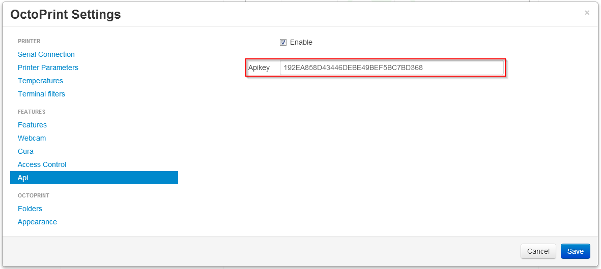
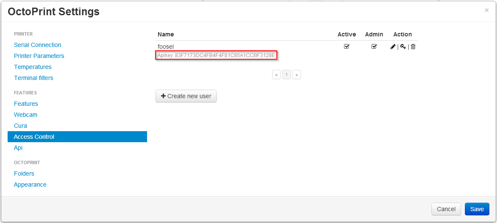
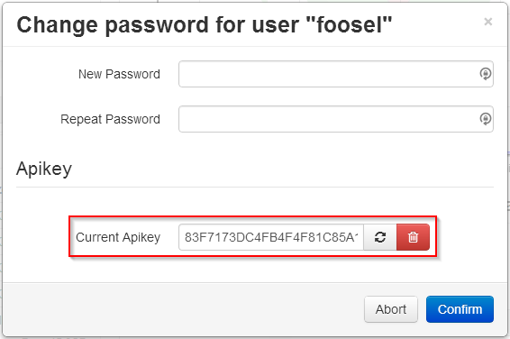
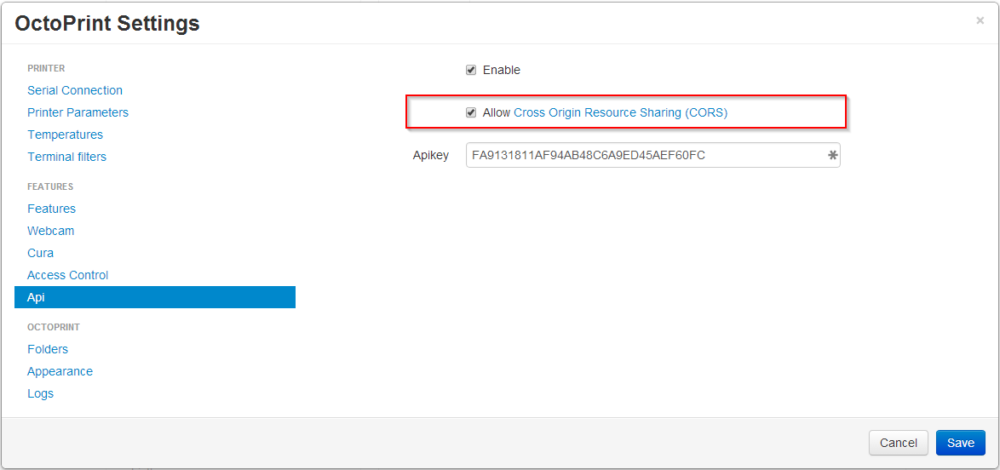

.. _sec-api-general:

*******************
General information
*******************

.. contents::

.. _sec-api-general-authorization:

Authorization
=============

If :ref:`Access Control <sec-features-access_control>` is enabled OctoPrint's API expects an API key to be supplied with each request. This API
key can be either the globally configured one, a user specific one or an app and user specific one as generated by the
authorization workflow implemented by the bundled :ref:`Application Keys Plugin <sec-bundledplugins-appkeys>` (since 1.3.10).

Clients are advised to implement the :ref:`Application Keys Plugin workflow <sec-bundledplugins-appkeys-workflow>` first and
fallback on directing the user to manually supply the the user specific API key. The global key should rarely be used.

The API key must either be supplied in the custom HTTP header ``X-Api-Key``, e.g.

.. sourcecode:: http

   GET /api/files HTTP/1.1
   Host: example.com
   X-Api-Key: abcdef...

or as a ``Bearer`` token in the ``Authorization`` header, e.g.

.. sourcecode:: http

   GET /api/files HTTP/1.1
   Host: example.com
   Authorization: Bearer abcdef...

For testing purposes it is also possible to supply the API key via a query parameter ``apikey``, e.g.

.. sourcecode:: http

   GET /api/files?apikey=abcdef... HTTP/1.1
   Host: example.com

Please be advised that clients should use the header field variant if at all possible.

If the key is missing or invalid, OctoPrint will treat the request as it would any unauthenticated anonymous request to the endpoint.
That means that any requests without or with an invalid API key targeting other API endpoints than :ref:`Login <sec-api-general-login>`
will be denied with a :http:statuscode:`403`.

.. warning::

   If :ref:`Access Control <sec-features-access_control>` is disabled, OctoPrint will treat any unauthenticated anonymous requests and thus also requests
   with an invalid or outright missing API key as requests with full admin rights!

.. note::

   The API key requirements changed in 1.3.11. Up to that version, even if Access Control was disabled, all requests needed to
   be supplied with an API Key. To make the webinterface work under these circumstances, an unauthenticated anonymous API key was injected into the
   HTML page and also available on the :ref:`Push API <sec-api-push>`. The presence and ready availability of this unauthenticated
   anonymous "UI API key" caused confusion and false alarm among users and didn't contribute to the security of the platform in a
   meaningful way, so it was finally abandoned in 1.3.11.

.. _fig-api-general-globalapikey:

   The global API key can be found in the "API" settings

.. _fig-api-general-userapikey:

   The user list in the "Access Control" settings shows the API key for users (if available)

.. _fig-api-general-changepassword:

   The API key options in the "Change password" dialog. Users can generate and revoke their custom API key here.

.. _sec-api-general-contenttype:

Content Type
============

If not otherwise stated, OctoPrint's API expects request bodies and issues response bodies as ``Content-Type: application/json``.

.. _sec-api-general-encoding:

Encoding
========

OctoPrint uses UTF-8 as charset.

That also includes headers in ``multipart/form-data`` requests, in order to allow the full UTF-8 range of characters
for uploaded filenames. If a ``multipart/form-data`` sub header cannot be decoded as UTF-8, OctoPrint will also attempt
to decode it as ISO-8859-1.

Additionally, OctoPrint supports replacing the ``filename`` field in the ``Content-Disposition`` header of a
multipart field with a ``filename*`` field following `RFC 5987, Section 3.2 <https://tools.ietf.org/html/rfc5987#section-3.2>`_,
which allows defining the charset used for encoding the filename. If both ``filename`` and ``filename*`` fields are
present, following the recommendation of the RFC ``filename*`` will be used.

For an example on how to send a request utilizing RFC 5987 for the ``filename*`` attribute, see the second example
in :ref:`Upload file <sec-api-fileops-uploadfile>`.

.. _sec-api-general-crossorigin:

Cross-origin requests
=====================

To make use of the OctoPrint API from websites other than the OctoPrint web interface,
cross-origin resource sharing (`CORS <http://en.wikipedia.org/wiki/Cross-origin_resource_sharing>`_) must be enabled.
This is the case even when the website in question is served from a different port on the same machine and on localhost.

To enable this feature, set the ``allowCrossOrigin`` key of the ``api`` section in ``config.yml`` to ``true`` or
check the corresponding checkbox in the API settings dialog.

.. code-block:: yaml

   api:
     enabled: true
     key: ...
     allowCrossOrigin: true

.. _fig-api-general-apicors:

   Support for CORS can be enabled in the "API" settings

.. warning::

   This means any browser page can send requests to the OctoPrint API. Authorization via an API-Key is still required however.

If CORS is not enabled you will get errors like the following::

   XMLHttpRequest cannot load http://localhost:8081/api/files. No 'Access-Control-Allow-Origin'
   header is present on the requested resource.

.. note::

   For security reasons, OctoPrint will not set the ``Access-Control-Allow-Credentials``
   header, even if CORS support is enabled. That means that cookies will not be sent by
   the browser to OctoPrint, effectively making it impossible to authenticate through
   the login mechanism (or reusing an existing login session). When accessing OctoPrint
   via CORS, you'll therefore always need to use an API key.

.. _sec-api-general-csrf:

CSRF Protection
===============

.. versionadded:: 1.8.3

To protect OctoPrint against `CSRF attacks <https://owasp.org/www-community/attacks/csrf>`_ against the non CORS affected upload endpoints, in case of browser session based authorization the API
is protected using the `Double Submit Cookie mitigation strategy <https://cheatsheetseries.owasp.org/cheatsheets/Cross-Site_Request_Forgery_Prevention_Cheat_Sheet.html#double-submit-cookie>`_.
On first page load of the UI, the login page or the recovery page, a ``csrf_token_P<port>`` or ``csrf_token_P<port>_R<root>`` cookie is set
that can be read via client-side JavaScript. All requests towards the API that are not ``GET``, ``HEAD`` or ``OPTIONS``
and rely on cookie based authorization (so not on an API key but rather an active login session) are required
to send both the ``csrf_token`` cookie as well as an ``X-CSRF-Token`` header containing its value.

.. note::

   If you use the :ref:`JS Client library <sec-jsclientlib>`, this will take care of doing the needful for you. Any code in the *Core UI* calling
   API functions through ``$.ajax`` or ``$.get`` or ``$.post`` will also take care of this for you. If you use another library for
   accessing OctoPrint's API in a browser context, you'll need to make sure to send the ``X-CSRF-Token`` header yourself. Examples for
   several JS frameworks can be found in the `OWASP cheatsheet on CSRF attacks <https://cheatsheetseries.owasp.org/cheatsheets/Cross-Site_Request_Forgery_Prevention_Cheat_Sheet.html#javascript-guidance-for-auto-inclusion-of-csrf-tokens-as-an-ajax-request-header>`_.
   Take a look at the implementations of ``OctoPrintClient.getCookie`` and ``OctoPrintClient.getHeaders`` in ``src/octoprint/static/js/client/base.js``
   for details on how to retrieve the cookie value and how to construct the header.

.. _sec-api-general-login:

Login
=====

.. http:post:: /api/login

   Creates a login session or retrieves information about the currently existing session ("passive login").

   Can be used in one of two ways: to login a user via username and password and create a persistent session (usually
   from a UI in the browser), or to retrieve information about the active user (from an existing session or an API key)
   via the ``passive`` flag.

   Will return a :http:statuscode:`200` with a :ref:`login response <sec-api-general-datamodel-login>` on successful
   login, whether active or passive. The active (username/password) login may also return a :http:statuscode:`403` in
   case of a username/password mismatch, unknown user or a deactivated account.

   .. warning::

      Previous versions of this API endpoint did return a :http:statuscode:`401` in case of a username/password
      mismatch or an unknown user. That was incompatible with basic authentication since it was a wrong use of
      the :http:statuscode:`401` code and got therefore changed as part of a bug fix.

   .. note::

      You cannot use this endpoint to login from a third party page via CORS, see above. You can however use it
      to retrieve user information via passive login with an API key (e.g. if you need the ``session`` to authenticate
      on the web socket.

   :json passive:  If present, performs a passive login only, returning information about the current user that's
                   active either through an existing session or the used API key
   :json user:     (active login only) Username
   :json pass:     (active login only) Password
   :json remember: (active login only) Whether to set a "remember me" cookie on the session
   :status 200:    Successful login
   :status 403:    Username/password mismatch, unknown user or deactivated account

.. _sec-api-general-logout:

Logout
======

.. http:post:: /api/logout

   Ends the current login session of the current user.

   Only makes sense in the context of browser based workflows.

   Will return a :http:statuscode:`204`.

   :status 204: No error

.. _sec-api-general-currentuser:

Current User
============

.. http:get:: /api/currentuser

   Retrieves information about the current user.

   Will return a :http:statuscode:`200` with a :ref:`current user object <sec-api-general-datamodel-currentuser>`
   as body.

   :status 200: No error

.. _sec-api-general-datamodel:

Data model
==========

.. _sec-api-general-datamodel-login:

Login response
--------------

The Login response is a :ref:`user record <sec-api-datamodel-access-users>` extended by the following fields:

.. list-table::
   :widths: 15 5 10 30
   :header-rows: 1

   * - Name
     - Multiplicity
     - Type
     - Description
   * - ``session``
     - 1
     - string
     - The session key, can be used to authenticate with the ``auth`` message on the :ref:`push API <sec-api-push>`.
   * - ``_is_external_client``
     - 1
     - boolean
     - Whether the client that made the request got detected as external from the local network or not.

.. _sec-api-general-datamodel-currentuser:

Current user
------------

.. list-table::
   :widths: 15 5 10 30
   :header-rows: 1

   * - Name
     - Multiplicity
     - Type
     - Description
   * - ``name``
     - 1
     - string
     - The id of the current user. Unset if guest.
   * - ``permissions``
     - 0..n
     - List of :ref:`permission records <sec-api-datamodel-access-permissions>`
     - The effective list of permissions assigned to the user
   * - ``groups``
     - 0..n
     - List of :ref:`permission records <sec-api-datamodel-access-groups>`
     - The list of groups assigned to the user
