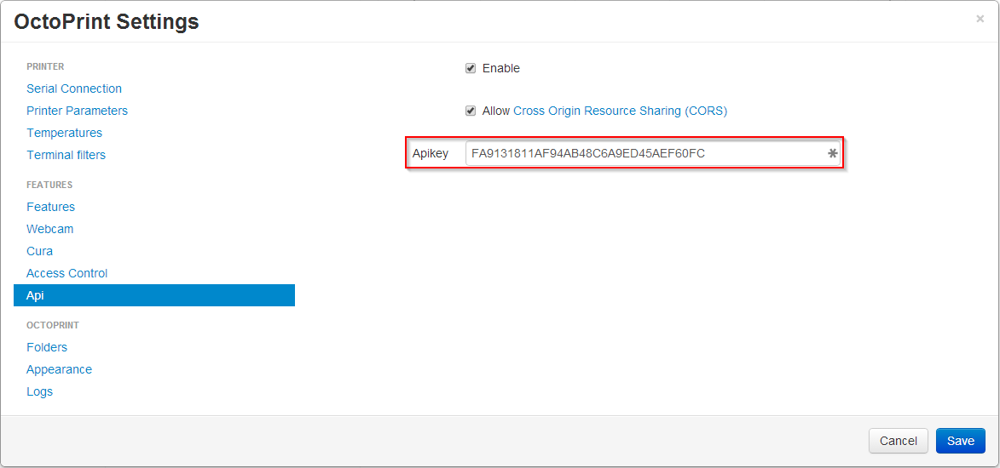

.. _sec-api-general:

*******************
General information
*******************

.. _sec-api-general-authorization:

Authorization
=============

OctoPrint's API expects an API key to be supplied with each request. This API key can be either the globally
configured one (compare :ref:`fig-api-general-globalapikey`) or a user specific one if "Access Control" is enabled
(compare :ref:`fig-api-general-userapikey`). Users are able to generate and revoke their custom API key via the
"Change password" dialog (compare :ref:`fig-api-general-changepassword`).

The API key must be supplied as query parameter ``apikey`` to each request, e.g.

.. sourcecode:: http

   GET /api/gcodefiles/local?apikey=abcdef HTTP/1.1
   Host: example.com

.. todo::
   Look into allowing to supply the API key as a custom ``Authorization`` scheme.

.. _fig-api-general-globalapikey:

   The global API key can be found in the "API" settings

.. _fig-api-general-userapikey:
.. figure:: ../images/settings-user-api-key.png
   :align: center
   :alt: User specific API key location in user list

   The user list in the "Access Control" settings shows the API key for users (if available)

.. _fig-api-general-changepassword:
.. figure:: ../images/change-password-api-key.png
   :align: center
   :alt: API key options in "Change password" dialog

   The API key options in the "Change password" dialog. Users can generate and revoke their custom API key here.

