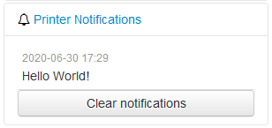

.. _sec-bundledplugins-action_command_notification:

Action Command Notification support
===================================

.. versionadded:: 1.4.1

The OctoPrint Action Command Notification Support Plugin comes bundled with OctoPrint.

It allows firmware to trigger notifications users with the ``PLUGIN_ACTION_COMMAND_NOTIFICATION_SHOW`` permission
using :ref:`action commands <sec-features-action_commands>` about relevant events. These notifications will be shown
in the sidebar and if configured also as popup messages. The notifications in the sidebar panel can also be cleared
by users with the ``PLUGIN_ACTION_COMMAND_NOTIFICATION_CLEAR`` permission.

.. _fig-bundledplugins-action_command_notification-example:

   A simple notification example triggered by the firmware

.. _sec-bundledplugins-action_command_notification-configuration:

Configuring the plugin
----------------------

The plugin supports the following configuration keys:

  * ``enable``: Whether to enable the support of notifications (enabled by default).
  * ``enable_popup``: Whether to enable the additional display of notifications as popups in the UI (disabled by default).

You can modify them either through the plugin's configuration dialog under Settings, or by directly editing ``config.yaml``.

.. _sec-bundledplugins-action_command_notification-action_commands:

Supported action commands
-------------------------

notification <message>
    Displays the notification ``<message>``

.. _sec-bundledplugins-action_command_notification-example:

Example communication with the firmware
---------------------------------------

To display the :ref:`above notification <fig-bundledplugins-action_command_notification-example>` the firmware sent this action command:

.. code-block:: none

   //action:notification Hello World!

.. _sec-bundledplugins-action_command_notification-sourcecode:

Source code
-----------

The source of the Action Command Prompt Notification plugin is bundled with OctoPrint and can be found in
its source repository under ``src/octoprint/plugins/action_command_notification``.
