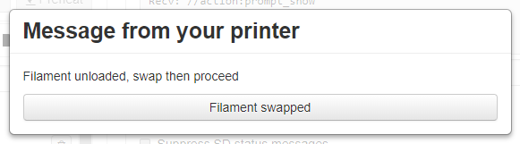
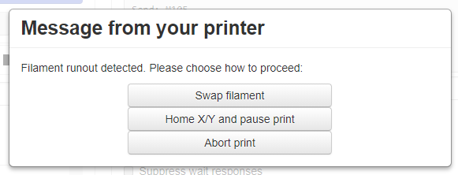

.. _sec-bundledplugins-action_command_prompt:

Action Command Prompt support
=============================

.. versionadded:: 1.3.9

The OctoPrint Action Command Prompt Support Plugin comes bundled with OctoPrint.

It allows firmware to trigger dialog prompts for logged in users using :ref:`action commands <sec-features-action_commands>`, e.g. to wait
for user acknowledgement or allow the user to choose between options, and also to close the dialog again
in case its no longer needed, e.g. due to the user proceeding on the printer's own controller.

The choice of the user can be communicated back to the firmware via a configurable GCODE command with a
placeholder for the selected option's index.

.. _fig-bundledplugins-action_command_prompt-example:

   A simple dialog example triggered by the firmware

.. _sec-bundledplugins-action_command_prompt-configuration:

Configuring the plugin
----------------------

The plugin supports the following configuration keys:

  * ``enable``: Whether to always enable (``always``), disable (``never``) or ``detect`` support.
  * ``enable_emergency_sending``: Will make the selection command be sent as an emergency command to jump the internal
    send queue and even be sent to the printer if it's not signaling to be able to received. Only done if this is true
    and the printer signals support for emergency command processing. Defaults to ``true``.
  * ``enable_signaling``: If enabled, will send the configured command with the ``P1`` parameter to the printer to
    signal prompt support of the host. Defaults to ``true``.
  * ``command``: The command to send to the firmware on choice, defaults to ``M876``.

You can modify them either through the plugin's configuration dialog under Settings, or by directly editing ``config.yaml``.

.. _sec-bundledplugins-action_command_prompt-action_commands:

Supported action commands
-------------------------

prompt_begin <message>
    Starts the definition of a prompt dialog. ``<message>`` is the message to display to the user. Will be ignored
    if a dialog is already defined.

prompt_choice <text>
    Defines a choice with the associated ``<text>``. Will be ignored if no dialog has been defined yet.

prompt_button <text>
    Same as ``prompt_choice``.

prompt_show
    Tells OctoPrint that the dialog is now fully defined and to prompt the user. Will be ignored if no dialog is
    defined yet.

prompt_end
    Tells OctoPrint that the dialog should now be closed (e.g. the user made the choice on the printer directly instead
    of through OctoPrint). Will be ignored if no dialog is defined yet.

.. _sec-bundledplugins-action_command_prompt-example:

Example communication with the firmware
---------------------------------------

To display the :ref:`above dialog <fig-bundledplugins-action_command_prompt-example>` the firmware sent these action commands:

.. code-block:: none

   //action:prompt_begin Filament unloaded, swap then proceed
   //action:prompt_choice Filament swapped
   //action:prompt_show

If the user clicks the button, OctoPrint will send back ``M876 S0`` (0-based index).

A more complicated example with three options would be the following:

.. code-block:: none

   //action:prompt_begin Filament runout detected. Please choose how to proceed:
   //action:prompt_choice Swap filament
   //action:prompt_choice Home X/Y and pause print
   //action:prompt_choice Abort print
   //action:prompt_show

This would produce the following output:

.. _fig-bundledplugins-action_command_prompt-example2:

   Another dialog example triggered by the firmware

If the user selects "Abort print", OctoPrint will send ``2`` as selected choice.

.. _sec-bundledplugins-action_command_prompt-sourcecode:

Source code
-----------

The source of the Action Command Prompt Support plugin is bundled with OctoPrint and can be found in
its source repository under ``src/octoprint/plugins/action_command_prompt``.
