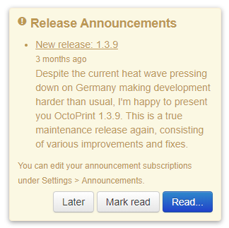
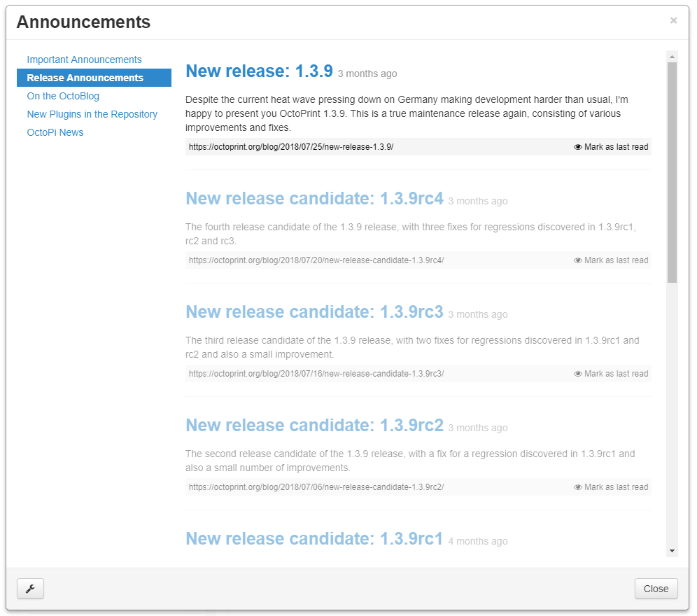
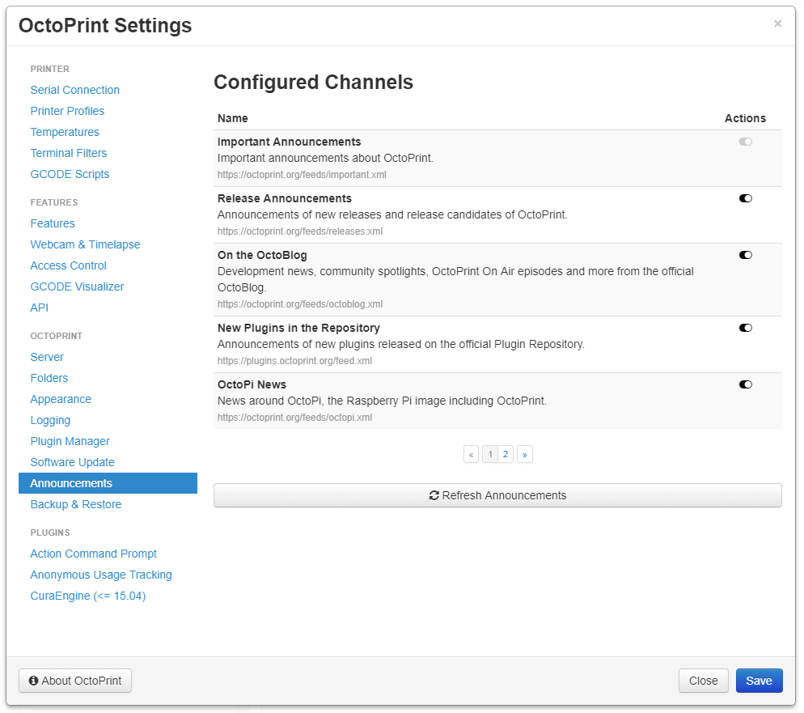

.. _sec-bundledplugins-announcements:

Announcement Plugin
===================

The OctoPrint Announcement Plugin comes bundled with OctoPrint (starting with 1.2.11).

It displays announcements fetched from OctoPrint's websites, such as important updates, release announcements, new
plugins and similar. Through some manual configuration via ``config.yaml`` it also allows adding additional channels
via RSS or Atom feed URLs.

.. _fig-bundledplugins-announcements-example1:

   An example notification from the Announcement Plugin.

.. _fig-bundledplugins-announcements-example2:

   The Announcement Plugin's reader dialog.

.. _fig-bundledplugins-announcements-settings:

   The Announcement Plugin's settings dialog.

.. _sec-bundledplugins-announcements-configuration:

Configuring the plugin
----------------------

The plugin allows enabling and disabling the preconfigured announcement channels via its settings dialog.

On top of that it's possible to add additional announcement channels (as RSS or Atom feed URLs) or change the
configuration of the existing channels through ``config.yaml``.

The available configuration keys are:

  * ``channels``: Configured announcement channels. A mapping from a unique identifier to a configuration structure
    that follows this format:

    * ``name``: Name of the channel, used e.g. in the title of the displayed notifications.
    * ``description``: Description of the channel.
    * ``priority``: ``1`` for high priority announcements (red notification), ``2`` for regular ones (yellow notification).
    * ``type``: Currently unused.
    * ``url``: URL for the feed acting as notification source, must be RSS or Atom format.

  * ``enabled_channels``: List of identifiers of enabled channels.
  * ``forced_channels``: List of identifiers of channels that cannot be disabled (currently only ``_important`` which is used sparingly).
  * ``channel_order``: List of channel identifiers in the order they should appear in the UI.
  * ``ttl``: Time to live of the channel cache in minutes (default: 6 hours).
  * ``display_limit``: Limit of items to display per channel (default: 3).
  * ``summary_limit``: Limit of characters to display from each channel entry (default: 300).

.. _sec-bundledplugins-announcements-sourcecode:

Source code
-----------

The source of the Announcement plugin is bundled with OctoPrint and can be found in
its source repository under ``src/octoprint/plugins/announcements``.
