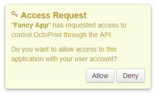
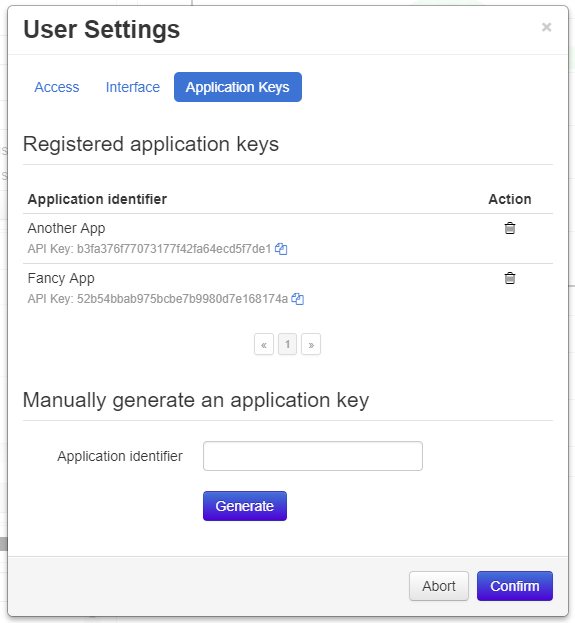
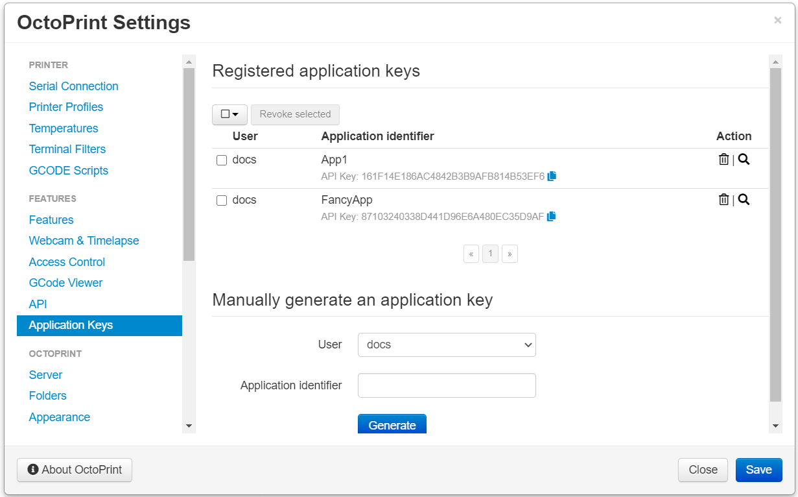

.. _sec-bundledplugins-appkeys:

Application Keys Plugin
=======================

.. versionadded:: 1.3.10

The OctoPrint Application Keys Plugin comes bundled with OctoPrint.

It implements a workflow for third party apps or clients to obtain an application specific API key from OctoPrint to interact with it
on a user's behalf, via confirmation of the user through OctoPrint's web interface. Existing keys can be managed
on a per-user base as well as globally by administrators.

.. _fig-bundledplugins-appkeys-confirmation:

   The plugin's confirmation generated for a new application key request.

.. _fig-bundledplugins-appkeys-user_settings:

   Users can manage the application specific API keys registered to their account via their user settings.

.. _fig-bundledplugins-appkeys-settings:

   Administrators can manage all application specific API keys registered to any user.

.. _sec-bundledplugins-appkeys-workflow:

Workflow
--------

The workflow to receive an API key for a third party client/an app via the Application Keys Plugin should consist
of the following steps:

  1. The User opens the App and gets prompted to enter or select an instance URL. Optionally (recommended!) the User also
     enters their username which is also their user ID into the App.
  2. The App :ref:`probes for workflow support <sec-bundledplugins-appkeys-api-probe>` on the Server. If this request
     doesn't get an HTTP :http:statuscode:`204` the App needs to direct the user to an alternative manual workflow
     (copy-paste API key) and abort this one. Otherwise it proceeds to the next step.
  3. The App sends an :ref:`Authorization request <sec-bundledplugins-appkey-datamodel-authrequest>` to the Server to start the
     authorization process.
  4. The Server triggers a confirmation dialog for the User on the Webinterface (unused here) and returns an endpoint to the
     App to poll for a decision in the ``Location`` header of an HTTP :http:statuscode:`201`
     and an :ref:`Authorization response <sec-bundledplugins-appkey-datamodel-authresponse>` (unused here).
  5. The App uses the obtained request specific endpoint to poll for a decision every second. An HTTP :http:statuscode:`202`
     signals that no decision has been made yet.
  6. The User either accepts or denies the access request which makes the Webinterface send a
     :ref:`decision request <sec-bundledplugins-appkey-datamodel-decisionrequest>` to the Server.
  7. If the User accepted the request, the App receives an HTTP :http:statuscode:`200` with an attached
     :ref:`API key response <sec-bundledplugins-appkey-datamodel-keyresponse>`. If they deny it, the App will receive
     an HTTP :http:statuscode:`404`.

.. mermaid::

   sequenceDiagram
      participant User
      participant App
      participant Webinterface
      participant Server

      note over User, Server: Step 1, 2 & 3

      User->>App: enters URL of instance to connect to and optional user_id

      App->>Server: GET /plugin/appkeys/probe

      alt Workflow unsupported

      Server->>App: 404
      App->>User: alternative workflow, copy-paste key manually

      else Workflow supported

      App->>Server: POST /plugin/appkeys/request, (app_name, user_id)

      note over User, Server: Step 4

      Server-->>Webinterface: plugin message for "appkeys" w/ (app_name, user_token, user_id)
      Webinterface-->>User: Display confirmation dialog
      Server->>App: 201, Location: /plugin/appkeys/request/<app_token>

      note over User, Server: Step 5

      loop Poll for decision
      App->>Server: GET /plugin/appkeys/request/<app_token>
      Server->>App: 202
      end

      note over User, Server: Step 6 & 7

      alt User accepts

      User-->>Webinterface: Allow access
      Webinterface->>Server: POST /plugin/appkeys/decision/<user_token>, (True)
      Server->>Webinterface: 204
      App->>Server: GET /plugin/appkeys/request/<app_token>
      Server->>App: 200, api_key

      else User denies

      User-->>Webinterface: Deny access
      Webinterface->>Server: POST /plugin/appkeys/decision/<user_token>, (False)
      Server->>Webinterface: 204
      App->>Server: GET /plugin/appkeys/request/<app_token>
      Server->>App: 404

      end

      end

.. _sec-bundledplugins-appkeys-workflow-authdialog:

Workflow with redirect to auth dialog
-------------------------------------

.. versionadded:: 1.8.0

Instead of asking the user to open the full blown OctoPrint interface to confirm the request,
since OctoPrint 1.8.0 there also exists the alternative of redirecting the user to a
basic auth dialog that allows logging in and confirming the request in a light-weight
dialog. To implementat that, follow these steps:

  1. The User opens the App and gets prompted to enter or select an instance URL. Optionally (recommended!) the User also
     enters their username which is also their user ID into the App.
  2. The App :ref:`probes for workflow support <sec-bundledplugins-appkeys-api-probe>` on the Server. If this request
     doesn't get an HTTP :http:statuscode:`204` the App needs to direct the user to an alternative manual workflow
     (copy-paste API key) and abort this one. Otherwise it proceeds to the next step.
  3. The App sends an :ref:`Authorization request <sec-bundledplugins-appkey-datamodel-authrequest>` to the Server to start the
     authorization process.
  4. The Server triggers a confirmation dialog for the User on the Webinterface (unused here) and returns an endpoint to the
     App to poll for a decision in the ``Location`` header of an HTTP :http:statuscode:`201`
     and an :ref:`Authorization response <sec-bundledplugins-appkey-datamodel-authresponse>`.
  5. The App opens a browser window with the provided `auth_dialog` URL for the user to log in and confirm the request. At the
     same time the App also uses the obtained request specific endpoint to poll for a decision every second. An HTTP :http:statuscode:`202`
     signals that no decision has been made yet.
  6. The User logs in and either accepts or denies the access request which makes the auth dialog send a
     :ref:`decision request <sec-bundledplugins-appkey-datamodel-decisionrequest>` to the Server.
  7. If the User accepted the request, the App receives an HTTP :http:statuscode:`200` with an attached
     :ref:`API key response <sec-bundledplugins-appkey-datamodel-keyresponse>`. If they deny it, the App will receive
     an HTTP :http:statuscode:`404`.

.. mermaid::

   sequenceDiagram
      participant User
      participant App
      participant Auth Dialog
      participant Server

      note over User, Server: Step 1, 2 & 3

      User->>App: enters URL of instance to connect to and optional user_id

      App->>Server: GET /plugin/appkeys/probe

      alt Workflow unsupported

      Server->>App: 404
      App->>User: alternative workflow, copy-paste key manually

      else Workflow supported

      App->>Server: POST /plugin/appkeys/request, (app_name, user_id)

      note over User, Server: Step 4

      Server->>App: 201, Location: /plugin/appkeys/request/<app_token>, auth_dialog: <auth_dialog>

      note over User, Server: Step 5

      App-->>Auth Dialog: open new browser window with auth_dialog URL

      loop Poll for decision
      App->>Server: GET /plugin/appkeys/request/<app_token>
      Server->>App: 202
      end

      note over User, Server: Step 6 & 7

      User->>Auth Dialog: Logs in

      alt User accepts

      User-->>Auth Dialog: Allow access
      Auth Dialog->>Server: POST /plugin/appkeys/decision/<user_token>, (True)
      Server->>Auth Dialog: 204
      App->>Server: GET /plugin/appkeys/request/<app_token>
      Server->>App: 200, api_key

      else User denies

      User-->>Auth Dialog: Deny access
      Auth Dialog->>Server: POST /plugin/appkeys/decision/<user_token>, (False)
      Server->>Auth Dialog: 204
      App->>Server: GET /plugin/appkeys/request/<app_token>
      Server->>App: 404

      end

      end

.. _sec-bundledplugins-appkeys-api:

API
---

.. _sec-bundledplugins-appkeys-api-probe:

Probe for workflow support
..........................

.. http:get:: /plugin/appkeys/probe

   Probes for support of the workflow.

   Normally returns an HTTP :http:statuscode:`204`, indicating workflow availability. If a different status code is returned
   (usually an HTTP :http:statuscode:`404`), the plugin is disabled or not installed. Fall back to manual api key exchange.

   :status 204: the workflow is supported

.. _sec-bundledplugins-appkeys-api-startauthprocess:

Start authorization process
...........................

.. http:post:: /plugin/appkeys/request

   Starts the authorization process.

   Expects a :ref:`Authorization request <sec-bundledplugins-appkey-datamodel-authrequest>` as request body.

   The ``app`` parameter should be a human readable identifier to use
   for the application requesting access. It will be displayed to the user. Internally it will be used case insensitively,
   so ``My App`` and ``my APP`` are considered the same application identifiers.

   The optional ``user`` parameter should be used to limit the authorization process to a specified user. If the parameter
   is left unset, any user will be able to complete the authorization process and grant access to the app with their
   account. E.g. if a user ``me`` starts the process in an app, the app should request that name from the user and use
   it in the ``user`` parameter. OctoPrint will then only display the authorization request on browsers the user ``me``
   is logged in on.

   Returns a :ref:`Authorization response <sec-bundledplugins-appkey-datamodel-authresponse>`
   and HTTP :http:statuscode:`201` with the ``Location`` header set to the endpoint to poll for a decision.

   :json app: application identifier to use for the request, case insensitive
   :json user: optional user id to restrict the decision to the specified user
   :status 201: authorization process started, polling URL to query can be found in ``Location`` header

.. _sec-bundledplugins-appkeys-api-polldecision:

Poll for decision on existing request
.....................................

.. http:get:: /plugin/appkeys/request/<str:app_token>

   Endpoint generated per authorization request to poll for the result.

   Returns an HTTP :http:statuscode:`202` while no decision has been made yet, an HTTP :http:statuscode:`200` and
   a :ref:`Key response <sec-bundledplugins-appkey-datamodel-keyresponse>` if access has been granted and an
   HTTP :http:statuscode:`404` if the request has been denied or timed out.

   .. note::

      The request will be considered stale and deleted internally if the polling endpoint for it isn't called
      for more than 5s.

   :status 200: access granted, API key in response body
   :status 202: no decision has been made yet, continue polling
   :status 404: access denied or request timed out

.. _sec-bundledplugins-appkeys-api-decide:

Decide on existing request
..........................

.. http:post:: /plugin/appkeys/decision/<str:user_token>

   Endpoint to decide on the authorization request.

   Expects a :ref:`Decision request <sec-bundledplugins-appkey-datamodel-decisionrequest>` as request body.

   Returns an HTTP :http:statuscode:`204` on success.

   :json decision: boolean value to indicate whether to confirm (``True``) or deny (``False``) access
   :status 204: success

.. _sec-bundledplugins-appkeys-api-fetchlist:

Fetch list of existing application keys
.......................................

.. http:get:: /api/plugin/appkeys

   Fetches a list of existing application keys and pending requests registered in the system for the current user.

   If the additional optional parameter ``all`` is provided and the user has administrator rights, fetches a list
   of *all** application keys and pending requests registered in the system for any user.

   Returns a :http:statuscode:`200` with a :ref:`List response <sec-bundledplugins-appkey-datamodel-listreponse>` in the
   body upon success.

   :query all: Fetch all application keys and pending requests from all users. Requires administrator rights.

.. _sec-bundledplugins-appkeys-api-issuecommand:

Issue an application key command
................................

.. http:post:: /api/plugin/appkeys

   Application key commands allow revoking existing application keys and manually generating new ones. The available
   commands are:

   revoke
     Revokes an existing application key. Must belong to the user issuing the command, unless the user has admin rights
     in which case they make revoke any application key in the system. Expects the key in question as parameter ``key``.

   generate
     Generates a new application key for the user, using the application identifier provided as parameter ``app``.

   Upon success, a status code of :http:statuscode:`204` and an empty body is returned.

   Requires user rights.

   **Example revoke request**

   Revokes the (fictional) key ``aabbccddeeff112233445566``.

   .. sourcecode:: http

      POST /api/plugin/appkeys HTTP/1.1
      Host: example.com
      Content-Type: application/json
      X-Api-Key: abcdef...

      {
        "command": "revoke",
        "key": "aabbccddeeff112233445566"
      }

   .. sourcecode:: http

      HTTP/1.1 204 No Content

   **Example generate request**

   Generates a new key for application identifier "My awesome application 1.0".

   .. sourcecode:: http

      POST /api/plugin/appkeys HTTP/1.1
      Host: example.com
      Content-Type: application/json
      X-Api-Key: abcdef...

      {
        "command": "generate",
        "key": "My awesome application 1.0"
      }

   .. sourcecode:: http

      HTTP/1.1 204 No Content

   :json string command: The command to issue, either ``revoke`` or ``generate``
   :json string key:     ``revoke`` command: The key to revoke
   :json string app:     ``generate`` command: Application identifier for which to generate a key
   :statuscode 204:      No error
   :statuscode 400:      Invalid or missing parameter

.. _sec-bundledplugins-appkey-datamodel:

Data model
----------

.. _sec-bundledplugins-appkey-datamodel-authrequest:

Authorization request
.....................

.. list-table::
   :widths: 15 5 10 30
   :header-rows: 1

   * - Name
     - Multiplicity
     - Type
     - Description
   * - ``app``
     - 1
     - str
     - Application identifier to use for the request
   * - ``user``
     - 0..1
     - str
     - User identifier/name to restrict the request to

.. _sec-bundledplugins-appkey-datamodel-authresponse:

Authorization response
......................

.. list-table::
   :widths: 15 5 10 30
   :header-rows: 1

   * - Name
     - Multiplicity
     - Type
     - Description
   * - ``app_token``
     - 1
     - str
     - Application token to use to poll for the decision.
   * - ``auth_dialog``
     - 1
     - str
     - An URL with which a dedicated auth dialog can be used for the user to log into
       and authorize the request.

.. _sec-bundledplugins-appkey-datamodel-keyresponse:

Key response
............

.. list-table::
   :widths: 15 5 10 30
   :header-rows: 1

   * - Name
     - Multiplicity
     - Type
     - Description
   * - ``api_key``
     - 1
     - str
     - the API key generated for the application

.. _sec-bundledplugins-appkey-datamodel-decisionrequest:

Decision request
................

.. list-table::
   :widths: 15 5 10 30
   :header-rows: 1

   * - Name
     - Multiplicity
     - Type
     - Description
   * - ``decision``
     - 1
     - boolean
     - ``True`` if the access request it to be granted, ``False`` otherwise

.. _sec-bundledplugins-appkey-datamodel-listreponse:

List response
.............

.. list-table::
   :widths: 15 5 10 30
   :header-rows: 1

   * - Name
     - Multiplicity
     - Type
     - Description
   * - ``keys``
     - 1
     - list of :ref:`key list entries <sec-bundledplugins-appkey-datamodel-keylistentry>`
     - Keys registered in the system
   * - ``pending``
     - 1
     - list of :ref:`pending list entries <sec-bundledplugins-appkey-datamodel-pendinglistentry>`
     - Currently pending authorization requests

.. _sec-bundledplugins-appkey-datamodel-keylistentry:

Key list entry
..............

.. list-table::
   :widths: 15 5 10 30
   :header-rows: 1

   * - Name
     - Multiplicity
     - Type
     - Description
   * - ``api_key``
     - 1
     - str
     - API key
   * - ``app_id``
     - 1
     - str
     - Application identifier
   * - ``user_id``
     - 1
     - str
     - User ID of the key's owner

.. _sec-bundledplugins-appkey-datamodel-pendinglistentry:

Pending list entry
..................

.. list-table::
   :widths: 15 5 10 30
   :header-rows: 1

   * - Name
     - Multiplicity
     - Type
     - Description
   * - ``app_id``
     - 1
     - str
     - Application identifier
   * - ``user_id``
     - 0..1
     - str
     - optional: User ID of user who can grant or deny request
   * - ``user_token``
     - 1
     - str
     - Token to grant or deny request

.. _sec-bundledplugins-appkeys-jsclientlib:

JavaScript Client Library
-------------------------

.. js:function:: OctoPrintClient.plugins.appkeys.getKeys(opts)

   Retrieves registered keys and pending requests for the current user.

   See :ref:`Fetch list of existing application keys <sec-bundledplugins-appkeys-api-fetchlist>` for more details.

   :param object opts: Additional options for the request
   :returns Promise: A `jQuery Promise <http://api.jquery.com/Types/#Promise>`_ for the request's response

.. js:function:: OctoPrintClient.plugins.appkeys.getAllKeys(opts)

   Retrieves registered keys and pending requests for all users.

   Needs administrator rights.

   See :ref:`Fetch list of existing application keys <sec-bundledplugins-appkeys-api-fetchlist>` for more details.

   :param object opts: Additional options for the request
   :returns Promise: A `jQuery Promise <http://api.jquery.com/Types/#Promise>`_ for the request's response

.. js:function:: OctoPrintClient.plugins.appkeys.generateKey(app, opts)

   Generates a key for the given ``app`` and the current user.

   See :ref:`Issue an application key command <sec-bundledplugins-appkeys-api-issuecommand>` for details.

   :param string app: Application identifier
   :param object opts: Additional options for the request
   :returns Promise: A `jQuery Promise <http://api.jquery.com/Types/#Promise>`_ for the request's response

.. js:function:: OctoPrintClient.plugins.appkeys.revokeKey(key, opts)

   Revokes the given ``key``. The key must belong to the current user, or the current user must have administrator
   rights.

   See :ref:`Issue an application key command <sec-bundledplugins-appkeys-api-issuecommand>` for details.

   :param string key: Key to revoke
   :param object opts: Additional options for the request
   :returns Promise: A `jQuery Promise <http://api.jquery.com/Types/#Promise>`_ for the request's response

.. js:function:: OctoPrintClient.plugins.appkeys.decide(token, decision, opts)

   Decides on an existing authorization request.

   See :ref:`Decide on existing request <sec-bundledplugins-appkeys-api-decide>` for more details.

   :param string token: User token for which to make the decision, as pushed to the client via the socket.
   :param boolean decision: Whether to grant access (``true``) or not (``false``).
   :param object opts: Additional options for the request
   :returns Promise: A `jQuery Promise <http://api.jquery.com/Types/#Promise>`_ for the request's response

.. js:function:: OctoPrintClient.plugins.appkeys.probe(opts)

   Probes for workflow support.

   See :ref:`Probe for workflow support <sec-bundledplugins-appkeys-api-probe>` for more details.

   :param object opts: Additional options for the request
   :returns Promise: A `jQuery Promise <http://api.jquery.com/Types/#Promise>`_ for the request's response

.. js:function:: OctoPrintClient.plugins.appkeys.request(app, opts)

   Starts a new authorization request for the provided ``app`` identifier.

   See :ref:`Start authorization process <sec-bundledplugins-appkeys-api-startauthprocess>` for more details.

   :param object opts: Additional options for the request
   :returns Promise: A `jQuery Promise <http://api.jquery.com/Types/#Promise>`_ for the request's response

.. js:function:: OctoPrintClient.plugins.appkeys.requestForUser(app, user, opts)

   Starts a new authorization request for the provided ``app`` and ``user`` identifiers.

   See :ref:`Start authorization process <sec-bundledplugins-appkeys-api-startauthprocess>` for more details.

   :param object opts: Additional options for the request
   :returns Promise: A `jQuery Promise <http://api.jquery.com/Types/#Promise>`_ for the request's response

.. js:function:: OctoPrintClient.plugins.appkeys.checkDecision(token, opts)

   Polls for a decision on an existing authorization request identified by ``token``.

   See :ref:`Poll for decision on existing request <sec-bundledplugins-appkeys-api-polldecision>` for more details.

   :param object opts: Additional options for the request
   :returns Promise: A `jQuery Promise <http://api.jquery.com/Types/#Promise>`_ for the request's response

.. js:function:: OctoPrintClient.plugins.appkeys.authenticate(app, user, opts)

   Convenience function that probes for support, issues a request and then automatically starts polling for a decision
   on the returned polling endpoint every 1s, until either a positive or negative decision is returned. On success the
   returned promise is resolved with the generated API key as argument. If anything goes wrong or there is no support
   for the workflow, the promise is rejected.

   **Example usage**

   .. sourcecode:: javascript

      OctoPrint.plugins.appkeys.authenticate("My App", "some_user")
          .done(function(api_key) {
              console.log("Got our API key:", api_key);
          })
          .fail(function() {
              console.log("No API key for us");
          })

   :param string app: Application identifier
   :param string user: Optional user identifier
   :param object opts: Additional options for the request
   :returns Promise: A `jQuery Promise <http://api.jquery.com/Types/#Promise>`_ for the request's response

.. _sec-bundledplugins-appkeys-sourcecode:

Source code
-----------

The source of the Application Keys plugin is bundled with OctoPrint and can be found in
its source repository under ``src/octoprint/plugins/appkeys``.
