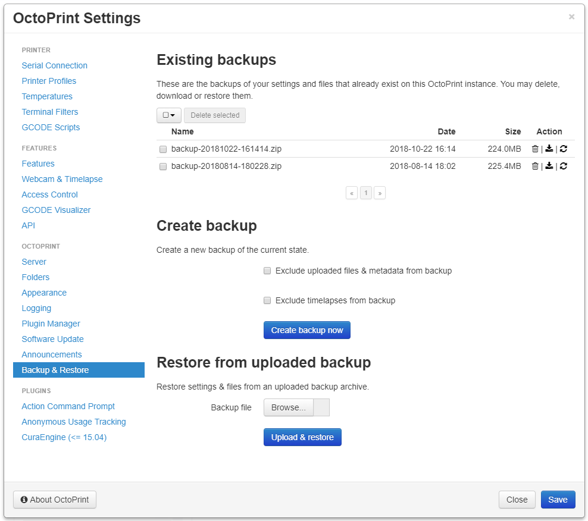

.. _sec-bundledplugins-backup:

Backup Plugin
=============

.. versionadded:: 1.3.10

The OctoPrint Backup Plugin comes bundled with OctoPrint (starting with 1.3.10).

It allows the creation and restoration [#1]_ of backups of OctoPrint's settings, data and installed plugins [#2]_.

This allows easy migration
to newly setup instances as well as making regular backups to prevent data loss.

.. _fig-bundledplugins-backup-settings:

   The plugin's settings panel with existing backups, the backup creation and restore sections.

As long as plugins adhere to the standard of storing their data and settings in OctoPrint's plugin data folders, their
data will be part of the backup. Note that the backups made by the Backup Plugin will *not* be part of any backups -
you'll need to persist the resulting zip files yourself!

.. _sec-bundledplugins-backup-configuration:

Configuring the plugin
----------------------

The plugin supports the following configuration keys:

  * ``restore_unsupported``: If the system you are installing OctoPrint on doesn't support restoring backups or you
    want to disable that feature for other reasons, set this to `true`. Alternatively you can also set the
    environment variable `OCTOPRINT_BACKUP_RESTORE_UNSUPPORTED` to `true`. OctoPrint will then disable the restore
    functionality. Under normal circumstances you should not have to touch this setting (OctoPrint will do its
    best to autodetect whether it's able to perform restores), thus it is not exposed in the Settings dialog.

.. _sec-bundledplugins-backup-cli:

Command line usage
------------------

The Backup Plugin implements a command line interface that allows creation and restoration of backups.
It adds two new commands, ``backup:backup`` and ``backup:restore``.

.. code-block:: none

   $ octoprint plugins backup:backup --help
     Initializing settings & plugin subsystem...
     Usage: octoprint plugins backup:backup [OPTIONS]

     Creates a new backup.

     Options:
       --exclude TEXT  Identifiers of data folders to exclude, e.g. 'uploads' to
                       exclude uploads or 'timelapse' to exclude timelapses.
       --help          Show this message and exit.

   $ octoprint plugins backup:restore --help
     Initializing settings & plugin subsystem...
     Usage: octoprint plugins backup:restore [OPTIONS] PATH

       Restores an existing backup from the backup zip provided as argument.

       OctoPrint does not need to run for this to proceed.

     Options:
       --help  Show this message and exit.

.. note::

   The ``backup:backup`` command can be useful in combination with a cronjob to create backups in regular intervals.

.. _sec-bundledplugins-backup-events:

Events
------

*Events will not be triggered by CLI operations.*

plugin_backup_backup_created
  A new backup was created. On the push socket only available with a valid login session with ``Backup Access``
  permission.

  Payload:

    * ``name``: the name of the backup
    * ``path``: the path to the backup
    * ``excludes``: the list of parts excluded from the backup

  .. versionadded:: 1.5.0

.. _sec-bundledplugins-backup-hooks:

Hooks
-----

.. _sec-bundledplugins-backup-hooks-excludes:

octoprint.plugin.backup.additional_excludes
+++++++++++++++++++++++++++++++++++++++++++

.. py:function:: additional_excludes_hook(excludes, *args, **kwargs)

   .. versionadded:: 1.5.0

   Use this to provide additional paths on your plugin's data folder to exclude from the backup. Your handler also
   get a list of currently excluded sub paths in the base folder, so you can react to them. E.g. exclude things
   in your data folder that relate to uploaded GCODE files if `uploads` is excluded, or exclude things that relate
   to timelapses if `timelapse` is excluded.

   Expects a list of additional paths relative to your plugin's data folder. If you return a single `.`, your whole
   plugin's data folder will be excluded from the backup.

   **Example 1**

   The following example plugin will create two files ``foo.txt`` and ``bar.txt`` in its data folder, but flag
   ``foo.txt`` as not to be backed up.

   .. code-block:: python

      import octoprint.plugin

      import os
      import io

      class BackupExcludeTestPlugin(octoprint.plugin.OctoPrintPlugin):
          def initialize(self):
              with io.open(os.path.join(self.get_plugin_data_folder(), "foo.txt"), "w", encoding="utf-8") as f:
                  f.write("Hello\n")
              with io.open(os.path.join(self.get_plugin_data_folder(), "bar.txt"), "w", encoding="utf-8") as f:
                  f.write("Hello\n")

          def additional_excludes_hook(self, excludes, *args, **kwargs):
              return ["foo.txt"]

      __plugin_implementation__ = BackupExcludeTestPlugin()
      __plugin_hooks__ = {
          "octoprint.plugin.backup.additional_excludes": __plugin_implementation__.additional_excludes_hook
      }

   **Example 2**

   In this example the plugin will create a file ``foo.txt`` in its data folder and flag its whole data folder as excluded from the
   backup if uploaded GCODE files are also excluded:

   .. code-block:: python

      import octoprint.plugin

      import os
      import io

      class BackupExcludeTestPlugin(octoprint.plugin.OctoPrintPlugin):
          def initialize(self):
              with io.open(os.path.join(self.get_plugin_data_folder(), "foo.txt"), "w", encoding="utf-8") as f:
                  f.write("Hello\n")

          def additional_excludes_hook(self, excludes, *args, **kwargs):
              if "uploads" in excludes:
                 return ["."]
              return []

      __plugin_implementation__ = BackupExcludeTestPlugin()
      __plugin_hooks__ = {
          "octoprint.plugin.backup.additional_excludes": __plugin_implementation__.additional_excludes_hook
      }

   :param excludes list: A list of paths already flagged as excluded in the backup
   :return: A list of paths to exclude, relative to your plugin's data folder
   :rtype: list

Helpers
-------

.. _sec-bundledplugins-backup-helpers:

The Backup plugin exports two helpers that can be used by other plugins or internal methods
from within OctoPrint, without going via the API.

.. _sec-bundledplugins-backup-helpers-create_backup:

create_backup
+++++++++++++

.. autofunction:: octoprint.plugins.backup.BackupPlugin.create_backup_helper

.. _sec-bundledplugins-backup-helpers-delete_backup:

delete_backup
+++++++++++++

.. autofunction:: octoprint.plugins.backup.BackupPlugin.delete_backup_helper

.. _sec-bundledplugins-backup-sourcecode:

Source code
-----------

The source of the Backup plugin is bundled with OctoPrint and can be found in
its source repository under ``src/octoprint/plugins/backup``.

.. [#1] Note that restore is currently unavailable on OctoPrint servers running on Windows. Additionally they may be
        disabled through a config flag or an environment variable as documented :ref:`here <sec-bundledplugins-backup-configuration>`.
.. [#2] Note that only those plugins that are available on `OctoPrint's official plugin repository <https://plugins.octoprint.org>`_
        can be automatically restored. If you have plugins installed that are not available on there you'll get their
        names and - if available - homepage URL displayed after restore in order to be able to manually reinstall them.
