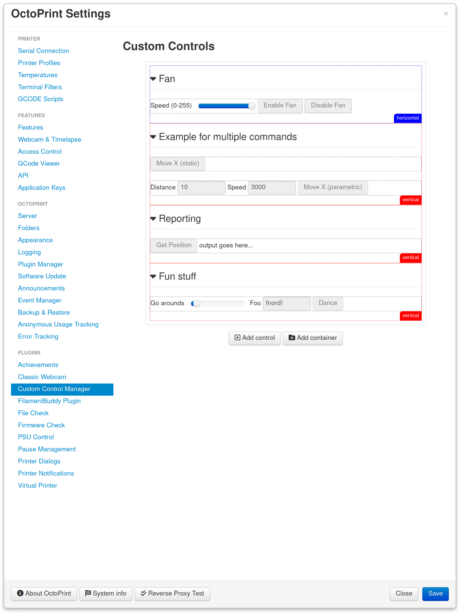

.. _sec-bundledplugins-customcontrolmanager:

Custom Control Manager
======================

.. versionadded:: 1.11.0

The Custom Control Manager plugin allows visual configuration of :ref:`custom controls <sec-features-custom_controls>`.

It is a replacement for the no longer maintained third-party `Custom Control Editor plugin <https://plugins.octoprint.org/plugins/customControl/>`_.

.. _fig-bundledplugins-customcontrolmanager-settings:

   The Custom Control Manager settings dialog in action

.. _sec-bundledplugins-customcontrolmanager-configuration:

Configuring the plugin
----------------------

The plugin doesn't need any configuration. It only utilizes the :ref:`custom controls feature of OctoPrint itself <sec-features-custom_controls>`.

.. _sec-bundledplugins-customcontrolmanager-sourcecode:

Source code
-----------

The source of the Custom Control Manager plugin is bundled with OctoPrint and can be found in
its source repository under ``src/octoprint/plugins/customcontrolmanager``.
