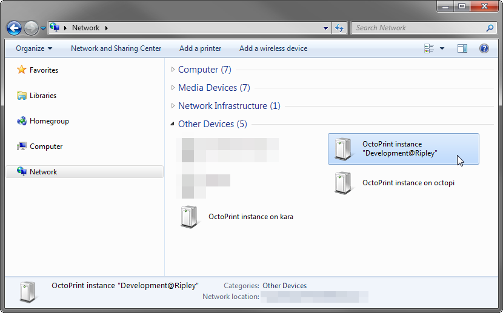

.. _sec-bundledplugins-discovery:

Discovery Plugin
================

The OctoPrint Discovery Plugin comes bundled with OctoPrint (starting with 1.2.0).

It allows discovery of the OctoPrint instances via SSDP/UPNP. If
`pybonjour <https://pypi.python.org/pypi/pybonjour>`_ is installed OctoPrint
will additionally support discovery via ZeroConf, also known as Bonjour or Avahi.

The SSDP/UPNP support allows OctoPrint to announce itself to machines on the same
network running Microsoft Windows. You will be able to just double click on the
OctoPrint instance icon in "Networks > Other Devices" in your Windows Explorer,
which will take you directly to the web frontend.

The ZeroConf support allows OctoPrint to announce itself to Safari on MacOS X
on the same network.

Linux users should install `Avahi <http://avahi.org>`_ and can then use one
of the various Avahi browsers (e.g. ``avahi-browse`` for the command
line) to scan for available instances.

.. _fig-bundledplugins-discovery-windowsexplorer:

   Various discovered OctoPrint instances in Windows Explorer

.. _sec-bundledplugins-discovery-firststeps:

First Steps
-----------

.. _sec-bundledplugins-discovery-firststeps-pybonjour:

Installing pybonjour
++++++++++++++++++++

.. note::

   OctoPi versions 0.12.0 and later already come with pybonjour installed and ready to go,
   you don't need to perform these steps there.

.. note::

   Currently there are no releases for pybonjour available on the Python Package Index PyPI. The latest pybonjour
   release is still available in the `Google Code Archive <https://storage.googleapis.com/google-code-archive-downloads/v2/code.google.com/pybonjour/pybonjour-1.1.1.tar.gz>`_.
   Since that URL is hilariously long though, a shortened version is provided with https://goo.gl/SxQZ06 and
   used in the installation instructions below.

In order for the Zeroconf discovery to work, the
`pybonjour package <https://pypi.python.org/pypi/pybonjour>`_ needs to be available
to the Python installation running OctoPrint.

It can be installed via ``pip``. Let's assume you installed OctoPrint manually
into some folder ``~/OctoPrint``. You executed ``python setup.py install`` within a
virtualenv in the same folder called ``venv``. In order to install ``pybonjour``
so it will be available to OctoPrint you'll need to do the following::

    venv/bin/pip install https://goo.gl/SxQZ06

**Linux users:** You'll need to install an additional dependency for this to work, the
libdnssd compatibility layer for libavahi. On Debian/Ubuntu that can be achieved with::

    sudo apt-get install libavahi-compat-libdnssd-dev

.. _sec-bundledplugins-discovery-configuration:

Configuring the plugin
----------------------

The plugin supports the following configuration keys:

  * ``publicPort``: Public port number OctoPrint is reachable under,
    optional, if not set the port OctoPrint itself was started under will be used
  * ``pathPrefix``: Path prefix OctoPrint is running under, optional, if not
    set ``/`` will be used
  * ``useSsl``: ``true`` if OctoPrint should be called via HTTPS, ``false`` otherwise
  * ``httpUsername``: HTTP Basic Auth username OctoPrint is reachable with, optional
  * ``httpPassword``: HTTP Basic Auth password OctoPrint is reachable with, optional
  * ``upnpUuid``: uPNP UUID used for SSDP service announcements, usually you will
    not have to touch this, will be autogenerated if not set
  * ``zeroConf``: A list of additional services to announce via ZeroConf, optional,
    see below.
  * ``model``:

    * ``name``: Name of the device model OctoPrint is running on, optional
    * ``description``: Description of the device model OctoPrint is running on,
      optional, used only for SSDP
    * ``number``: Model number of the device OctoPrint is running on, optional,
      used only for SSDP
    * ``url``: URL with further details about the device OctoPrint is running on,
      optional, used only for SSDP
    * ``serial``: Serial number of the device OctoPrint is running on, optional,
      used only for SSDP
    * ``vendor``: Vendor of the device OctoPrint is running on, optional
    * ``vendorUrl``: URL with further details about the vendor of the device
      OctoPrint is running on, optional, used only for SSDP

.. _sec-bundledplugins-discovery-configuration-furtherzeroconf:

Further ZeroConf Services
+++++++++++++++++++++++++

The configuration also allows specifying additional ZeroConf service OctoPrint should
announce itself as. Each entry supports the following fields:

  * ``service``: The service to announce, this is the only obligatory field
  * ``name``: The name to announce, defaults to the OctoPrint instance name if not
    supplied
  * ``port``: The port to announce, defaults to the OctoPrint was started under if
    not supplied
  * ``txt_record``: The TXT record to publish with the DNS-SD record, should be a
    map of keys and associated values.

.. _sec-bundledplugins-discovery-configuration-example:

Example
+++++++

The following snippet is a valid configuration example for the discovery plugin in OctoPrint's
:ref:`config.yaml <sec-configuration-config_yaml>`:

.. code-block:: yaml

   plugins:
     discovery:
       publicPort: 443
       useSsl: true
       zeroConf:
       - service: _someservice._tcp
         port: 1234
         txt_record:
           field1: value1
           field2: value2
       model:
         name: Some Model
         vendor: Some Vendor

.. _sec-bundledplugins-discovery-announcedservices:

Announced Services
------------------

.. _sec-bundledplugins-discovery-announcedservices-http:

ZeroConf Service ``_http._tcp``
+++++++++++++++++++++++++++++++

If :ref:`pybonjour <sec-bundledplugins-discovery-firststeps-pybonjour>` is
correctly installed, OctoPrint will announce itself on the network via ZeroConf
as service ``_http._tcp``, with the TXT record containing the standard fields.

See also `this documentation of _http._tcp TXT records <http://www.dns-sd.org/txtrecords.html>`_
for more information.

.. _sec-bundledplugins-discovery-announcedservices-octoprint:

ZeroConf Service ``_octoprint._tcp``
++++++++++++++++++++++++++++++++++++

If :ref:`pybonjour <sec-bundledplugins-discovery-firststeps-pybonjour>` is
correctly installed, OctoPrint will announce itself on the network via ZeroConf
as service ``_octoprint._tcp``. The TXT record may contain the following fields:

  * ``path``: path prefix to actual OctoPrint instance, inherited from ``_http._tcp``
  * ``u``: username if HTTP Basic Auth is used, optional, inherited from ``_http._tcp``
  * ``p``: password if HTTP Basic Auth is used, optional, inherited from ``_http._tcp``
  * ``version``: OctoPrint software version
  * ``api``: OctoPrint API version
  * ``model``: Model of the device that is running OctoPrint, optional
  * ``vendor``: Vendor of the device that is running OctoPrint, optional

Clients should construct the full path to the OctoPrint instance from this information
following this scheme::

    http://[u[:p]@]host:port[path]

See also `this documentation of _http._tcp TXT records <http://www.dns-sd.org/txtrecords.html>`_
for more information.

.. _sec-bundledplugins-discovery-sourcecode:

Source code
-----------

The source of the Discovery plugin is bundled with OctoPrint and can be found in
its source repository under ``src/octoprint/plugins/discovery``.
