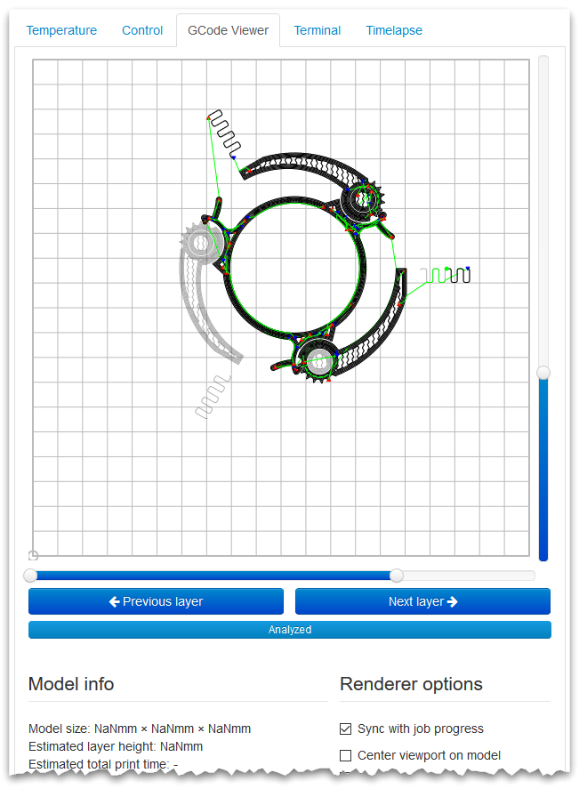

.. _sec-bundledplugins-gcodeviewer:

GCode Viewer Plugin
===================

.. versionchanged:: 1.4.1

The GCode Viewer plugin provides a GCode viewer based on `Alex Ustyantsev's work <https://github.com/hudbrog/gCodeViewer>`_.

.. _fig-bundledplugins-gcodeviewer-example:

   An example of the GCode Viewer in action.

The viewer has been included in OctoPrint ever since the first releases back in 2013, however as of
OctoPrint 1.4.1 it has been extracted into its own bundled plugin.

.. _sec-bundledplugins-gcodeviewer-configuration:

Configuring the plugin
----------------------

The plugin supports the following configuration keys:

  * ``mobileSizeThreshold``: Whether to also enable tracking on unreleased OctoPrint versions (anything not stable releases
    or release candidates). Defaults to ``false``.
  * ``sizeThreshold``: Unique instance identifier, auto generated on first activation
  * ``skipUntilThis``: If this string is provided the GCode Viewer will search for this string, and if found, skip all gcode up until this string. This can be used to skip prime nozzle gcode in the preview

.. _sec-bundledplugins-gcodeviewer-sourcecode:

Source Code
-----------

The source of the GCode Viewer plugin is bundled with OctoPrint and can be
found in its source repository under ``src/octoprint/plugins/gcodeviewer``.
