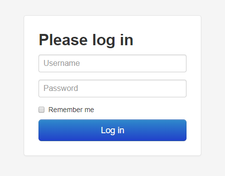

.. _sec-bundledplugins-loginui:

Login UI
========

The Login UI plugin has been bundled since OctoPrint 1.4.0 and replaces the ForceLogin plugin bundled with prior
versions since 1.3.10.

If anonymous read-only access is disabled in the :ref:`Access Control settings <sec-features-access_control>`
it provides a stand alone login dialog that gets displayed instead of OctoPrint's regular UI.

.. _fig-bundledplugins-loginui:

   OctoPrint's login dialog.

The plugin allows theming of the dialog through :ref:`a plugin hook <sec-bundledplugins-loginui-hooks-theming>`.

.. warning::

   Since the plugin is absolutely required for the case of anonymous read-only access because in this case the
   UI itself could not even fully initialize due to a lack of permissions required to do so, it is hidden in the plugin
   manager and cannot be disabled through that.

.. _sec-bundledplugins-loginui-hooks:

Hooks
-----

.. _sec-bundledplugins-loginui-hooks-theming:

octoprint.plugin.loginui.theming
~~~~~~~~~~~~~~~~~~~~~~~~~~~~~~~~

.. py:function:: loginui_theming_hook(*args, **kwargs)

   Support theming of the login dialog, just in case the core UI is themed as well. Use to return a list of additional
   CSS file URLs to inject into the login dialog HTML.

   Example usage by a plugin:

   .. code-block:: python

      def loginui_theming():
          from flask import url_for
          return [url_for("plugin.myplugin.static", filename="css/loginui_theme.css")]

      __plugin_hooks__ = {
          "octoprint.plugin.loginui.theming": loginui_theming
      }

   Only a list of ready-made URLs to CSS files is supported, neither LESS nor JS. Best use
   url_for like in the example above to be prepared for any configured prefix URLs.

   :return: A list of additional CSS URLs to inject into the login dialog.
   :rtype: A list of strings.

.. _sec-bundledplugins-loginui-sourcecode:

Source Code
-----------

The source of the Anonymous Usage Tracking plugin is bundled with OctoPrint and can be
found in its source repository under ``src/octoprint/plugins/loginui``.
