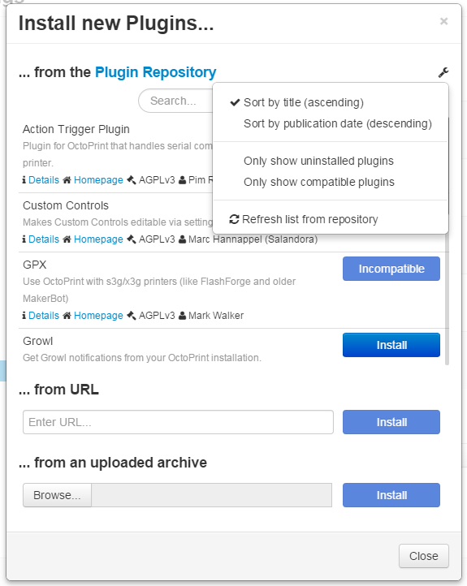

.. _sec-bundledplugins-pluginmanager:

Plugin Manager
==============

The OctoPrint Plugin Manager comes bundled with OctoPrint starting with
version 1.2.0.

It allows management of installed plugins (listing, enabling, disabling
and uninstalling) and installing new plugins from the official
`OctoPrint Plugin Repository <http://plugins.octoprint.org>`_, web addresses
or uploaded file archives.

.. _fig-bundledplugins-pluginmanager-mainscreen:
.. figure:: ../images/bundledplugins-pluginmanager-mainscreen.png
   :align: center
   :alt: Plugin Manager

   The main dialog of the Plugin Manager

.. _fig-bundledplugins-pluginmanager-installing:
.. figure:: ../images/bundledplugins-pluginmanager-installing.png
   :align: center
   :alt: Installation dialog

   Dialog for installing new plugins

.. _fig-bundledplugins-pluginmanager-repofilters:

   Filter options for the repository browser

.. _sec-bundledplugins-pluginmanager-configuration:

Configuring the Plugin
----------------------

The Plugin Manager plugin only has a handful of configuration settings
which normally won't have to be touched.

You can modify them either through the plugin's configuration dialog that
you can open when clicking the little wrench icon in the upper right corner
under Settings > Plugin Manager, or by directly editing ``config.yaml``:

.. code-block:: yaml

   plugins:
     pluginmanager:
       # The URL of the repository index to use
       repository: http://plugins.octoprint.org/plugins.json

       # Time to live for the repository cache
       repository_ttl: 1440

       # Additional arguments to use with pip. Defaults to unset,
       # you normally shouldn't need to modify this
       pip_args: --some --additional --pip --arguments

       # Whether to force the --user flag with pip. Defaults to
       # false, you normally shouldn't need to modify this
       pip_force_user: false

       # Whether to have pip always follow dependency links.
       # Defaults to false, you normally shouldn't need to
       # modify this
       dependency_links: false

       # List of plugin identifiers hidden from the plugin
       # manager. Defaults to an empty list. Not available
       # through the configuration dialog, only available
       # to allow for vendor customization
       hidden:
       - some
       - hidden
       - plugins

.. _sec-bundledplugins-pluginmanager-sourcecode:

Source Code
-----------

The source of the Plugin Manager is bundled with OctoPrint and can be found in its source repository under ``src/octoprint/plugins/pluginmanager``.
