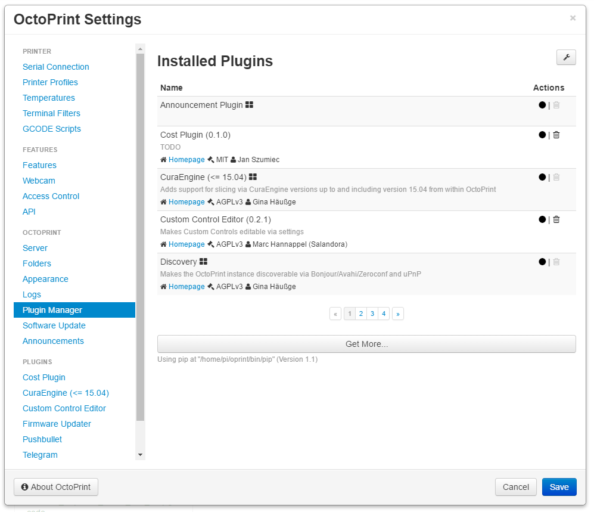

.. _sec-bundledplugins-pluginmanager:

Plugin Manager
==============

.. versionadded:: 1.2.0

The OctoPrint Plugin Manager comes bundled with OctoPrint.

It allows management of installed plugins (listing, enabling, disabling
and uninstalling) and installing new plugins from the official
`OctoPrint Plugin Repository <http://plugins.octoprint.org>`_, web addresses
or uploaded files.

Installing from URL or file uploads currently supports the following file
formats:

  * ``.zip``, ``.tar.gz``, ``.tgz``, ``.tar``, ``.gz``, ``.whl``: Will be considered to be
    plugin archive and installed via ``pip``.
  * ``.py``: Will be considered to be a single file plugin and installed by copying it
    into ``~/.octoprint/plugins``.
  * ``.json``: Will be considered to be either a plugin manager export file (created by the Export button) or a manually created
    list of URLs to install from, e.g.

    .. code-block:: json

       [
         "https://github.com/jneilliii/OctoPrint-BedLevelVisualizer/archive/master.zip",
         "https://github.com/eyal0/OctoPrint-PrintTimeGenius/archive/master.zip"
       ]

    The plugin manager will feed all contained URLs to the same logic as above.

.. _fig-bundledplugins-pluginmanager-mainscreen:

   The main dialog of the Plugin Manager

.. _fig-bundledplugins-pluginmanager-installing:
.. figure:: ../images/bundledplugins-pluginmanager-installing.png
   :align: center
   :alt: Installation dialog

   Dialog for installing new plugins

.. _fig-bundledplugins-pluginmanager-repofilters:
.. figure:: ../images/bundledplugins-pluginmanager-repofilters.png
   :align: center
   :alt: Filter options for the repository browser

   Filter options for the repository browser

.. _sec-bundledplugins-pluginmanager-configuration:

Configuring the Plugin
----------------------

The Plugin Manager plugin only has a handful of configuration settings
which normally won't have to be touched.

You can modify them either through the plugin's configuration dialog that
you can open when clicking the little wrench icon in the upper right corner
under Settings > Plugin Manager, or by directly editing ``config.yaml``:

.. code-block:: yaml

   plugins:
     pluginmanager:
       # The URL of the repository index to use
       repository: http://plugins.octoprint.org/plugins.json

       # Time to live for the repository cache
       repository_ttl: 1440

       # The URL of the plugin notices feed to use
       notices: http://plugins.octoprint.org/notices.json

       # Time to live for the notices feed cache
       notices_ttl: 360

       # Additional arguments to use with pip. Defaults to unset,
       # you normally shouldn't need to modify this
       pip_args: --some --additional --pip --arguments

       # Whether to force the --user flag with pip. Defaults to
       # false, you normally shouldn't need to modify this
       pip_force_user: false

       # Whether to have pip always follow dependency links.
       # Defaults to false, you normally shouldn't need to
       # modify this
       dependency_links: false

       # List of plugin identifiers hidden from the plugin
       # manager. Defaults to an empty list. Not available
       # through the configuration dialog, only available
       # to allow for vendor customization
       hidden:
       - some
       - hidden
       - plugins

.. _sec-bundledplugins-pluginmanager-events:

Events
------

plugin_pluginmanager_install_plugin
  A plugin was installed.

  Payload:

    * ``id``: the identifier of the installed plugin
    * ``version``: the version of the installed plugin
    * ``source``: source from which the plugin was installed, can be an URL or a path in the local file system
    * ``source_type``: type of source from which the plugin was installed, can be ``url`` or ``path``

plugin_pluginmanager_uninstall_plugin
  A plugin was uninstalled.

  Payload:

    * ``id``: the identifier of the uninstalled plugin
    * ``version``: the version of the uninstalled plugin

plugin_pluginmanager_enable_plugin
  A plugin was enabled.

  Payload:

    * ``id``: the identifier of the enabled plugin
    * ``version``: the version of the enabled plugin

plugin_pluginmanager_disabled_plugin
  A plugin was disabled.

  Payload:

    * ``id``: the identifier of the disabled plugin
    * ``version``: the version of the disabled plugin

.. _sec-bundledplugins-pluginmanager-hooks:

Hooks
-----

.. _sec-bundledplugins-pluginmanager-hooks-reconnect_hooks:

octoprint.plugin.pluginmanager.reconnect_hooks
++++++++++++++++++++++++++++++++++++++++++++++

.. py:function:: reconnect_hooks_hook(*args, **kwargs)

   Returns additional hooks defined by the plugin for which the plugin manager
   should display the "You should reconnect to your printer" message on plugin
   install/uninstall/enabling/disabling.

   Handlers should return a Python list containing the affected hook names.

   **Example**

   .. code-block:: python

      def reconnect_hooks_hook(*args, **kwargs):
          return ["octoprint.plugin.exampleplugin.some_custom_hook",
                  "octoprint.plugin.exampleplugin.some_other_custom_hook"]

      __plugin_hooks__ = {
          "octoprint.plugin.pluginmanager.reconnect_hooks": reconnect_hooks_hook
      }

.. _sec-bundledplugins-pluginmanager-sourcecode:

Source Code
-----------

The source of the Plugin Manager is bundled with OctoPrint and can be found in its source repository under ``src/octoprint/plugins/pluginmanager``.
