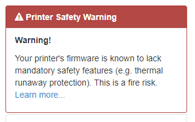

.. _sec-bundledplugins-printer_safety_check:

Printer Safety Check
====================

The Printer Safety Check plugin comes bundled with OctoPrint starting with version 1.3.7.

It tries to identify printers or rather printer firmwares with known safety issues, such as
disabled thermal runaway protection, and displays a warning box to logged in users on
such identification.

.. _fig-bundledplugins-printer_safety_check-example:

   An example of a warning generated by the Printer Safety Check

Please refer to the `entry on the "unsafe firmware" warning in OctoPrint's FAQ <https://faq.octoprint.org/warning-firmware-unsafe>`_
for a list of currently identified printers.

If you know of further printers/printer firmwares that need to be added here, please
`get in touch on the forum and provide their response to an M115 <https://faq.octoprint.org/warning-firmware-unsafe>`_.

.. note::

   Feel free to disable the plugin in OctoPrint's Plugin Manager if you feel like it is unnecessary. Be advised though
   that even if your printer might be running totally fine with a known unsafe configuration, that might change
   unexpectedly and with `catastrophic <https://www.thissmarthouse.net/dont-burn-your-house-down-3d-printing-a-cautionary-tale/>`_
   `results <https://www.reddit.com/r/3Dprinting/comments/6cekgk/house_fire_thanks_to_cheap_printer_from_china/>`_.

.. _sec-bundledplugins-printer_safety_check-source:

Source Code
-----------

The source of the Printer Safety Check plugin is bundled with OctoPrint and can be
found in its source repository under ``src/octoprint/plugins/printer_safety_check``.
