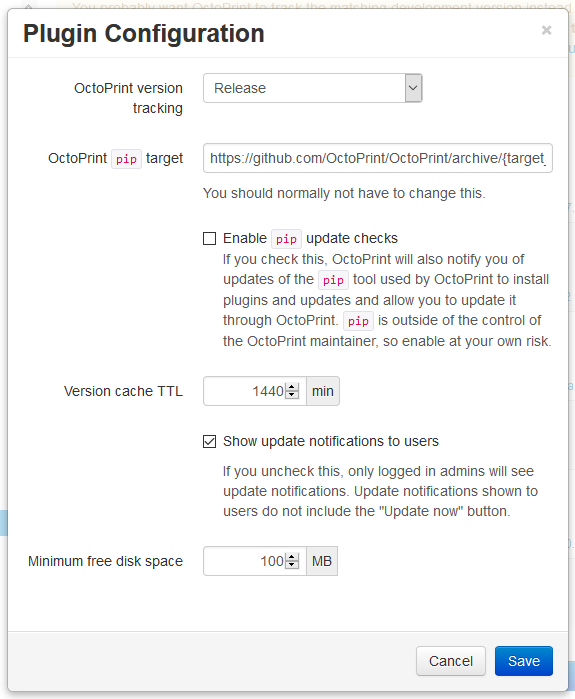

.. _sec-bundledplugins-softwareupdate:

Software Update Plugin
======================

.. versionadded:: 1.2.0

The Software Update Plugin allows receiving notifications about new releases
of OctoPrint or installed plugins which registered with it and -- if properly
configured -- also applying the found updates.

It comes bundled with OctoPrint.

.. _sec-bundledplugins-softwareupdate-firststeps:

First Steps
-----------

Out of the box the Software Update Plugin will be able to notify you of any
updates that might be available for your OctoPrint installation or any plugins
that registered themselves with it. In order for automatic restarts after updates
to work, you should configure the restart commands for OctoPrint and the whole server.

Out of the box the plugin should already be ready to update your OctoPrint installation to current
stable release versions, but you can also switch to one of the available release candidate channels
or outright git commit tracking via the plugin's configuration dialog. To open this dialog, fire up OctoPrint's
Settings Dialog, navigate to the Software Update section therein and once you are there click on the little
wrench icon in the upper right corner.

.. _fig-bundledplugins-softwareupdate-plugin-configuration:

   The Software Update plugin configuration dialog

There you can adjust the following settings:

  * **OctoPrint version tracking**: Whether you want to track OctoPrint *releases* or every *commit*. Usually you want to
    select "Release" here which is also the default, unless you are a developer.
  * **Tracked branch** (if tracking is set to "Github Commit"): The branch that will be tracked if you set version tracking to "Github Commit".
  * **OctoPrint ``pip`` target** (if tracking is set to "Release" or "Github Commit"): The argument that will be provided to ``pip`` when updating OctoPrint.
    Usually you don't want to change this from its default value of ``https://github.com/OctoPrint/OctoPrint/archive/{target_version}.zip``.
  * **OctoPrint checkout folder** (if tracking is set to "Local checkout"): This must be the path to OctoPrint's git checkout folder
    (``/home/pi/OctoPrint`` for OctoPi or `manual installs following the Raspberry Pi setup guide <https://community.octoprint.org/t/setting-up-octoprint-on-a-raspberry-pi-running-raspbian/2337/>`_).
    Note that since OctoPrint 1.3.6 you will no longer need to set this to be able to update to releases, only if you
    want to be able to update against some bleeding edge git branch.
  * **Enable ``pip`` update checks**: Whether to have OctoPrint automatically check for updates of
    the ``pip`` tool that is used for updating most components.
  * **Version cache TTL**: The "time to live" of the cache OctoPrint will use to temporarily persist the version information
    for the various components registered with the plugin, so that they don't have to be queried from the internet every time
    you load the page. Defaults to 24h, you usually shouldn't need to change that value.
  * **Show notifications to users**: Whether to display update notifications (without "Update now" button) to users that cannot
    apply updates.
  * **Minimum free disk space**: The minimum amount of free disk space needed in order to allow software updates to be run.

More settings are available by :ref:`editing the corresponding section in config.yaml <sec-bundledplugins-softwareupdate-configuration>`.

Restart commands for OctoPrint and the whole server can be configured under Settings > Server.

.. _sec-bundledplugins-softwareupdate-cli:

Command line usage
------------------

The functionality of the Software Update Plugin is also available on OctoPrint's command line interface under the
``plugins`` sub command. It's possible to check for updates via ``octoprint plugins softwareupdate:check``
and to apply available updates via ``octoprint plugins softwareupdate:update``. Please see the corresponding
``--help`` pages for details:

.. code-block:: none

   $ octoprint plugins softwareupdate:check --help
   Usage: octoprint plugins softwareupdate:check [OPTIONS] [TARGETS]...

     Check for updates.

     If any TARGETs are provided, only those components will be checked.

     Examples:
     - octoprint plugins softwareupdate:check
         This will check all components for available updates,
         utilizing cached version information.
     - octoprint plugins softwareupdate:check --force
         This will check all components for available updates,
         ignoring any cached version information even if it's
         still valid.
     - octoprint plugins softwareupdate:check octoprint
         This will only check OctoPrint itself for available
         updates.

   Options:
     --force  Ignore the cache for the update check
     --help   Show this message and exit.

.. code-block:: none

   $ octoprint plugins softwareupdate:update --help
   Usage: octoprint plugins softwareupdate:update [OPTIONS] [TARGETS]...

     Apply updates.

     If any TARGETs are provided, only those components will be updated.

     Examples:
     - octoprint plugins softwareupdate:update
         This will update all components with a pending update
         that can be updated.
     - octoprint plugins softwareupdate:update --force
         This will force an update of all registered components
         that can be updated, even if they don't have an updated
         pending.
     - octoprint plugins softwareupdate:update octoprint
         This will only update OctoPrint and leave any further
         components with pending updates at their current versions.

   Options:
     --force  Update even if already up to date
     --help   Show this message and exit.

.. _sec-bundledplugins-softwareupdate-configuration:

Configuring the Plugin
----------------------

.. code-block:: yaml

   plugins:
     softwareupdate:
       # configured version check and update methods
       checks:
         # "octoprint" is reserved for OctoPrint
         octoprint:
           # this defines a version check that will check against releases
           # published on OctoPrint's Github repository and pip as update method
           # against the release archives on Github - this is the default
           type: github_release
           user: foosel
           repo: OctoPrint
           method: pip
           pip: 'https://github.com/OctoPrint/OctoPrint/archive/{target_version}.zip'

         # further checks may be defined here

       # pip command, if another one than the automatically detected one should be
       # used - should normally NOT be necessary and hence set
       pip_command: /path/to/pip

       # the time-to-live of the version cache, in minutes, defaults to 24h
       cache_ttl: 1440

       # whether to show update notifications to users that cannot apply updates
       notify_users: true

       # whether to ignore the system throttled state reported by the pisupport plugin and
       # allow updating even when the system is not running stable - really not recommended
       ignore_throttled: false

       # minimum free storage in MB for updates to be enabled
       minimum_free_storage: 150

       # URL from which to fetch check overlays
       check_overlay_url: https://plugins.octoprint.org/update_check_overlay.json

       # time to live of the overlay cache, defaults to 6h
       check_overlay_ttl: 360

       # global credentials to provide to version checks
       credentials:

         # GitHub API token to use for the github_release and github_commit version checks.
         # Helpful if you regularly run into rate limit issues with the GitHub API using
         # the default anonymous access. Use a personal access token:
         #   https://docs.github.com/en/free-pro-team@latest/github/authenticating-to-github/creating-a-personal-access-token
         # Unset by default
         github:

         # Bitbucket user name and password, used by the bitbucket_commit version check if
         # provided, but only if the check doesn't specify credentials on its own.
         # Unset by default
         bitbucket_user:
         bitbucket_password:

.. _sec-bundledplugins-softwareupdate-configuration-versionchecks:

Version checks
++++++++++++++

Version check types are configured through the ``type`` parameter. The following
types are currently recognized:

  * ``github_release``: Checks against releases published on Github. Additional
    config parameters:

    * ``user``: (mandatory) Github user the repository to check belongs to
    * ``repo``: (mandatory) Github repository to check
    * ``prerelease``: ``True`` or ``False``, default ``False``, set to
      ``True`` to also include releases on Github marked as prerelease.
    * ``prerelease_branches``: Prerelease channel definitions, optional. List of:

      * ``branch``: Branch associated with the channel, acts as ID
      * ``name``: Human readable name of the release channel
      * ``commitish``: List of values to check against ``target_commitish``
        field in Github release data - release will only be included if the
        values match. Defaults to being unset, in which case the ``branch``
        will be matched.

      .. versionadded:: 1.2.16
    * ``stable_branch``: Stable channel definition, optional. Structure:

      * ``branch``: Branch associated with the channel, acts as ID
      * ``name``: Human readable name of the release channel
      * ``commitish``: List of values to check against ``target_commitish``
        field in Github release data - release will only be included if the
        values match. Defaults to being unset, in which case the ``branch``
        will be matched.

      .. versionadded:: 1.2.16
    * ``prerelease_channel``: Release channel to limit updates to. If set only
      those releases will be included if their ``target_commitish`` matches
      the ones associated with the release channel identified by this, either
      included in ``prerelease_channels`` or the ``stable_channel``. Only
      taken into account if ``prerelease`` is ``true``.
      .. versionadded:: 1.2.16

    * ``release_compare``: Method to use to compare between current version
      information and release versions on Github. One of ``python`` (version
      comparison using ``pkg_resources.parse_version``, newer version detected
      if remote > current), ``semantic`` (version comparison using
      ``semantic_version`` package, newer version detected if remote > current)
      and ``unequal`` (string comparison, newer version detected if
      remote != current).

  * ``github_commit``: Checks against commits pushed to Github. Additional
    config parameters:

    * ``user``: (mandatory) Github user the repository to check belongs to
    * ``repo``: (mandatory) Github repository to check
    * ``branch``: Branch of the Github repository to check, defaults to
      ``master`` if not set.
    * ``current``: Current commit hash. Will be updated automatically.

  * ``bitbucket_commit``: Checks against commits pushed to Bitbucket. Additional
    config parameters:

    * ``user``: (mandatory) Bitbucket user the repository to check belongs to
    * ``repo``: (mandatory) Bitbucket repository to check
    * ``branch``: Branch of the Bitbucket repository to check, defaults to
      ``master`` if not set.
    * ``current``: Current commit hash. Will be updated automatically.
    * ``api_user``: (mandatory only for private repositories) Bitbucket user name (not email address).
      Requires ``api_password`` to be set. Hint: This is used for the check only. For the actual
      download you might register your public SSH key as access key for the according repo and
      configure this as pip URL in ``config.yaml``: ``git+ssh://git@bitbucket.org/my_user/my_repo.git@{target_version}``
    * ``api_password``: (mandatory only for private repositories) App password. Requires
      ``api_user`` to be set. **Important**: Never use your actual Bitbucket login password. Generate
      a new app password. App passwords are user specific on Bitbucket.

    .. versionadded:: 1.3.5

  * ``git_commit``: Checks a local git repository for new commits on its
    configured remote. Additional config parameters:

    * ``checkout_folder``: (mandatory) The full path to the folder with a valid git
      repository to check.

  * ``pypi_release``: Checks `pypi.org <https://pypi.org>`_ for new releases of a specified package. Additional
    config parameters:

    * ``package``: (mandatory) Name of the package which to check.

    .. versionadded:: 1.4.0

  * ``httpheader``: Checks an HTTP header on a defined URL for changes. This can be used for easy checks
    against things like ``ETag`` or ``Last-Modified`` headers. Additional
    config parameters:

    * ``header_url`` or ``url``: (mandatory) URL to check. ``url`` can be used to avoid duplication in case of updater
      methods such as ``single_file_plugin``.
    * ``header_name``: (mandatory) HTTP header to check, case-insensitive, e.g. ``ETag`` or ``Last-Modified``.
    * ``header_method``: HTTP request method to use for the check, defaults to ``HEAD``.
    * ``header_prefix``: Prefix to use for the obtained value in the version display. If not provided ``header_name``
      will be used. If set to an empty string, no prefix will be added.

    .. versionadded:: 1.4.1

  * ``jsondata``: Checks the provided JSON endpoint for changes. The JSON endpoint must return an object with the
    property ``version``, which should contain the latest version, e.g. ``{"version":"1.2.3"}``. Additional
    config parameters:

    * ``jsondata``: (mandatory) URL from which to fetch the JSON data

    .. versionadded:: 1.4.1

  * ``command_line``: Uses a provided script to determine whether an update
    is available. Additional config parameters:

    * ``command``: (mandatory) The full path to the script to execute. The script is
      expected to return a ``0`` return code if an update is available and to
      return the display name of the available version as the final and
      optionally the display name of the current version as the next to final
      line on stdout.

  * ``python_checker``: Can only be specified by plugins through the
    :ref:`hook <sec-bundledplugins-softwareupdate-hooks>`. Additional config
    parameters:

    * ``python_checker``: (mandatory) A Python callable which returns version
      information and whether the current version is up-to-date or not, see
      below for details.

  * ``always_current``: Always reports that no update is necessary. Useful for debugging
    software update mechanisms during development. Additional config parameters:

    * ``current_version``: Version to report for both local and remote version.

    .. versionadded:: 1.3.7

  * ``never_current``: Always reports that an update is necessary. Useful for debugging
    software update mechanisms during development. Additional config parameters:

    * ``local_version``: Current local version. Defaults to ``1.0.0``.
    * ``remote_version``: Remote version to offer update to. Defaults to ``1.0.1``.

    .. versionadded:: 1.3.7

.. _sec-bundledplugins-softwareupdate-configuration-updatemethods:

Update methods
++++++++++++++

Update methods are specified via the ``method`` parameter. Some update methods are assigned implicitly
through the presence of their mandatory configuration parameters. The following methods are currently
supported:

  * ``pip``: Update by ``pip install``ing the supplied URL. May contain a
    placeholder ``{target}`` which will be the most recent version specifier as retrieved from the update check.
    Additional config parameters:

    * ``pip``: The URL to use for installing. Presence implies ``method: pip``.
    * ``pip_command``: The command to use for installing. Defaults to the ``pip`` instance belong to OctoPrint's environment.
    * ``pip_cwd``: The working directory to use for installing. Defaults to the current working directory.
    * ``force_reinstall``: Whether to force reinstallation of the package. Defaults to ``false``. Helpful
      for development and version checks that don't guarantee a Python package version change (e.g. commit based
      version checks like ``git_commit``, ``github_commit``, ``bitbucket_commit``).

    .. versionchanged:: 1.8.0

       Added ``force_reinstall`` parameter.

  * ``single_file_plugin``: Update a single file plugin by re-downloading it from a configured URL.
    Additional config parameters:

    * ``url``: (mandatory) The URL from which to install the single file plugin. Must be a single self contained
      python file.

  * ``update_script``: Update by executing a script.
    Additional config parameters:

    * ``update_script``: (mandatory) The path of the script to run. May
      contain placeholders ``{target}`` (for the most recent version specified
      as retrieved from the update check), ``{branch}`` for the branch to switch
      to to access the release, ``{folder}`` for the working directory
      of the script and ``{python}`` for the python executable OctoPrint is
      running under. Presence implies ``method: update_script``.
    * ``update_folder`` or ``checkout_folder``: (mandatory) The working directory.
      ``checkout_folder`` can be used to avoid duplication in case of check
      types such as ``git_commit``.

  * ``python_updater``: Update by executing a custom python callable.
    Additional config parameters:

    * ``python_updater``: (mandatory) Can only be specified by plugins through the
      :ref:`hook <sec-bundledplugins-softwareupdate-hooks>`. A Python callable
      which performs the update, see below for details. Presence implies ``method: python_updater``.

  * ``sleep_a_bit``: Does nothing but block for a configurable ``duration`` and log
    a countdown in the meantime. Useful for debugging software update mechanisms
    during development.

    .. versionadded:: 1.3.7

.. note::

   To allow default configurations for multiple update methods, if more than one of
   the above update method specific settings is set the one to use can be selected
   by setting the property ``method`` to the method specific setting in question.

   **Example**

   The following example defines both ``pip`` and ``update_script``. By setting to
   ``method`` to ``pip``, the Software Update plugin is instructed to use that as
   update method.

   .. code-block:: yaml

      plugins:
        softwareupdate:
          checks:
            octoprint:
              type: github_release
              user: foosel
              repo: OctoPrint
              method: pip
              pip: 'https://github.com/OctoPrint/OctoPrint/archive/{target_version}.zip'
              update_script: '{python} "/path/to/octoprint-update.py" --python="{python}" "{folder}" "{target}"'
              checkout_folder: /path/to/octoprint/checkout/folder

.. _sec-bundledplugins-softwareupdate-configuration-patterns:

Common configuration patterns
+++++++++++++++++++++++++++++

Example for a setup that allows "bleeding edge" updates of OctoPrint under
OctoPi (the ``update_script`` gets configured correctly automatically by the
plugin itself):

.. code-block:: yaml

   plugins:
     softwareupdate:
       checks:
         octoprint:
           type: github_commit
           user: foosel
           repo: OctoPrint
           branch: devel
           method: update_script
           update_folder: /home/pi/OctoPrint

Plugin installed via pip and hosted on Github under
``https://github.com/someUser/OctoPrint-SomePlugin``, only releases should be
tracked:

.. code-block:: yaml

   plugins:
     softwareupdate:
       checks:
         some_plugin:
           type: github_release
           user: someUser
           repo: OctoPrint-SomePlugin
           pip: 'https://github.com/someUser/OctoPrint-SomePlugin/archive/{target}.zip'

The same, but declaring three release channels "Stable", "Maintenance RCs" (tagged on ``rc/maintenance`` or ``master``,
id ``rc/maintenance``) and "Devel RCs" (tagged on ``rc/maintenance``, ``rc/devel`` or ``master``, id ``rc/devel``),
but with "Stable" active:

.. code-block:: yaml

   plugins:
     softwareupdate:
       checks:
         some_plugin:
           type: github_release
           user: someUser
           repo: OctoPrint-SomePlugin
           stable_branch:
             name: Stable
             branch: master
             commitish:
             - master
           prerelease_branches:
           - name: Maintenance RCs
             branch: rc/maintenance
             commitish:
             - rc/maintenance
             - master
           - name: Devel RCs
             branch: rc/devel
             commitish:
             - rc/devel
             - rc/maintenance
             - master
           pip: 'https://github.com/someUser/OctoPrint-SomePlugin/archive/{target}.zip'

And now with "Maintenance RCs" active (note the ``prerelease`` and ``prerelease_channel`` settings):

.. code-block:: yaml

   plugins:
     softwareupdate:
       checks:
         some_plugin:
           type: github_release
           user: someUser
           repo: OctoPrint-SomePlugin
           stable_branch:
             name: Stable
             branch: master
             commitish:
             - master
           prerelease_branches:
           - name: Maintenance RCs
             branch: rc/maintenance
             commitish:
             - rc/maintenance
             - master
           - name: Devel RCs
             branch: rc/devel
             commitish:
             - rc/devel
             - rc/maintenance
             - master
           prerelease: True
           prerelease_channel: rc/maintenance
           pip: 'https://github.com/someUser/OctoPrint-SomePlugin/archive/{target}.zip'

The same plugin again, but tracking all commits pushed to branch ``devel`` (thus allowing
"bleeding edge" updates):

.. code-block:: yaml

   plugins:
     softwareupdate:
       checks:
         some_plugin:
           type: github_commit
           user: someUser
           repo: OctoPrint-SomePlugin
           branch: devel
           pip: 'https://github.com/someUser/OctoPrint-SomePlugin/archive/{target}.zip'

Single file plugin hosted in a gist ``https://gist.github.com/someUser/somegist`` and updated whenever there are changes:

.. code-block:: yaml

   plugins:
     softwareupdate:
       checks:
         some_plugin:
           type: httpheader
           header_name: ETag
           url: 'https://gist.github.com/someUser/somegist/raw/some_plugin.py'
           method: single_file_plugin

The same but updated when a ``version.json`` hosted alongside gets updated with a new version can be found at

.. code-block:: yaml

   plugins:
     softwareupdate:
       checks:
         some_plugin:
           type: jsondata
           jsondata: 'https://gist.github.com/someUser/somegist/raw/version.json'
           url: 'https://gist.github.com/someUser/somegist/raw/some_plugin.py'
           method: single_file_plugin

Note that for gist hosted single file plugins, you need to use the "Raw" install link but should remove the
commit identifier. E.g. ``https://gist.githubusercontent.com/<user>/<gistid>/raw/my_plugin.py`` instead of
``https://gist.githubusercontent.com/<user>/<gistid>/raw/<commit>/my_plugin.py``. Note that these URLs will
be cached by Github for a bit, so an update will not be immediately picked up.

.. _sec-bundledplugins-softwareupdate-configuration-credentials:

Global credentials
++++++++++++++++++

.. versionadded:: 1.5.0

Starting with OctoPrint 1.5.0, the Software Update Plugin supports supplying a GitHub
API token to use for the ``github_release`` and ``github_commit`` version check types,
to work around possible rate limit problems if a lot of checks are to be made from a single
external IP. You may create a `personal access token <https://docs.github.com/en/free-pro-team@latest/github/authenticating-to-github/creating-a-personal-access-token>`_
and configure that as ``plugins.softwareupdate.credentials.github`` via
:ref:`config.yaml <sec-configuration-config_yaml>` in order to get a higher rate limit than with purely anonymous access.

Additionally, the username and password to use with the ``bitbucket_commit`` version check
type may also be configured via ``plugins.softwareupdate.credentials.bitbucket_user`` and
``plugins.softwareupdate.credentials.bitbucket_password`` respectively.

None of these configuration options are currently exposed on the UI and can only be used
via :ref:`config.yaml <sec-configuration-config_yaml>` or the
:ref:`config command line interface <sec-configuration-cli>`.

.. _sec-bundledplugins-softwareupdate-events:

Events
------

plugin_softwareupdate_update_succeeded
  An update succeeded.

  Payload:

    * ``target``: update target
    * ``from_version``: version from which was updated
    * ``to_version``: version to which was updated

plugin_softwareupdate_update_failed
  An update failed.

  Payload:

    * ``target``: update target
    * ``from_version``: version from which was updated
    * ``to_version``: version to which was updated

.. _sec-bundledplugins-softwareupdate-hooks:

Hooks
-----

.. _sec-bundledplugins-softwareupdate-hooks-check_config:

octoprint.plugin.softwareupdate.check_config
++++++++++++++++++++++++++++++++++++++++++++

.. py:function:: update_config_hook(*args, **kwargs)

   Returns additional check configurations for the Software Update plugin.

   Handlers should return a Python dict containing one entry per check. Usually
   this will probably only be the check configuration for the plugin providing
   the handler itself, using the plugin's identifier as key.

   The check configuration must match the format expected in the configuration
   (see description above). Handlers may also utilize the ``python_checker``
   and ``python_updater`` properties to return Python callables that take care
   of performing the version check or the update.

   ``python_checker`` is expected to be a callable matching signature and return
   value of the ``get_latest`` methods found in the provided version checkers in
   ``src/octoprint/plugins/softwareupdate/version_checks``. ``python_updater``
   is expected to be a callable matching signature and return value of the
   ``perform_update`` methods found in the provided updaters in
   ``src/octoprint/plugins/softwareupdate/updaters``.

   **Example**

   The example single-file-plugin updates itself from Github releases published
   at the (fictional) repository ``https://github.com/someUser/OctoPrint-UpdatePluginDemo``.

   .. code-block:: python

      def get_update_information(*args, **kwargs):
          return dict(
              updateplugindemo=dict(
                  displayName=self._plugin_name,
                  displayVersion=self._plugin_version,

                  type="github_release",
                  current=self._plugin_version,
                  user="someUser",
                  repo="OctoPrint-UpdatePluginDemo",

                  pip="https://github.com/someUser/OctoPrint-UpdatePluginDemo/archive/{target}.zip"
              )
          )

      __plugin_hooks__ = {
      "octoprint.plugin.softwareupdate.check_config": get_update_information
      }

   :return: A dictionary of check configurations as described above
   :rtype: dict

.. _sec-bundledplugins-softwareupdate-helpers:

Helpers
-------

.. _sec-bundledplugins-softwareupdate-helpers-version_checks:

version_checks
++++++++++++++

``version_checks`` module of the Software Update plugin, allows reusing the
bundled version check variants from plugins (e.g. wrapped in a ``python_checker``).

.. _sec-bundledplugins-softwareupdate-helpers-updaters:

updaters
++++++++

``updaters`` module of the Software Update plugin, allows reusing the bundled
updater variants from plugins (e.g. wrapped in a ``python_updater``).

.. _sec-bundledplugins-softwareupdate-helpers-exceptions:

exceptions
++++++++++

``exceptions`` module of the Software Update plugin.

.. _sec-bundledplugins-softwareupdate-helpers-util:

util
++++

``util`` module of the Software Update plugin.

.. _sec-bundledplugins-softwareupdate-source:

Source Code
-----------

The source of the Software Update plugin is bundled with OctoPrint and can be
found in its source repository under ``src/octoprint/plugins/softwareupdate``.
