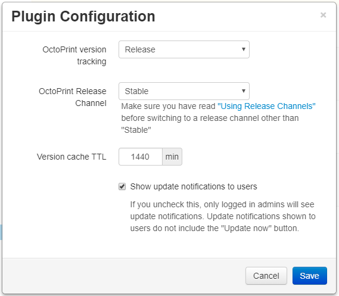

.. _sec-bundledplugins-softwareupdate:

Software Update Plugin
======================

The Software Update Plugin allows receiving notifications about new releases
of OctoPrint or installed plugins which registered with it and -- if properly
configured -- also applying the found updates.

.. _sec-bundledplugins-softwareupdate-firststeps:

First Steps
-----------

Out of the box the Software Update Plugin will be able to notify you of any
updates that might be available for your OctoPrint installation or any plugins
that registered themselves with it. In order for automatic restarts after updates
to work, you should configure the restart commands for OctoPrint and the whole server.

Out of the box the plugin should already be ready to update your OctoPrint installation to current
stable release versions, but you can also switch to one of the available release candidate channels
or outright git commit tracking via the plugin's configuration dialog. To open this dialog, fire up OctoPrint's
Settings Dialog, navigate to the Software Update section therein and once you are there click on the little
wrench icon in the upper right corner.

.. _fig-bundledplugins-softwareupdate-plugin-configuration:

   The Software Update plugin configuration dialog

There you can adjust the following settings:

  * **OctoPrint version tracking**: Whether you want to track OctoPrint *releases* or every *commit*. Usually you want to
    select "Release" here which is also the default, unless you are a developer.
  * **OctoPrint Release Channel** (if tracking releases): The release channel of OctoPrint to track for updates. If you only want stable versions,
    select "Stable" here which is also the default. "Maintenance RCs" will also allow you to update to maintenance release
    candidates, "Devel RCs" will also allow you to update to development release candidates. If in doubt, leave it at
    "Stable". `Read more about Release Channels here <https://github.com/foosel/OctoPrint/wiki/Using-Release-Channels>`_.
  * **OctoPrint checkout folder** (if tracking git commits): This must be the path to OctoPrint's git checkout folder
    (``/home/pi/OctoPrint`` for OctoPi or `manual installs following the Raspberry Pi setup guide <https://github.com/foosel/OctoPrint/wiki/Setup-on-a-Raspberry-Pi-running-Raspbian>`_).
    Note that since OctoPrint 1.3.6 you will no longer need to set this to be able to update to releases, only if you
    want to be able to update against some bleeding edge git branch.
  * **Version cache TTL**: The "time to live" of the cache OctoPrint will use to temporarily persist the version information
    for the various components registered with the plugin, so that they don't have to be queried from the internet every time
    you load the page. Defaults to 24h, you usually shouldn't need to change that value.

More settings are available by :ref:`editing the correspondi.. _section in config.yaml <sec-bundledplugins-softwareupdate-configuration>`.

That restart commands for OctoPrint and the whole server can be configured under Settings > Server.

.. _sec-bundledplugins-softwareupdate-cli:

Command line usage
------------------

The functionality of the Software Update Plugin is also available on OctoPrint's command line interface under the
``plugins`` sub command. It's is possible to check for updates via ``octoprint plugins softwareupdate:check``
and to apply available updates via ``octoprint plugins softwareupdate:update``. Please the corresponding
``--help`` pages on details:

.. code-block:: none

   $ octoprint plugins softwareupdate:check --help
   Usage: octoprint plugins softwareupdate:check [OPTIONS] [TARGETS]...

     Check for updates.

     If any TARGETs are provided, only those components will be checked.

     Examples:
     - octoprint plugins softwareupdate:check
         This will check all components for available updates,
         utilizing cached version information.
     - octoprint plugins softwareupdate:check --force
         This will check all components for available updates,
         ignoring any cached version information even if it's
         still valid.
     - octoprint plugins softwareupdate:check octoprint
         This will only check OctoPrint itself for available
         updates.

   Options:
     --force  Ignore the cache for the update check
     --help   Show this message and exit.

.. code-block:: none

   $ octoprint plugins softwareupdate:update --help
   Usage: octoprint plugins softwareupdate:update [OPTIONS] [TARGETS]...

     Apply updates.

     If any TARGETs are provided, only those components will be updated.

     Examples:
     - octoprint plugins softwareupdate:update
         This will update all components with a pending update
         that can be updated.
     - octoprint plugins softwareupdate:update --force
         This will force an update of all registered components
         that can be updated, even if they don't have an updated
         pending.
     - octoprint plugins softwareupdate:update octoprint
         This will only update OctoPrint and leave any further
         components with pending updates at their current versions.

   Options:
     --force  Update even if already up to date
     --help   Show this message and exit.

.. _sec-bundledplugins-softwareupdate-configuration:

Configuring the Plugin
----------------------

.. code-block:: yaml

   plugins:
     softwareupdate:
       # the time-to-live of the version cache, in minutes
       cache_ttl: 60

       # configured version check and update methods
       checks:
         # "octoprint" is reserved for OctoPrint
         octoprint:
           # this defines an version check that will check against releases
           # published on OctoPrint's Github repository and pip as update method
           # against the release archives on Github - this is the default
           type: github_release
           user: foosel
           repo: OctoPrint
           method: pip
           pip: 'https://github.com/foosel/OctoPrint/archive/{target_version}.zip'

         # further checks may be define here

       # pip command, if another one than the automatically detected one should be
       # used - should normally NOT be necessary and hence set
       pip_command: /path/to/pip

.. _sec-bundledplugins-softwareupdate-configuration-versionchecks:

Version checks
++++++++++++++

  * ``github_release``: Checks against releases published on Github. Additional
    config parameters:

    * ``user``: (mandatory) Github user the repository to check belongs to
    * ``repo``: (mandatory) Github repository to check
    * ``prerelease``: ``True`` or ``False``, default ``False``, set to
      ``True`` to also include releases on Github marked as prerelease.
    * ``release_branch``: Branch name to check against ``target_comittish``
      field in Github release data - release will only be included if the
      values match. Defaults to being unset, in which case no match will
      be performed.
    * ``release_compare``: Method to use to compare between current version
      information and release versions on Github. One of ``python`` (version
      comparison using ``pkg_resources.parse_version``, newer version detected
      if remote > current), ``semantic`` (version comparison using
      ``semantic_version`` package, newer version detected if remote > current)
      and ``unequal`` (string comparison, newer version detected if
      remote != current).

  * ``github_commit``: Checks against commits pushed to Github. Additional
    config parameters:

    * ``user``: (mandatory) Github user the repository to check belongs to
    * ``repo``: (mandatory) Github repository to check
    * ``branch``: Branch of the Github repository to check, defaults to
      ``master`` if not set.
    * ``current``: Current commit hash. Will be updated automatically.

  * ``bitbucket_commit``: Checks against commits pushed to Bitbucket. Additional
    config parameters:

    * ``user``: (mandatory) Bitbucket user the repository to check belongs to
    * ``repo``: (mandatory) Bitbucket repository to check
    * ``branch``: Branch of the Bitbucket repository to check, defaults to
      ``master`` if not set.
    * ``current``: Current commit hash. Will be updated automatically.
    * ``api_user``: (mandatory only for private repositories) Bitbucket user name (not email address).
      Requires ``api_password`` to be set. Hint: This is used for the check only. For the actual
      download you might register your public SSH key as access key for the according repo and
      configure this as pip URL in ``config.yaml``: ``git+ssh://git@bitbucket.org/my_user/my_repo.git@{target_version}``
    * ``api_password``: (mandatory only for private repositories) App password. Requires
      ``api_user`` to be set. **Important**: Never use your actual Bitbucket login password. Generate
      a new app password. App passwords are user specific on Bitbucket.

  * ``git_commit``: Checks a local git repository for new commits on its
    configured remote. Additional config parameters:

    * ``checkout_folder``: (mandatory) The full path to the folder with a valid git
      repository to check.

  * ``command_line``: Uses a provided script to determine whether an update
    is available. Additional config parameters:

    * ``command``: (mandatory) The full path to the script to execute. The script is
      expected to return a ``0`` return code if an update is available and to
      return the display name of the available version as the final and
      optionally the display name of the current version as the next to final
      line on stdout.

  * ``python_checker``: Can only be specified by plugins through the
    :ref:`hook <sec-bundledplugins-softwareupdate-hooks>`. Additional config
    parameters:

    * ``python_checker``: (mandatory) A python callable which returns version
      information and whether the current version is up-to-date or not, see
      below for details.

.. _sec-bundledplugins-softwareupdate-configuration-updatemethods:

Update methods
++++++++++++++

  * ``pip``: An URL to provide to ``pip install`` in order to perform the
    update. May contain a placeholder ``{target}`` which will be the most
    recent version specifier as retrieved from the update check.
  * ``update_script``: A script to execute in order to perform the update. May
    contain placeholders ``{target}`` (for the most recent version specified
    as retrieved from the update check), ``{branch}`` for the branch to switch
    to to access the release, ``{folder}`` for the working directory
    of the script and ``{python}`` for the python executable OctoPrint is
    running under. The working directory must be specified either by an
    ``update_folder`` setting or if the ``git_commit`` check is used its
    ``checkout_folder`` setting.
  * ``python_updater``: Can only be specified by plugins through the
    :ref:`hook <sec-bundledplugins-softwareupdate-hooks>`. A python callable
    which performs the update, see below for details.

.. note::

   To allow default configurations for multiple update methods, if more than one of
   the above update method specific settings is set the one to use can be selected
   by setting the property ``method`` to the method specific setting in question.

   **Example**

   The following example defines both ``pip`` and ``update_script``. By setting to
   ``method`` to ``pip``, the Software Update plugin is instructed to use that as
   update method.

   .. code-block:: yaml

      plugins:
        softwareupdate:
          checks:
            octoprint:
              type: github_release
              user: foosel
              repo: OctoPrint
              method: pip
              pip: 'https://github.com/foosel/OctoPrint/archive/{target_version}.zip'
              update_script: '{python} "/path/to/octoprint-update.py" --python="{python}" "{folder}" "{target}"'
              checkout_folder: /path/to/octoprint/checkout/folder

.. _sec-bundledplugins-softwareupdate-configuration-patterns:

Common configuration patterns
+++++++++++++++++++++++++++++

Example for a setup that allows "bleeding edge" updates of OctoPrint under
OctoPi (the ``update_script`` gets configured correctly automatically by the
plugin itself):

.. code-block:: yaml

   plugins:
     softwareupdate:
       checks:
         octoprint:
           type: github_commit
           user: foosel
           repo: OctoPrint
           branch: devel
           method: update_script
           update_folder: /home/pi/OctoPrint

Plugin installed via pip and hosted on Github under
``https://github.com/someUser/OctoPrint-SomePlugin``, only releases should be
tracked:

.. code-block:: yaml

   plugins:
     softwareupdate:
       checks:
         some_plugin:
           type: github_release
           user: someUser
           repo: OctoPrint-SomePlugin
           pip: 'https://github.com/someUser/OctoPrint-SomePlugin/archive/{target}.zip'

The same, but tracking all commits pushed to branch ``devel`` (thus allowing
"bleeding edge" updates):

.. code-block:: yaml

   plugins:
     softwareupdate:
       checks:
         some_plugin:
           type: github_commit
           user: someUser
           repo: OctoPrint-SomePlugin
           branch: devel
           pip: 'https://github.com/someUser/OctoPrint-SomePlugin/archive/{target}.zip'

.. _sec-bundledplugins-softwareupdate-hooks:

Hooks
-----

.. _sec-bundledplugins-softwareupdate-hooks-check_config:

octoprint.plugin.softwareupdate.check_config
++++++++++++++++++++++++++++++++++++++++++++

.. py:function:: update_config_hook(*args, **kwargs)

   Returns additional check configurations for the Software Update plugin.

   Handlers should return a Python dict containing one entry per check. Usually
   this will probably only be the check configuration for the plugin providing
   the handler itself, using the plugin's identifier as key.

   The check configuration must match the format expected in the configuration
   (see description above). Handlers may also utilize the ``python_checker``
   and ``python_updater`` properties to return Python callables that take care
   of performing the version check or the update.

   ``python_checker`` is expected to be a callable matching signature and return
   value of the ``get_latest`` methods found in the provided version checkers in
   ``src/octoprint/plugins/softwareupdate/version_checks``. ``python_updater``
   is expected to be a callable matching signature and return value of the
   ``perform_update`` methods found in the provided updaters in
   ``src/octoprint/plugins/softwareupdate/updaters``.

   **Example**

   The example single-file-plugin updates itself from Github releases published
   at the (fictional) repository ``https://github.com/someUser/OctoPrint-UpdatePluginDemo``.

   .. code-block:: python

      # coding=utf-8
      from __future__ import absolute_import

      def get_update_information(*args, **kwargs):
          return dict(
              updateplugindemo=dict(
                  displayName=self._plugin_name,
                  displayVersion=self._plugin_version,

                  type="github_release",
                  current=self._plugin_version,
                  user="someUser",
                  repo="OctoPrint-UpdatePluginDemo",

                  pip="https://github.com/someUser/OctoPrint-UpdatePluginDemo/archive/{target}.zip"
              )
          )

      __plugin_hooks__ = {
      "octoprint.plugin.softwareupdate.check_config": get_update_information
      }

   :return: A dictionary of check configurations as described above
   :rtype: dict

.. _sec-bundledplugins-softwareupdate-helpers:

Helpers
-------

.. _sec-bundledplugins-softwareupdate-helpers-version_checks:

version_checks
++++++++++++++

``version_checks`` module of the Software Update plugin, allows reusing the
bundled version check variants from plugins (e.g. wrapped in a ``python_checker``).

.. _sec-bundledplugins-softwareupdate-helpers-updaters:

updaters
++++++++

``updaters`` module of the Software Update plugin, allows reusing the bundled
updater variants from plugins (e.g. wrapped in a ``python_updater``).

.. _sec-bundledplugins-softwareupdate-helpers-exceptions:

exceptions
++++++++++

``exceptions`` module of the Software Update plugin.

.. _sec-bundledplugins-softwareupdate-helpers-util:

util
++++

``util`` module of the Software Update plugin.

.. _sec-bundledplugins-softwareupdate-source:

Source Code
-----------

The source of the Software Update plugin is bundled with OctoPrint and can be
found in its source repository under ``src/octoprint/plugins/softwareupdate``.
