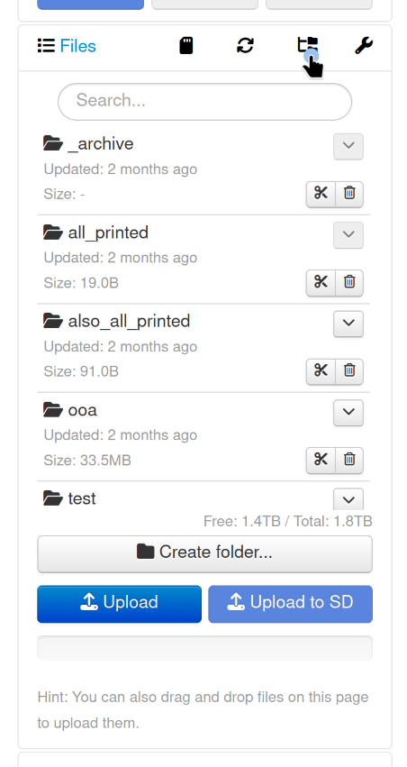
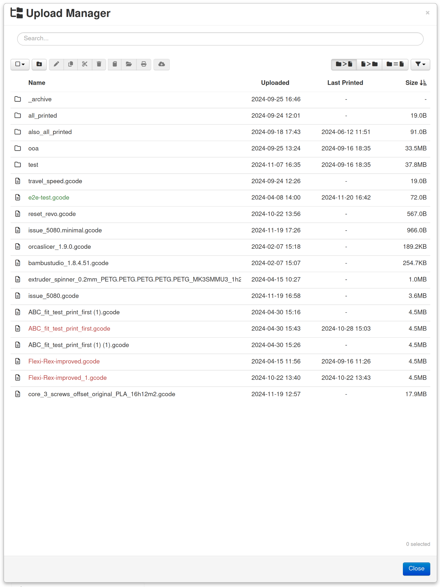

.. _sec-bundledplugins-uploadmanager:

Upload Manager
==============

.. versionadded:: 1.11.0

The Upload Manager plugin allows full management of the uploaded printable files.

It is a replacement for the no longer maintained third-party `File Manager plugin <https://plugins.octoprint.org/plugins/filemanager/>`_.

.. _fig-bundledplugins-uploadmanager-button:

   The button on the file list panel with which to open the Upload Manager

.. _fig-bundledplugins-uploadmanager-dialog:

   The open Upload Manager dialog

.. _sec-bundledplugins-uploadmanager-configuration:

Configuring the plugin
----------------------

The plugin doesn't need any configuration.

.. _sec-bundledplugins-uploadmanager-sourcecode:

Source code
-----------

The source of the Upload Manager plugin is bundled with OctoPrint and can be found in
its source repository under ``src/octoprint/plugins/uploadmanager``.
