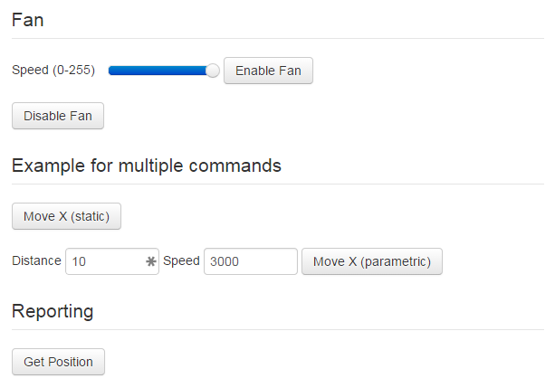

.. _sec-configuration-custom_controls:

Custom Controls
===============

OctoPrint allows you to add custom controls to the "Control" tab of its interface. Control types reach from simple
buttons which trigger sending of one or more lines of GCODE to the printer over more complex controls allowing
parameterization of these commands with values entered by the user to full blown GCODE script templates backed by
`Jinja2 <http://jinja.pocoo.org/>`_.

.. note::

   At the current time, the configuration of custom controls is only possible through manually editing OctoPrint's
   ``config.yaml`` file.

   To make sure that your ``config.yaml`` stays valid when adding custom controls, don't hesitate to take a look at the
   :ref:`YAML Primer <sec-configuration-yaml>`.

.. _sec-configuration-custom_controls-configyaml:

config.yaml
-----------

Custom controls are configured within ``config.yaml`` in a ``controls`` section which basically represents a hierarchical
structure of all configured custom controls of various types.

The following example defines a control for enabling the cooling fan with a variable speed defined by the user
(default 255 and selectable through a slider UI element) and a control for disabling the fan, all within a section named
"Fan", two example controls with multiple commands in a section "Example for multiple commands" and a command with printer
feedback evaluation for the result of the M114 "Get Position" gcode inside a section named "Reporting".

.. sourcecode:: yaml

   controls:
     - name: Fan
       type: section
       children:
         - name: Enable Fan
           type: parametric_command
           command: M106 S%(speed)s
           input:
             - name: Speed (0-255)
               parameter: speed
               default: 255
               slider:
                   min: 0
                   max: 255
         - name: Disable Fan
           type: command
           command: M107
     - name: Example for multiple commands
       type: section
       children:
       - name: Move X (static)
         type: commands
         commands:
         - G91
         - G1 X10 F3000
         - G90
       - name: Move X (parametric)
         type: parametric_commands
         commands:
         - G91
         - G1 X%(distance)s F%(speed)s
         - G90
         input:
         - default: 10
           name: Distance
           parameter: distance
         - default: 3000
           name: Speed
           parameter: speed
     - name: Reporting
       type: section
       children:
       - command: M114
         name: Get Position
         type: feedback_command
         regex: "X:([0-9.]+) Y:([0-9.]+) Z:([0-9.]+) E:([0-9.]+)"
         template: "Position: X={0}, Y={1}, Z={2}, E={3}"

Adding this to ``config.yaml``, restarting the OctoPrint server and switching to the "Control" tab within its
interface yields the following visual representation:

.. _fig-configuration-custom_controls-example:

As you can see there are quite a number of different custom controls already in this small example, each with their own
attributes: :ref:`sections <sec-configuration-custom_controls-types-section>`, :ref:`commands <sec-configuration-custom_controls-commands>`,
:ref:`parametric commands <sec-configuration-custom_controls-types-parametric_command>` and
:ref:`feedback commands <sec-configuration-custom_controls-types-feedback_command>`. Two attributes are common for all
of the types: ``name`` and ``type``.

.. _sec-configuration-custom_controls-types:

Types
-----

.. _sec-configuration-custom_controls-types:

Sections
........

.. _sec-configuration-custom_controls-types:

Rows
....

.. _sec-configuration-custom_controls-types:

Section rows
............

.. _sec-configuration-custom_controls-types:

Commands
........

.. _sec-configuration-custom_controls-types-parametric_command:

Parametric commands
...................

.. _sec-configuration-custom_controls-types-script:

Scripts
.......

.. _sec-configuration-custom_controls-types-feedback_command:

Feedback commands
.................

