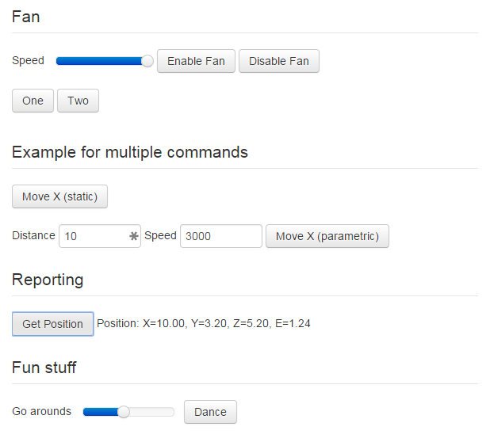
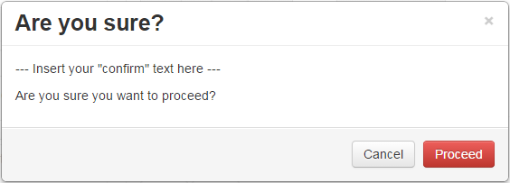

.. _sec-features-custom_controls:

Custom Controls
===============

.. contents::

OctoPrint allows you to add custom controls to the "Control" tab of its interface. Control types reach from simple
buttons which trigger sending of one or more lines of GCODE to the printer over more complex controls allowing
parameterization of these commands with values entered by the user to full blown GCODE script templates backed by
`Jinja2 <http://jinja.pocoo.org/>`_.

Custom controls are configured within :ref:`config.yaml <sec-configuration-config_yaml>` [#f1]_  in a ``controls`` section which
basically represents a hierarchical structure of all configured custom controls of various types.

.. note::

   To make sure that your ``config.yaml`` stays valid when adding custom controls, don't hesitate to take a look at the
   :ref:`YAML Primer <sec-configuration-yaml>`.

The following example defines a control for enabling the cooling fan with a variable speed defined by the user
(default 255 and selectable through a slider UI element) and a control for disabling the fan, all within a section named
"Fan", two example controls with multiple commands in a section "Example for multiple commands", a command with printer
feedback evaluation for the result of the M114 "Get Position" gcode inside a section named "Reporting" and finally
a GCODE script including user input.

.. code-block-ext:: yaml

   controls:
     - name: Fan
       layout: horizontal
       children:
       - name: Enable Fan
         command: M106 S%(speed)s
         input:
         - name: Speed (0-255)
           parameter: speed
           default: 255
           slider:
             min: 0
             max: 255
       - name: Disable Fan
         command: M107
     - name: Example for multiple commands
       children:
       - name: Move X (static)
         confirm: You are about to move the X axis right by 10mm with 3000mm/s.
         commands:
         - G91
         - G1 X10 F3000
         - G90
       - name: Move X (parametric)
         commands:
         - G91
         - G1 X%(distance)s F%(speed)s
         - G90
         input:
         - default: 10
           name: Distance
           parameter: distance
         - default: 3000
           name: Speed
           parameter: speed
     - name: Reporting
       children:
       - name: Get Position
         command: M114
         regex: "X:([0-9.]+) Y:([0-9.]+) Z:([0-9.]+) E:([0-9.]+)"
         template: "Position: X={0}, Y={1}, Z={2}, E={3}"
     - name: Fun stuff
       children:
       - name: Dance
         script: custom/dance.gco
         input:
         - name: Go arounds
           parameter: repetitions
           slider:
             max: 10
             min: 1
             step: 1

Adding this to ``config.yaml``, restarting the OctoPrint server and switching to the "Control" tab within its
interface yields the visual representation in :numref:`fig-configuration-customcontrols-example`.

.. _fig-configuration-customcontrols-example:

   The rendered output created through the example configuration

As you can see you have two basic types of control definitions here: controls that actually do something (providing a
button that sends one or more commands to the printer when clicked, displaying output received from the printer) and
controls that just serve as *container* for other controls, the latter being identified by having a ``children``
attribute wrapping more controls.

.. hint::

   Take a look at the `Custom Control Editor plugin <http://plugins.octoprint.org/plugins/customControl/>`_
   which allows you configuring your Custom Controls through OctoPrint's
   settings interface without the need to manually edit the configuration
   file.

.. _sec-features-custom_controls-types:

Types
-----

Let's take a closer look at the possible attributes that are available for both basic types.

.. _sec-features-custom_controls-types-containers:

Containers
..........

.. list-table::
   :widths: 25 75

   * - **Attribute**
     - **Description**
   * - ``children``
     - A list of children controls or containers contained within this container
   * - ``name``
     - (Optional) A name to display above the container, basically a section header
   * - ``layout``
     - (Optional) The layout to use for laying out the contained children, either from top to bottom (``vertical``) or
       from left to right (``horizontal``). Defaults to a ``vertical`` layout.

.. _sec-features-custom_controls-types-controls:

Controls
........

.. list-table::
   :widths: 25 75

   * - **Attribute**
     - **Description**
   * - ``name``
     - The name of the control, will be displayed either on the button if it's a control sending a command or as a label
       for controls which only display output.
   * - ``command``
     - (Optional) A single GCODE command to send to the printer. Will be rendered as a button which sends the command to
       the printer upon click. The button text will be the value of the ``name`` attribute. Mutually exclusive with
       ``commands`` and ``script``. The rendered button be disabled if the printer is currently offline or printing or
       alternatively if the requirements defined via the ``enabled`` attribute are not met.
   * - ``commands``
     - (Optional) A list of GCODE commands to send to the printer. Will be rendered as a button which sends the commands
       to the printer upon click. The button text will be the value of the ``name`` attribute. Mutually exclusive with
       ``command`` and ``script``. The rendered button will be disabled if the printer is currently offline or printing
       or alternatively if the requirements defined via the ``enabled`` attribute are not met.
   * - ``script``
     - (Optional) The name of a full blown :ref:`GCODE script <sec-features-gcode_scripts>` to send to the printer.
       Will be rendered as a button which sends the script to the printer upon click. The button text will be the value
       of the ``name`` attribute. Mutually exclusive with ``command`` and ``commands``. The rendered button will be
       disabled if the printer is currently offline or printing or alternatively if the requirements defined via the
       ``enabled`` attribute are not met.

       Values of input parameters will be available in the template context under the ``parameter`` variable (e.g.
       an input parameter ``speed`` will be available in the script template as ``parameter.speed``). On top of that all
       other variables defined in the :ref:`GCODE template context <sec-features-gcode_scripts-context>` will be available.

       :ref:`See below for an example <sec-features-custom_controls-examples-gcode_script>`.
   * - ``javascript``
     - (Optional) A JavaScript snippet to be executed when the button rendered for ``command`` or ``commands`` is
       clicked. This allows to override the direct sending of the command or commands to the printer with more
       sophisticated behaviour. The JavaScript snippet is ``eval``'d and processed in a context where the control
       it is part of is provided as local variable ``data`` and the ``ControlViewModel`` is available as ``self``.
   * - ``enabled``
     - (Optional) A JavaScript snippet returning either ``true`` or ``false`` determining whether the control
       should be enabled or not. This allow to override the default logic for this (disabled if printer is offline
       or currently printing). The JavaScript snippet is ``eval``'d and processed in a context where the control
       it is part of is provided as local variable ``data`` and the ``ControlViewModel`` is available as ``self``.
   * - ``input``
     - (Optional) A list of definitions of input parameters for a ``command`` or ``commands``, to be rendered as
       additional input fields. ``command``/``commands`` may contain placeholders to be replaced by the values obtained
       from the user for the defined input fields:

       .. code-block-ext:: yaml

          name: Enable Fan
          command: M106 S%(speed)s
          input:
            - name: Speed (0-255)
              parameter: speed
              default: 255
              slider:
                  min: 0
                  max: 255

       In OctoPrint's default UI input fields are always rendered left to right (inline).
   * - ``input.name``
     - Name to display for the input field.
   * - ``input.parameter``
     - Internal parameter name for the input field, used as a placeholder in ``command``/``commands``.
   * - ``input.default``
     - Default value for the input field.
   * - ``input.slider``
     - (Optional) If this attribute is included, instead of an input field a slider control will
       be rendered. If you don't want to define any of ``min``, ``max`` or ``step``, write ``slider: {}`` to render
       a slider based on default values.
   * - ``input.slider.min``
     - (Optional) Minimum value of the slider, defaults to 0.
   * - ``input.slider.max``
     - (Optional) Maximum value of the slider, defaults to 255.
   * - ``input.slider.step``
     - (Optional) Step size per slider "tick", defaults to 1.
   * - ``regex``
     - (Optional) A `regular expression <https://docs.python.org/2/library/re.html#regular-expression-syntax>`_ to
       match against lines received from the printer to retrieve information from it (e.g. specific output). Together
       with ``template`` this allows rendition of received data from the printer within the UI.
   * - ``template``
     - (Optional) A template to use for rendering the match of ``regex``. May contain placeholders in
       `Python Format String Syntax <https://docs.python.org/2/library/string.html#format-string-syntax>`_ for either named
       groups within the regex (e.g. ``Temperature: {temperature}`` for a regex ``T:\s*(?P<temperature>\d+(\.\d*)``)
       or positional groups within the regex (e.g. ``Position: X={0}, Y={1}, Z={2}, E={3}`` for a regex
       ``X:([0-9.]+) Y:([0-9.]+) Z:([0-9.]+) E:([0-9.]+)``).
   * - ``confirm``
     - (Optional) A text to display to the user to confirm his button press. Can be used with sensitive custom controls
       like changing EEPROM values in order to prevent accidental clicks. The text will be displayed in a confirmation
       dialog like in :numref:`fig-configuration-customcontrols-confirm`.

.. _fig-configuration-customcontrols-confirm:

   An example confirmation dialog

.. _sec-features-custom_controls-examples:

Examples
--------

.. _sec-features-custom_controls-examples-gcode_script:

Parameterized GCODE Script
..........................

.. code-block-ext:: yaml
   :caption: Control definition in ~/.octoprint/config.yaml
   :name: code-features-custom_controls-example-gcode_script-config_yaml

   name: Dance
   script: custom/dance.gco
   input:
   - default: 5
     name: Go arounds
     parameter: repetitions
     slider:
       max: 10
       min: 1
       step: 1

.. code-block-ext:: jinja
   :caption: ~/.octoprint/scripts/gcode/custom/dance.gco
   :name: code-features-custom_controls-example-gcode_script-dance_gco

   
   
   
   
   
   M117 run {{ script.name }}
   G4 P500
   G1 Z10
   G1 X{{ center_x }} Y{{ center_y }} F{{ speed_x }}
   M117 let's dance!
   G91
   G1 X-1 Y-1 F{{ speed_x }}
   
   M117 and {{ n + 1 }}
     {% if n % 2 == 0 %}
       G1 Z1 F{{ speed_z }}
       G1 Z-2 F{{ speed_z }}
       G1 Z1 F{{ speed_z }}
     
     G1 X2 F{{ speed_x }}
     G1 Y2 F{{ speed_y }}
     G1 X-2 F{{ speed_x }}
     G1 Y-2 F{{ speed_y }}
   
   G90
   G1 X{{ center_x }} Y{{ center_y }} F{{ speed_x }}
   G28 X0 Y0

Note the usage of the ``parameters.repetitions`` template variable in the GCODE script template, which will contain
the value selected by the user for the "Go arounds" slider.

.. rubric:: Footnotes

.. [#f1] For Linux that will be ``~/.octoprint/config.yaml``, for Windows it will be ``%APPDATA%/OctoPrint/config.yaml`` and for
         Mac ``~/Library/Application Support/OctoPrint/config.yaml``
