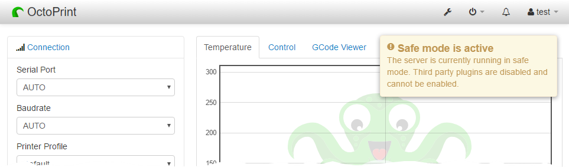

.. _sec-features-safemode:

*********
Safe mode
*********

With the advent of support for plugins in OctoPrint, it quickly became apparent that some of the bugs
reported on OctoPrint's bug tracker were actually bugs with installed third party plugins instead of
OctoPrint itself.

To allow an easier identification of these cases, OctoPrint 1.3.0 introduced safe mode. Starting
OctoPrint in safe mode disables all plugins that are not bundled with OctoPrint, allowing to easier
identify most cases where a third party plugin is the culprit of an observed issue.

Additionally, OctoPrint allows uninstalling plugins in this mode, allowing recovery from cases where
a third party plugin causes the server to not start up or the web interface to not render or function
correctly anymore.

.. _sec-features-safemode-how:

How to start OctoPrint in safe mode
===================================

There exist three ways to start OctoPrint in safe mode:

  * since OctoPrint 1.3.2: by selecting "Restart OctoPrint in safe mode" from the "System" menu,
    if the "Restart OctoPrint" server command has been correctly configured (see :numref:`fig-features-safemode-systemmenu`).
  * by starting OctoPrint with the command line parameter ``--safe``, e.g. ``octoprint serve --safe``
  * by setting the option ``server.startOnceInSafeMode`` in :ref:`config.yaml <sec-configuration-config_yaml>`
    to ``true`` and restarting

The last two options will have OctoPrint enable safe mode only for the next server start - once you
restart OctoPrint again, safe mode will be disabled again.

.. _fig-features-safemode-systemmenu:
.. figure:: ../images/features-safemode-systemmenu.png
   :align: center
   :alt: "Restart OctoPrint in safe mode" in the "System" menu

   "Restart OctoPrint in safe mode" in the "System" menu

.. _sec-features-safemode-differences:

Differences of safe mode vs normal operation mode
=================================================

When OctoPrint is running in safe mode the following changes to its normal operation mode apply:

  * OctoPrint will not enable any of the installed third party plugins. OctoPrint considers all plugins third
    party plugins that do not ship with OctoPrint's sources, so any plugins installed either via `pip` or
    into OctoPrint's plugin folder at ``~/.octoprint/plugins`` (Linux), ``%APPDATA%/OctoPrint`` (Windows) and
    ``~/Library/Application Support/OctoPrint`` (MacOS).
  * OctoPrint will still allow to uninstall third party plugins through the built-in Plugin Manager.
  * OctoPrint will still allow to disable (bundled) plugins that are still enabled.
  * OctoPrint will not allow to enable third party plugins.
  * OctoPrint's web interface will display a notification to remind you that it is running in
    safe mode.

.. _fig-features-safemode-notification:

   Safe mode notification
