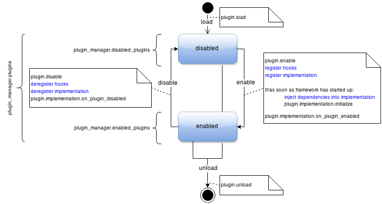

.. _sec-plugin-concepts:

General Concepts
================

OctoPrint's plugins are `Python Packages <https://docs.python.org/2/tutorial/modules.html#packages>`_ which in their
top-level module define a bunch of :ref:`control properties <sec-plugins-controlproperties>` defining
metadata (like name, version etc of the plugin) as well as information on how to initialize the plugin and into what
parts of the system the plugin will actually plug in to perform its job.

There are three types of ways a plugin might attach itself to the system, through so called
:ref:`mixin <sec-plugins-mixins>` implementations, by attaching itself to specified
:ref:`hook <sec-plugins-hooks>`, by offering :ref:`helper <sec-plugins-helpers>` functionality to be
used by other plugins or by providing :ref:`settings overlays <sec-plugins-controlproperties-plugin_settings_overlay>`.

Plugin mixin implementations will get a bunch of :ref:`properties injected <sec-plugins-mixins-injectedproperties>`
by OctoPrint plugin system to help them work.

.. _sec-plugins-concept-lifecycle:

Lifecycle
---------

There are three sources of installed plugins that OctoPrint will check during start up:

  * it's own ``octoprint/plugins`` folder (this is where the bundled plugins reside),
  * the ``plugins`` folder in its configuration directory (e.g. ``~/.octoprint/plugins`` on Linux),
  * any python packages registered for the entry point ``octoprint.plugin``.

Each plugin that OctoPrint finds it will first load, then enable. On enabling a plugin, OctoPrint will
register its declared :ref:`hook handlers <sec-plugins-hooks>` and :ref:`helpers <sec-plugins-helpers>`, apply
any :ref:`settings overlays <sec-plugins-controlproperties-plugin_settings_overlay>`,
:ref:`inject the required properties <sec-plugins-mixins-injectedproperties>` into its declared
:ref:`mixin implementation <sec-plugins-mixins>` and register those as well.

On disabling a plugin, its hook handlers, helpers, mixin implementations and settings overlays will be de-registered again.

Some plugin types require a reload of the frontend or a restart of OctoPrint for enabling/disabling them. You
can recognized such plugins by their implementations implementing :class:`~octoprint.plugin.ReloadNeedingPlugin` or
:class:`~octoprint.plugin.RestartNeedingPlugin` or providing handlers for one of the hooks marked correspondingly.

