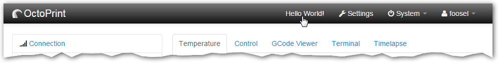
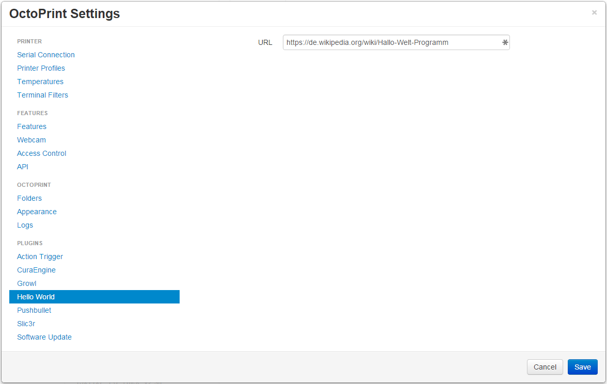
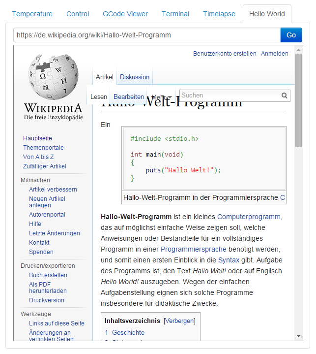

.. _sec-plugins-gettingstarted:

Getting Started
===============

Over the course of this little tutorial we'll build a full fledged, installable OctoPrint plugin that displays "Hello World!"
at some locations throughout OctoPrint and also offers some other basic functionality to give you an idea of what
you can achieve with OctoPrint's plugin system.

We'll start at the most basic form a plugin can take - just a couple of simple lines of Python code:

.. code-block:: python
   :linenos:

   # coding=utf-8
   from __future__ import absolute_import

   __plugin_name__ = "Hello World"
   __plugin_version__ = "1.0"
   __plugin_description__ = "A quick \"Hello World\" example plugin for OctoPrint"

Saving this as ``helloworld.py`` in ``~/.octoprint/plugins`` yields you something resembling these log entries upon server startup::

   2015-01-27 11:14:35,124 - octoprint.server - INFO - Starting OctoPrint 1.2.0-dev-448-gd96e56e (devel branch)
   2015-01-27 11:14:35,124 - octoprint.plugin.core - INFO - Loading plugins from /home/pi/.octoprint/plugins, /home/pi/OctoPrint/src/octoprint/plugins and installed plugin packages...
   2015-01-27 11:14:36,135 - octoprint.plugin.core - INFO - Found 3 plugin(s): Hello World (1.0), CuraEngine (0.1), Discovery (0.1)

OctoPrint found that plugin in the folder and took a look into it. The name and the version it displays in that log
entry it got from the ``__plugin_name__`` and ``__plugin_version__`` lines. It also read the description from
``__plugin_description__`` and stored it in an internal data structure, but we'll just ignore this for now.

.. _sec-plugins-gettingstarted-sayinghello:

Saying hello: How to make the plugin actually do something
----------------------------------------------------------

Apart from being discovered by OctoPrint, our plugin does nothing yet. We want to change that. Let's make it print
"Hello World!" to the log upon server startup. Modify our ``helloworld.py`` like this:

.. code-block:: python
   :emphasize-lines: 4-8,13
   :linenos:

   # coding=utf-8
   from __future__ import absolute_import

   import octoprint.plugin

   class HelloWorldPlugin(octoprint.plugin.StartupPlugin):
       def on_after_startup(self):
           self._logger.info("Hello World!")

   __plugin_name__ = "Hello World"
   __plugin_version__ = "1.0"
   __plugin_description__ = "A quick \"Hello World\" example plugin for OctoPrint"
   __plugin_implementations__ = [HelloWorldPlugin()]

and restart OctoPrint. You now get this output in the log::

   2015-01-27 11:17:10,792 - octoprint.plugins.helloworld - INFO - Hello World!

Neat, isn't it? We added a custom class that subclasses one of OctoPrint's :ref:`plugin mixins <sec-plugins-mixins>`
with :class:`~octoprint.plugin.StartupPlugin` and another control property, ``__plugin_implementations__``, that instantiates
our plugin class and tells OctoPrint about it. Taking a look at the documentation of :class:`~octoprint.plugin.StartupPlugin` we see that
this mixin offers two methods that get called by OctoPrint during startup of the server, :func:`~octoprint.plugin.StartupPlugin.on_startup` and
:func:`~octoprint.plugin.StartupPlugin.on_after_startup`. We decided to add our logging output by overriding :func:`~octoprint.plugin.StartupPlugin.on_after_startup`, but we could also have
used :func:`~octoprint.plugin.StartupPlugin.on_startup` instead, in which case our logging statement would be executed before the server was done starting
up and ready to serve requests.

You'll also note that we are using ``self._logger`` for logging. Where did that one come from? OctoPrint's plugin system
injects :ref:`a couple of useful objects <sec-plugins-infrastructure-injections>` into our plugin implementation classes,
one of those being a fully instantiated `python logger <https://docs.python.org/2/library/logging.html>`_ ready to be
used by your plugin. As you can see in the log output above, that logger uses the namespace ``octoprint.plugins.helloworld``
for our little plugin here, or more generally ``octoprint.plugins.<plugin identifier>``.

.. _sec-plugins-gettingstarted-growingup:

Growing up: How to make it distributable
----------------------------------------

If you now want to distribute this plugin to other OctoPrint users (since it is so awesome to be greeted upon server
startup), let's take a look at how you'd go about that now before our plugin gets more complicated.

You basically have two options to distribute your plugin. One would be about the exact same way we are using it now,
as a simple python file following the naming convention ``<plugin identifier>.py`` that your users add to their
``~/.octoprint/plugins`` folder. You already know how that works. But let's say you have more than just a simple plugin
that can be done in one file. Distributing multiple files and getting your users to install them in the right way
so that OctoPrint will be able to actually find and load them is certainly not impossible (see :ref:`the plugin distribution
documentation <sec-plugins-distribution>` if you want to take a closer look at that option), but we want to do it in the
best way possible, meaning we want to make our plugin a fully installable python module that your users will be able to
install directly via Python's standard package manager ``pip`` or alternatively via `OctoPrint's own plugin manager <https://github.com/OctoPrint/OctoPrint-PluginManager>`_.

So let's begin. First checkout the `Plugin Skeleton <https://github.com/OctoPrint/OctoPrint-PluginSkeleton>`_ and rename
the ``octoprint_skeleton`` folder to something better suited to our "Hello World" plugin::

   $ git clone https://github.com/OctoPrint/OctoPrint-PluginSkeleton.git OctoPrint-HelloWorld
   Cloning into 'OctoPrint-HelloWorld'...
   [...]
   $ cd OctoPrint-HelloWorld
   $ mv octoprint_skeleton octoprint_helloworld

Then edit the configuration in the ``setup.py`` file to mirror our own "Hello World" plugin. The configuration should
look something like this:

.. code-block:: python
   :linenos:

   plugin_identifier = "helloworld"
   plugin_name = "OctoPrint-HelloWorld"
   plugin_version = "1.0"
   plugin_description = "A quick \"Hello World\" example plugin for OctoPrint"
   plugin_author = "You"
   plugin_author_email = "you@somewhere.net"
   plugin_url = "https://github.com/you/OctoPrint-HelloWorld"

Now all that's left to do is to move our ``helloworld.py`` into the ``octoprint_helloworld`` folder and renaming it to
``__init__.py``. Make sure to delete the copy under ``~/.octoprint/plugins`` in the process, including the `.pyc` file!

The plugin is now ready to be installed via ``python setup.py install``. However, since we are still
working on our plugin, it makes more sense to use ``python setup.py develop`` for now -- this way the plugin becomes
discoverable by OctoPrint, however we don't have to reinstall it after any changes we will still do::

   $ python setup.py develop
   running develop
   running egg_info
   creating OctoPrint_HelloWorld.egg-info
   [...]
   Finished processing dependencies for OctoPrint-HelloWorld==1.0

Restart OctoPrint. Your plugin should still be properly discovered and the log line should be printed::

   2015-01-27 13:43:34,134 - octoprint.server - INFO - Starting OctoPrint 1.2.0-dev-448-gd96e56e (devel branch)
   2015-01-27 13:43:34,134 - octoprint.plugin.core - INFO - Loading plugins from /home/pi/.octoprint/plugins, /home/pi/OctoPrint/src/octoprint/plugins and installed plugin packages...
   2015-01-27 13:43:34,818 - octoprint.plugin.core - INFO - Found 3 plugin(s): Hello World (1.0), CuraEngine (0.1), Discovery (0.1)
   [...]
   2015-01-27 13:43:38,997 - octoprint.plugins.helloworld - INFO - Hello World!

Looks like it still works!

Something is still a bit ugly though. Take a look into ``__init__.py`` and ``setup.py``. It seems like we have a bunch
of information now defined twice:

.. code-block:: python
   :linenos:

   # __init__.py:
   __plugin_name__ = "Hello World"
   __plugin_version__ = "1.0"
   __plugin_description__ = "A quick \"Hello World\" example plugin for OctoPrint"

   # setup.py
   plugin_name = "OctoPrint-HelloWorld"
   plugin_version = "1.0"
   plugin_description = "A quick \"Hello World\" example plugin for OctoPrint"

The nice thing about our plugin now being a proper python package is that OctoPrint can and will access the metadata defined
within ``setup.py``! So, we don't really need to define all this data twice. Remove ``__plugin_name__``, ``__plugin_version__``
and ``__plugin_description__``:

.. code-block:: python
   :linenos:

   # coding=utf-8
   from __future__ import absolute_import

   import octoprint.plugin

   class HelloWorldPlugin(octoprint.plugin.StartupPlugin):
       def on_after_startup(self):
           self._logger.info("Hello World!")

   __plugin_implementations__ = [HelloWorldPlugin()]

and restart OctoPrint::

   2015-01-27 13:46:33,786 - octoprint.plugin.core - INFO - Found 3 plugin(s): OctoPrint-HelloWorld (1.0), CuraEngine (0.1), Discovery (0.1)

Our "Hello World" Plugin still gets detected fine, but it's now listed under the same name it's installed under,
"OctoPrint-HelloWorld". That's a bit redundant and squashed, so we'll override that bit via ``__plugin_name__`` again:

.. code-block:: python
   :emphasize-lines: 10
   :linenos:

   # coding=utf-8
   from __future__ import absolute_import

   import octoprint.plugin

   class HelloWorldPlugin(octoprint.plugin.StartupPlugin):
       def on_after_startup(self):
           self._logger.info("Hello World!")

   __plugin_name__ = "Hello World"
   __plugin_implementations__ = [HelloWorldPlugin()]

Restart OctoPrint again::

   2015-01-27 13:48:54,122 - octoprint.plugin.core - INFO - Found 3 plugin(s): Hello World (1.0), CuraEngine (0.1), Discovery (0.1)

Much better! You can override pretty much all of the metadata defined within ``setup.py`` from within your Plugin itself --
take a look at :ref:`the available control properties <sec-plugins-infrastructure-controlproperties>` for all available
overrides.

Following the README of the `Plugin Skeleton <https://github.com/OctoPrint/OctoPrint-PluginSkeleton>`_ you could now
already publish your plugin on Github and it would be directly installable by others using pip::

   pip install https://github.com/you/OctoPrint-HelloWorld/archive/master.zip

But let's add some more features instead.

.. _sec-plugins-gettingstarted-templates:

Frontend fun: How to add functionality to OctoPrint's web interface
-------------------------------------------------------------------

Outputting a log line upon server startup is all nice and well, but we want to greet not only the administrator of
our OctoPrint instance but actually everyone that opens OctoPrint in their browser. Therefore, we need to modify
OctoPrint's web interface itself.

We can do this using the :class:`TemplatePlugin` mixin. For now, let's start with a little "Hello World!" in OctoPrint's
navigation bar right at the top that links to the Wikipedia node about "Hello World" programs. For this we'll first
add the :class:`TemplatePlugin` to our ``HelloWorldPlugin`` class:

.. code-block:: python
   :emphasize-lines: 7
   :linenos:

   # coding=utf-8
   from __future__ import absolute_import

   import octoprint.plugin

   class HelloWorldPlugin(octoprint.plugin.StartupPlugin,
                          octoprint.plugin.TemplatePlugin):
       def on_after_startup(self):
           self._logger.info("Hello World!")

   __plugin_name__ = "Hello World"
   __plugin_implementations__ = [HelloWorldPlugin()]

Next, we'll create a sub folder ``templates`` underneath our ``octoprint_helloworld`` folder, and within that a file
``helloworld_navbar.jinja2`` like so:

.. code-block:: html
   :linenos:

   <a href="https://en.wikipedia.org/wiki/Hello_world">Hello World!</a>

Our plugin's directory structure should now look like this::

   octoprint_helloworld/
       templates/
           helloworld_navbar.jinja2
       __init__.py
   README.md
   requirements.txt
   setup.py

Restart OctoPrint and open the web interface in your browser (make sure to clear your browser's cache!).

.. _fig-plugins-gettingstarted-helloworld_navbar:

Now look at that!

.. _sec-plugins-gettingstarted-settings:

Settings Galore: How to make parts of your plugin user adjustable
-----------------------------------------------------------------

Remember that Wikipedia link we added to our little link in the navigation bar? It links to the english Wikipedia. But
what if we want to allow our users to adjust that according to their wishes, e.g. to link to the german language node
about "Hello World" programs instead?

To allow your users to customized the behaviour of your plugin you'll need to implement the :class:`~octoprint.plugin.SettingsPlugin`
mixin and override it's :func:`~octoprint.plugin.SettingsPlugin.get_settings_defaults` method. We'll save the URL to
inject into the link under the key ``url`` in our plugin's settings and set it to the old value by default. We'll therefore
return just a single key in our default settings dictionary. To be able to quickly see if we've done that right we'll
extend our little startup message to also log the current setting to the console. We can access that via ``self._settings``,
which is a little settings manager OctoPrint conveniently injects into our Plugin when we include the :class:`~octoprint.plugin.SettingsPlugin`
mixin.

Let's take a look at how all that would look in our plugin's ``__init__.py``:

.. code-block:: python
   :emphasize-lines: 8, 10, 12-13
   :linenos:

   # coding=utf-8
   from __future__ import absolute_import

   import octoprint.plugin

   class HelloWorldPlugin(octoprint.plugin.StartupPlugin,
                          octoprint.plugin.TemplatePlugin,
                          octoprint.plugin.SettingsPlugin):
       def on_after_startup(self):
           self._logger.info("Hello World! (more: %s)" % self._settings.get(["url"]))

       def get_settings_defaults(self):
           return dict(url="https://en.wikipedia.org/wiki/Hello_world")

   __plugin_name__ = "Hello World"
   __plugin_implementations__ = [HelloWorldPlugin()]

Restart OctoPrint. You should see something like this::

   2015-01-30 11:41:06,058 - octoprint.plugins.helloworld - INFO - Hello World! (more: https://en.wikipedia.org/wiki/Hello_world)

So far so good. But how do we now get that value into our template? We have two options, the
static one using so called template variables and a dynamic one which retrieves that data from the backend and binds it
into the template using `Knockout data bindings <http://knockoutjs.com/documentation/introduction.html>`_. First let's
take a look at the static version using template variables. We already have the :class:`~octoprint.plugin.TemplatePlugin`
mixin included in our plugin, we just need to override its method :func:`~octoprint.plugin.TemplatePlugin.get_template_vars`
to add our URL as a template variable.

Adjust your plugin's ``__init__.py`` like this:

.. code-block:: python
   :emphasize-lines: 15-16
   :linenos:

   # coding=utf-8
   from __future__ import absolute_import

   import octoprint.plugin

   class HelloWorldPlugin(octoprint.plugin.StartupPlugin,
                          octoprint.plugin.TemplatePlugin,
                          octoprint.plugin.SettingsPlugin):
       def on_after_startup(self):
           self._logger.info("Hello World! (more: %s)" % self._settings.get(["url"]))

       def get_settings_defaults(self):
           return dict(url="https://en.wikipedia.org/wiki/Hello_world")

       def get_template_vars(self):
           return dict(url=self._settings.get(["url"]))

   __plugin_name__ = "Hello World"
   __plugin_implementations__ = [HelloWorldPlugin()]

Also adjust your plugin's ``templates/helloworld_navbar.jinja2`` like this:

.. code-block:: html
   :linenos:

   <a href="{{ plugin_helloworld_url|escape }}">Hello World!</a>

OctoPrint injects the template variables that your plugin defines prefixed with ``plugin_<plugin identifier>_`` into
the template renderer, so your ``url`` got turned into ``plugin_helloworld_url`` which you can now use as a simple
`Jinja2 Variable <http://jinja.pocoo.org/docs/dev/templates/#variables>`_ in your plugin's template.

Restart OctoPrint and shift-reload the page in your browser (to make sure you really get a fresh copy). The link should
still work and point to the URL we defined as default.

Let's change the URL! Open up your OctoPrint instance's ``config.yaml`` file and add the following to it (if a ``plugins``
section doesn't yet exist in the file, create it):

.. code-block:: yaml
   :emphasize-lines: 3-4

   # [...]
   plugins:
     helloworld:
       url: https://de.wikipedia.org/wiki/Hallo-Welt-Programm
   # [...]

Restart OctoPrint. Not only should the URL displayed in the log file have changed, but also the link should now (after
a proper shift-reload) point to the german Wikipedia node about "Hello World" programs::

   2015-01-30 11:47:18,634 - octoprint.plugins.helloworld - INFO - Hello World! (more: https://de.wikipedia.org/wiki/Hallo-Welt-Programm)

Nice! But not very user friendly. We don't have any way yet to edit the URL from within OctoPrint and have to restart
the server and reload the page every time we want a value change to take effect. Let's try adding a little settings dialog
for our plugin in which we can edit the URL and take any changes take immediate effect.

First of all, we'll create the settings dialog. You might already have guessed that we'll need another template for that.
So in your plugin's ``templates`` folder create a new file ``helloworld_settings.jinja2`` and put the following content
into it:

.. code-block:: html
   :linenos:

   <form class="form-horizontal">
       

           <label class="control-label">{{ _('URL') }}</label>
           

               <input type="text" class="input-block-level" data-bind="value: settings.plugins.helloworld.url">
           

       

   </form>

Note how we access our plugin's property via ``settings.plugins.helloworld.url``. The ``settings`` observable is made
available in the ``SettingsViewModel`` and holds the exact data structure returned from the server for all of
OctoPrint's settings. Accessing plugin settings hence works by following the path under which they are stored in
OctoPrint's internal settings data model (made public via the ``config.yaml``), ``plugins.<plugin identifier>.<configuration key>``.
We'll bind our own settings dialog to the existing ``SettingsViewModel``, so this will be the way we'll access our
property.

Now adjust your ``templates/helloworld_navbar.jinja2`` file to use a ``data-bind`` attribute to set the value from the
settings view model into the ``href`` attribute of the link tag:

.. code-block:: html
   :linenos:

   <a href="#" data-bind="attr: {href: settings.settings.plugins.helloworld.url}">Hello World!</a>

You might have noticed the quite ugly way to access our plugin's ``url`` property here: ``settings.settings.plugins.helloworld.url``.
The reason for this is that we'll make our plugin use the existing ``NavigationViewModel`` which holds the
``SettingsViewModel`` as a property called ``settings``. So to get to the ``settings`` property of the ``SettingsViewModel``
from the ``NavigationViewModel``, we'll need to first "switch" to the ``SettingsViewModel`` using its property name. Hence
the ugly access string.

If you were now to restart OctoPrint and reload the web interface, you'll get the settings dialog placed just fine
in OctoPrint's settings, and the link would also still show up in the navigation bar, but both the input field of the
settings dialog as well as the link's ``href`` attribute would not show our link. The reason for this is that OctoPrint
by default assumes that you'll want to bind your own view models to your templates and hence "unbinds" the included
templates from the templates that are in place at the injected location already. In order to tell OctoPrint to please
don't do this here (since we *do* want to use both ``NavigationViewModel`` and ``SettingsViewModel``), we'll need to
override the default template configuration using the :class:`~octoprint.plugin.TemplatePlugin`s
:func:`~octoprint.plugin.TemplatePlugin.get_template_configs` method. We'll tell OctoPrint to use no custom bindings
for both our ``navbar`` and our ``settings`` plugin. We'll also remove the override of :func:`octoprint.plugin.TemplatePlugin.get_template_vars`
again since we don't use that anymore:

.. code-block:: python
   :emphasize-lines: 15-19
   :linenos:

   # coding=utf-8
   from __future__ import absolute_import

   import octoprint.plugin

   class HelloWorldPlugin(octoprint.plugin.StartupPlugin,
                          octoprint.plugin.TemplatePlugin,
                          octoprint.plugin.SettingsPlugin):
   def on_after_startup(self):
       self._logger.info("Hello World! (more: %s)" % self._settings.get(["url"]))

   def get_settings_defaults(self):
       return dict(url="https://en.wikipedia.org/wiki/Hello_world")

   def get_template_configs(self):
       return [
           dict(type="navbar", custom_bindings=False),
           dict(type="settings", custom_bindings=False)
       ]

   __plugin_name__ = "Hello World"
   __plugin_implementations__ = [HelloWorldPlugin()]

Restart OctoPrint and shift-reload your browser. Your link in the navigation bar should still point to the URL we
defined in ``config.yaml`` earlier. Open the "Settings" and click on the new "Hello World" entry that shows up under
"Plugins".

.. _fig-plugins-gettingstarted-helloworld_settings:

Nice! Edit the value, then click "Save". Your link in the navigation bar should now have been updated as well.

.. note::

   The way we've done our data binding and how OctoPrint currently works, your link's target will update immediately
   when you update the value in the settings dialog. Even if you click Cancel instead of Save, the change will still
   be reflected in the UI but will be overwritten again by the stored data upon a reload. This is caused by OctoPrint
   not storing a copy of the settings data while it is being edited, which might be changed in the future to
   prevent this unexpected behaviour from occurring.

Congratulations, you've just made your Plugin configurable :)

More frontend fun: Adding custom javascript to your frontend components
-----------------------------------------------------------------------

In the previous section we set that ``custom_bindings`` parameter to ``False`` since we wanted OctoPrint to bind the
``SettingsViewModel`` to our settings dialog and the ``NavigationViewModel`` to our entry in the nav bar.

But what if we want to define our own, with more functionality that is already available? Let's take a look. We'll now
add an additional UI component to our OctoPrint interface, a custom tab. It will act as a little internal web browser,
showing the website behind the URL from the settings in an IFrame but also allowing the user to load a different URL
without having to change the settings.

First let us create the Jinja2 template for our tab. In your plugin's ``templates`` folder create a new file
``helloworld_tab.jinja2`` like so:

.. code-block:: html
   :linenos:

   

       <input type="text" class="input-xxlarge" data-bind="value: newUrl">
       <button class="btn btn-primary" data-bind="click: goToUrl">{{ _('Go') }}</button>
   

   <iframe data-bind="attr: {src: currentUrl}" style="width: 100%; height: 600px; border: 1px solid #808080"></iframe>

Then we create a new folder in your plugin's root called ``static`` and within that folder another folder by the name of
``js``. Finally, within that folder create a file ``helloworld.js``. Our plugin's folder structure should now
look like this::

   octoprint_helloworld/
       static/
           js/
               helloworld.js
       templates/
           helloworld_navbar.jinja2
           helloworld_settings.jinja2
           helloworld_tab.jinja2
       __init__.py
   README.md
   requirements.txt
   setup.py

We need to tell OctoPrint about this new static asset so that it will properly inject it into the page. For this we
just need to subclass :class:`~octoprint.plugin.AssetPlugin` and override its method :func:`~octoprint.plugin.AssetPlugin.get_assets`
like so:

.. code-block:: python
   :emphasize-lines: 9,22-25
   :linenos:

   # coding=utf-8
   from __future__ import absolute_import

   import octoprint.plugin

   class HelloWorldPlugin(octoprint.plugin.StartupPlugin,
                          octoprint.plugin.TemplatePlugin,
                          octoprint.plugin.SettingsPlugin,
                          octoprint.plugin.AssetPlugin):
    def on_after_startup(self):
        self._logger.info("Hello World! (more: %s)" % self._settings.get(["url"]))

    def get_settings_defaults(self):
        return dict(url="https://en.wikipedia.org/wiki/Hello_world")

    def get_template_configs(self):
        return [
            dict(type="navbar", custom_bindings=False),
            dict(type="settings", custom_bindings=False)
        ]

    def get_assets(self):
        return dict(
            js=["js/helloworld.js"]
        )

   __plugin_name__ = "Hello World"
   __plugin_implementations__ = [HelloWorldPlugin()]

Note how we did not add another entry to the return value of :func:`~octoprint.plugin.TemplatePlugin.get_template_configs`.
Remember how we only added those since we wanted OctoPrint to use existing bindings on our navigation bar and settings
menu entries? We don't want this this time, and we named our tab template such that OctoPrint will pick it up automatically
so we don't have to do anything here.

Then we'll create our custom `Knockout <http://knockoutjs.com/documentation/introduction.html>`_ view model in ``helloworld.js``
like so:

.. code-block:: javascript
   :linenos:

   $(function() {
       function HelloWorldViewModel(parameters) {
           var self = this;

           self.settings = parameters[0];

           // this will hold the URL currently displayed by the iframe
           self.currentUrl = ko.observable();

           // this will hold the URL entered in the text field
           self.newUrl = ko.observable();

           // this will be called when the user clicks the "Go" button and set the iframe's URL to
           // the entered URL
           self.goToUrl = function() {
               self.currentUrl(self.newUrl());
           };

           // This will get called before the HelloWorldViewModel gets bound to the DOM, but after its
           // dependencies have already been initialized. It is especially guaranteed that this method
           // gets called _after_ the settings have been retrieved from the OctoPrint backend and thus
           // the SettingsViewModel been properly populated.
           self.onBeforeBinding = function() {
               self.newUrl(self.settings.settings.plugins.helloworld.url());
               self.goToUrl();
           }
       }

       // This is how our plugin registers itself with the application, by adding some configuration
       // information to the global variable OCTOPRINT_VIEWMODELS
       OCTOPRINT_VIEWMODELS.push([
           // This is the constructor to call for instantiating the plugin
           HelloWorldViewModel,

           // This is a list of dependencies to inject into the plugin, the order which you request
           // here is the order in which the dependencies will be injected into your view model upon
           // instantiation via the parameters argument
           ["settingsViewModel"],

           // Finally, this is the list of selectors for all elements we want this view model to be bound to.
           ["#tab_plugin_helloworld"]
       ]);
   });

Take a close look at lines 31 to 42. This is how our plugin tells OctoPrint about our new view model, how to
instantiate it, which dependencies to inject and to which elements in the final page to bind. Since we want to access
the URL from the settings of our plugin, we'll have OctoPrint inject the ``SettingsViewModel`` into our own view model,
which is registered within OctoPrint under the name ``settingsViewModel``. We'll only bind to our custom tab
for now, which OctoPrint will make available in a container with the id ``tab_plugin_helloworld`` (unless otherwise
configured).

Our view model defines two observables: ``newUrl``, which we bound to the input field in our template, and ``currentUrl``
which we bound to the ``src`` attribute of the "browser iframe" in our template. There's also a function ``goToUrl``
which we bound to the click event of the "Go" button in our template.

Restart OctoPrint and shift-reload the browser. You should see a shiny new "Hello World" tab right at the end of the
tab bar. Click on it!

.. _fig-plugins-gettingstarted-helloworld_tab:

The desktop version of that article looks a bit squished in there, so let's enter ``https://de.m.wikipedia.org/wiki/Hallo-Welt-Programm``
into the input field and click the "Go" button. The page inside the iframe should be replaced with the mobile version
of the same article.

Style matters: Injecting custom CSS into the page
-------------------------------------------------

So it appears that this stuff is working great already. Only one thing is a bit ugly, let's take another look at
our ``helloworld_tab.jinja2``:

.. code-block:: html
   :linenos:
   :emphasize-lines: 6

   

       <input type="text" class="input-xxlarge" data-bind="value: newUrl">
       <button class="btn btn-primary" data-bind="click: goToUrl">{{ _('Go') }}</button>
   

   <iframe data-bind="attr: {src: currentUrl}" style="width: 100%; height: 600px; border: 1px solid #808080"></iframe>

We hardcoded some ``style`` on our ``iframe`` in line 6, to make it look a bit better. It would be nicer if that was actually
located inside a stylesheet instead of directly inside our HTML template. Of course that's no problem, we'll just
add a CSS file to our plugin's provided static assets.

First we'll create a new folder within our plugin's ``static`` folder called ``css`` and within that folders a file
``helloworld.css``. Our plugin's file structure should now look like this::

   octoprint_helloworld/
       static/
           css/
               helloworld.css
           js/
               helloworld.js
       templates/
           helloworld_navbar.jinja2
           helloworld_settings.jinja2
           helloworld_tab.jinja2
       __init__.py
   README.md
   requirements.txt
   setup.py

Put something like the following into ``helloworld.css``:

.. code-block:: css
   :linenos:

   #tab_plugin_helloworld {
     iframe {
       width: 100%;
       height: 600px;
       border: 1px solid #808080;
     }
   }

Don't forget to remove the ``style`` attribute from the ``iframe`` tag in ``helloworld_tab.jinja2``:

.. code-block:: html
   :linenos:
   :emphasize-lines: 6

   

       <input type="text" class="input-xxlarge" data-bind="value: newUrl">
       <button class="btn btn-primary" data-bind="click: goToUrl">{{ _('Go') }}</button>
   

   <iframe data-bind="attr: {src: currentUrl}"></iframe>

Then adjust our plugin's ``__init__.py`` so that the :func:`~octoprint.plugin.AssetPlugin.get_assets` method returns
a reference to our CSS file:

.. code-block:: python
   :emphasize-lines: 26
   :linenos:

   # coding=utf-8
   from __future__ import absolute_import

   import octoprint.plugin

   class HelloWorldPlugin(octoprint.plugin.StartupPlugin,
                          octoprint.plugin.TemplatePlugin,
                          octoprint.plugin.SettingsPlugin,
                          octoprint.plugin.AssetPlugin):

    def on_after_startup(self):
        self._logger.info("Hello World! (more: %s)" % self._settings.get(["url"]))

    def get_settings_defaults(self):
        return dict(url="https://en.wikipedia.org/wiki/Hello_world")

    def get_template_configs(self):
        return [
            dict(type="navbar", custom_bindings=False),
            dict(type="settings", custom_bindings=False)
        ]

    def get_assets(self):
        return dict(
            js=["js/helloworld.js"],
            css=["css/helloworld.css"]
        )

   __plugin_name__ = "Hello World"
   __plugin_implementations__ = [HelloWorldPlugin()]

Restart OctoPrint, shift-reload your browser and take a look. Everything should still look like before, but now
OctoPrint linked to our stylesheet and the style information for the ``iframe`` is taken from that instead of
hardcoded in our template. Way better!

Now, if you had something more complicated than just the couple of line of CSS we used here, you might want to use
something like LESS for generating your CSS from. If you use `LESS <http://lesscss.org/>`_, which is what OctoPrint
uses for that purpose, you can even put OctoPrint into a mode where it directly uses your LESS files instead of the
generated CSS files (and compiles them on the fly in your browser using `lessjs <http://lesscss.org/#client-side-usage>`_),
which makes development so much easier. Let's try that, so you know how it works for future bigger projects.

Add another folder to our ``static`` folder called ``less`` and within that create a file ``helloworld.less``. Put
into that the same content as into our CSS file. Compile that LESS file to CSS [#f1]_, overwriting our old ``helloworld.css``
in the process. The folder structure of our plugin should now look like this::

   octoprint_helloworld/
       static/
           css/
               helloworld.css
           js/
               helloworld.js
           less/
               helloworld.less
       templates/
           helloworld_navbar.jinja2
           helloworld_settings.jinja2
           helloworld_tab.jinja2
       __init__.py
   README.md
   requirements.txt
   setup.py

Then adjust our returned assets to include our LESS file as well:

.. code-block:: python
   :emphasize-lines: 27
   :linenos:

   # coding=utf-8
   from __future__ import absolute_import

   import octoprint.plugin

   class HelloWorldPlugin(octoprint.plugin.StartupPlugin,
                         octoprint.plugin.TemplatePlugin,
                         octoprint.plugin.SettingsPlugin,
                         octoprint.plugin.AssetPlugin):

   def on_after_startup(self):
       self._logger.info("Hello World! (more: %s)" % self._settings.get(["url"]))

   def get_settings_defaults(self):
       return dict(url="https://en.wikipedia.org/wiki/Hello_world")

   def get_template_configs(self):
       return [
           dict(type="navbar", custom_bindings=False),
           dict(type="settings", custom_bindings=False)
       ]

   def get_assets(self):
       return dict(
           js=["js/helloworld.js"],
           css=["css/helloworld.css"],
           less=["less/helloworld.less"]
       )

   __plugin_name__ = "Hello World"
   __plugin_implementations__ = [HelloWorldPlugin()]

and enable LESS mode by adjusting one of OctoPrint's ``devel`` flags via the ``config.yaml`` file:

.. code-block:: yaml
   :emphasize-lines: 2-3

   # [...]
   devel:
     stylesheet: less
   # [...]

Restart OctoPrint and shift-reload. Your "Hello World" tab should still look like before. Take a look at the site's
source code. In the ``head`` section of the page you'll see that instead of your ``helloworld.css`` OctoPrint now
embedded the ``helloworld.less`` file instead:

.. code-block:: html
   :linenos:
   :emphasize-lines: 7

   <head>
       <!-- [...] -->
       <link href="/static/less/octoprint.less" rel="stylesheet/less" type="text/css" media="screen">

       <!-- Plugin files -->
           <!-- [...] -->
           <link href="/plugin_assets/helloworld/less/helloworld.less" rel="stylesheet/less" type="text/css" media="screen">
           <!-- [...] -->
       <!-- /Plugin files -->

       
       <!-- [...] -->
   </head>

Switch your config back to CSS mode by either removing the ``stylesheet`` setting we just added to ``config.yaml`` or
setting it to ``css``, e.g.

.. code-block:: yaml
   :emphasize-lines: 3

   # [...]
   devel:
     stylesheet: css
   # [...]

Restart and shift-reload and take another look at the ``head``:

.. code-block:: html
   :linenos:
   :emphasize-lines: 7

   <head>
       <!-- [...] -->
       <link href="/static/css/octoprint.css" rel="stylesheet" type="text/css" media="screen">

       <!-- Plugin files -->
           <!-- [...] -->
           <link href="/plugin_assets/helloworld/css/helloworld.css" rel="stylesheet" type="text/css" media="screen">
           <!-- [...] -->
       <!-- /Plugin files -->
       <!-- [...] -->
   </head>

Now the CSS file is linked and no trace of the LESS links is left in the source. This should help to speed up your development
tremendously when you have to work with complex stylesheets, just don't forgot to check the generated CSS file in with
the rest of your plugin or people will miss it when trying to run your plugin!

.. note::

   If your plugin only provides CSS files, OctoPrint will detect this when switched to LESS mode and include your
   CSS files instead of any non-existing LESS files. So you don't really *have* to use LESS if you don't want, but
   as soon as you need it just switch over.

   The same thing works the other way around too btw. If your plugin only provides LESS files, OctoPrint will link to
   those and add lessjs to the page as well. Please keep in mind though that also providing CSS files is the cleaner
   way.

Where do we go from here?
-------------------------

You've now seen how easy it is to add functionality to OctoPrint with this little tutorial. You can find the full
source code of the little Hello World plugin we built together here `on Github <https://github.com/OctoPrint/Plugin-Examples/tree/master/helloworld>`_.

But I want to invite you to dive deeper into OctoPrint's plugin system. To get an idea of all the other various plugin types
you haven't seen yet, :ref:`take a look at the available plugin mixins <sec-plugins-mixins>`.

For some insight on how to create plugins that react to various events within OctoPrint,
`the Growl Plugin <https://github.com/OctoPrint/OctoPrint-Growl>`_ might be a good example to learn from. For how to
add support for a slicer, OctoPrint's own bundled `CuraEngine plugin <https://github.com/foosel/OctoPrint/wiki/Plugin:-Cura>`_
might give some hints. For extending OctoPrint's interface, the `NavbarTemp plugin <https://github.com/imrahil/OctoPrint-NavbarTemp>`_
might show what's possible with a few lines of code already. Finally, just take a look at the
`list of available plugins <https://github.com/foosel/OctoPrint/wiki#plugins>`_ on the OctoPrint wiki if you are
looking for examples.

.. rubric:: Footnotes

.. [#f1] Refer to the `LESS documentation <http://lesscss.org/#using-less>`_ on how to do that. If you are developing
         your plugin under Windows you might also want to give `WinLESS <http://winless.org/>`_ a look which will run
         in the background and keep your CSS files up to date with your various project's LESS files automatically.
