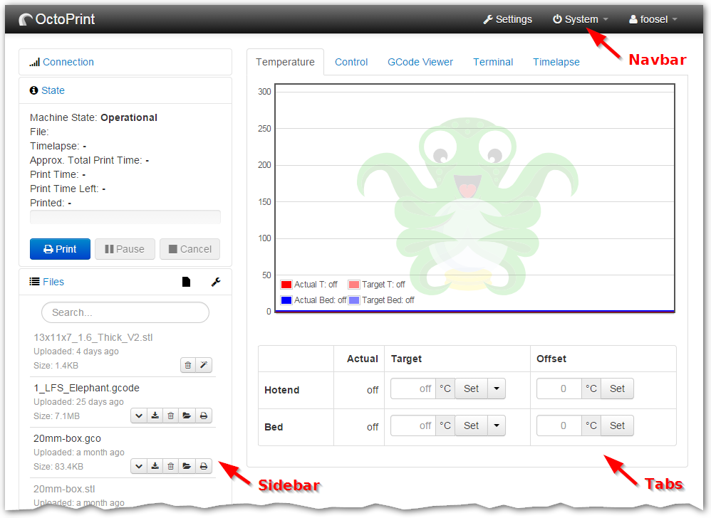
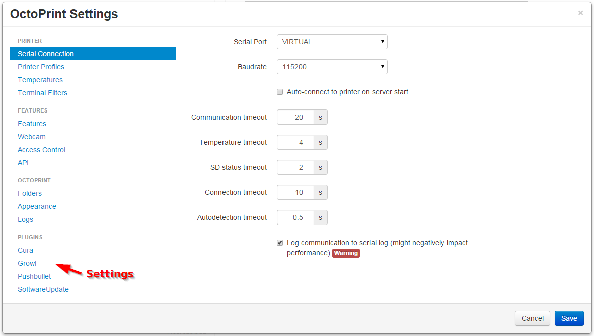

.. _sec-plugins-templates:

Component Templates
===================

OctoPrint allows plugins to extend the UI of OctoPrint through the use of the :class:`~octoprint.plugin.TemplatePlugin`
mixin. By implementing this mixing and providing templates and their configuration through it, Plugins may currently
create one or more of navbar, sidebar, tabs, settings and generic components.

   Template injection types in the main part of the interface

   Template injection types in the settings

You can find an example for a simple plugin which injects navbar, sidebar, tab and settings content into the interface in
`the "helloworld" plugin in OctoPrint's collection of plugin examples <https://github.com/OctoPrint/Plugin-Examples/tree/master/helloworld>`_.

.. _sec-plugins-templates-navbar:

Navbar
------

The right part of the navigation bar located at the top of the UI can be enriched with additional links. Note that
with the current implementation, plugins will always be located *to the left* of the existing links.

The included template must be called ``<pluginname>_navbar.jinja2`` (e.g. ``myplugin_navbar.jinja2``) unless
overridden by the configuration supplied through :func:`get_template_configs`.

The template will be already wrapped into the necessary structure, plugins just need to supply the pure content. The
wrapper structure will have all additional classes and styles applied as specified via the configuration supplied
through :func:`get_template_configs`.

.. _sec-plugins-templates-sidebar:

Sidebar
-------

The left side bar containing Connection, State and Files sections can be enriched with additional sections. Note
that with the current implementations, plugins will always be located *beneath* the existing sections.

The included template must be called ``<pluginname>_sidebar.jinja2`` (e.g. ``myplugin_sidebar.jinja2``) unless
overridden by the configuration supplied through :func:`get_template_configs`.

The template will be already wrapped into the necessary structure, plugins just need to supply the pure content. The
wrapper divs for both the whole box as well as the content pane will have all additional classes and styles applied
as specified via the configuration supplied through :func:`get_template_configs`.

.. _sec-plugins-templates-tabs:

Tabs
----

The available tabs of the main part of the interface may be extended with additional tabs originating from within
plugins. Note that with the current implementation, plugins will always be located *to the right* of the existing
tabs.

The included template must be called ``<pluginname>_tab.jinja2`` (e.g. ``myplugin_tab.jinja2``) unless
overridden by the configuration supplied through :func:`get_template_configs`.

The template will be already wrapped into the necessary structure, plugins just need to supply the pure content. The
wrapper div and the link in the navigation will have the additional classes and styles applied as specified via the
configuration supplied through :func:`get_template_configs`.

.. _sec-plugins-templates-settings:

Settings
--------

Plugins may inject a dialog into the existing settings view. Note that with the current implementations, plugins
will always be listed beneath the "Plugins" header in the settings link list, ordered alphabetically after
their displayed name.

The included template must be called ``<pluginname>_settings.jinja2`` (e.g. ``myplugin_settings.jinja2``) unless
overridden by the configuration supplied through :func:`get_template_configs`.

The template will be already wrapped into the necessary structure, plugins just need to supply the pure content. The
wrapper div and the link in the navigation will have the additional classes and styles applied as defined via the
supplied configuration supplied through :func:`get_template_configs`.

.. _sec-plugins-templates-generic:

Generic
-------

Plugins may also inject arbitrary templates into the page of the web interface itself, e.g. in order to
add overlays or dialogs to be called from within the plugin's javascript code.

.. _sec-plugins-templates-replacement:

Replacing existing components
-----------------------------
